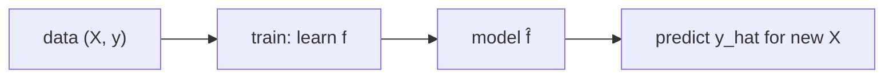

# Machine Learning이란 무엇인가?

추천, 의료, 금융, 자율주행처럼 머신러닝이 등장하지 않는 산업을 찾기 어려워졌습니다. 그런데 입문 단계에서는 오히려 가장 기본적인 질문이 흐려지기 쉽습니다. 머신러닝은 통계의 다른 이름인지, 규칙 기반 프로그래밍의 확장인지, 아니면 전혀 다른 문제 해결 방식인지부터 분명히 잡아야 이후 모델 선택도 흔들리지 않습니다.

이 글은 Machine Learning 101 시리즈의 첫 번째 글입니다. 여기서는 머신러닝을 **데이터에서 함수를 학습해 새로운 입력에 대해 예측하는 방식**이라는 관점으로 정리하고, 학습·일반화·예측이 각각 무엇을 뜻하는지 출발점부터 잡아 보겠습니다.

## 이 글에서 다룰 문제

- 머신러닝은 정확히 무엇을 학습한다고 봐야 할까요?
- 일반화는 왜 훈련 성능과 다른 개념일까요?
- 통계, 규칙 기반 코드, 머신러닝은 어디서 갈릴까요?
- scikit-learn의 `fit / predict / score`는 각각 무엇을 뜻할까요?
- 입문 단계에서 가장 자주 하는 실수는 무엇일까요?

> 머신러닝의 핵심은 모델 이름이 아닙니다. **데이터에서 함수 `f`를 학습하고, 그 함수를 아직 보지 못한 입력에 적용한다**는 실행 모델을 머릿속에 먼저 세우는 일이 출발점입니다.

## 왜 중요한가

추천 시스템, 의료 진단 보조, 금융 리스크 분석, 자율주행처럼 거의 모든 산업이 머신러닝의 영향을 받고 있습니다. 하지만 기초 개념이 약하면 뒤에서 어떤 모델을 올려도 해석이 무너집니다. 훈련 데이터에서 점수가 잘 나왔다고 곧바로 성공이라고 착각하거나, 문제 정의보다 알고리즘 이름에 먼저 끌리는 순간부터 프로젝트는 불안해집니다.

## 한눈에 보는 개념



## 핵심 용어

- **학습(Learning)**: 데이터에서 함수를 추정하는 과정입니다.
- **일반화(Generalization)**: 훈련 때 보지 못한 데이터에도 잘 동작하는 성질입니다.
- **예측(Prediction)**: 학습된 함수를 새로운 입력에 적용하는 일입니다.
- **피처(Feature)**: 모델에 들어가는 입력 변수입니다.
- **레이블(Label)**: 예측하려는 정답 또는 목표값입니다.

## Before/After

**Before**: "`if-else`로 모든 규칙을 직접 코딩한다"는 방식이라서 새로운 패턴이 생길 때마다 코드를 더 붙여야 합니다.

**After**: "데이터를 주면 모델이 규칙을 학습한다"는 방식이라서 코드보다 데이터가 확장의 중심이 됩니다.

## 실습: 5단계로 보는 첫 번째 ML

### Step 1 — 데이터

```python
from sklearn.datasets import load_iris
X, y = load_iris(return_X_y=True)
print(X.shape, y.shape)
```

### Step 2 — 모델 선택

```python
from sklearn.linear_model import LogisticRegression
model = LogisticRegression(max_iter=1000)
```

### Step 3 — 학습

```python
model.fit(X, y)
```

### Step 4 — 예측

```python
print(model.predict(X[:5]))
```

### Step 5 — 점수 확인

```python
print("acc:", model.score(X, y))
```

## 이 코드에서 먼저 봐야 할 점

- `fit / predict / score`는 **scikit-learn의 표준 인터페이스**입니다.
- 여기서 `score`는 **훈련 정확도**일 뿐이며, 일반화 성능을 바로 뜻하지는 않습니다.
- 어떤 모델을 고를지는 **문제 유형**에 따라 달라집니다.

## 자주 하는 실수 5가지

1. **훈련 데이터 점수만 보고 성공을 판단합니다.**
2. **피처 스케일링을 무시합니다.**
3. **피처 안에 타깃 누수(target leakage)가 섞인 것을 놓칩니다.**
4. **랜덤 시드를 고정하지 않아 재현 가능한 결과를 남기지 못합니다.**
5. **결측치나 이상치를 처리하지 않은 채 학습을 시작합니다.**

## 실무에서는 이렇게 나타납니다

추천, 사기 탐지, 수요 예측, 이미지 인식, NLP 챗봇까지, **데이터 → 학습 → 예측** 파이프라인은 거의 모든 ML 제품의 뼈대입니다.

## 시니어 엔지니어는 이렇게 생각합니다

- **문제 정의**가 **모델 선택**보다 먼저입니다.
- **데이터 품질**이 **알고리즘 이름**보다 더 중요할 때가 많습니다.
- 일반화는 항상 **분리된 데이터**에서 확인해야 합니다.
- 복잡한 모델보다 먼저 **베이스라인 모델**을 세웁니다.
- 복잡도는 처음이 아니라 **마지막 카드**로 아껴 둡니다.

## 체크리스트

- [ ] `X, y`가 무엇을 뜻하는지 설명할 수 있습니다.
- [ ] `fit / predict / score`를 호출할 수 있습니다.
- [ ] 훈련 정확도와 일반화 성능이 다르다는 점을 이해했습니다.
- [ ] 베이스라인 모델의 가치를 알고 있습니다.

## 연습 문제

1. `iris`가 아닌 **자신의 데이터셋**으로 `fit / predict`를 실행해 보세요.
2. `score`가 왜 **과도하게 낙관적**일 수 있는지 설명해 보세요.
3. 피처 스케일링이 결과를 바꾸는 예시를 하나 만들어 보세요.

## 정리

머신러닝은 **데이터에서 학습한 함수를 새로운 입력에 적용하는 방식**입니다. 이 한 문장을 정확히 잡아 두면 이후 분류, 회귀, 군집, 평가 지표를 만날 때도 길을 잃지 않습니다.

이 글에서 가져가야 할 핵심은 네 가지입니다. 첫째, 학습은 데이터를 외우는 일이 아니라 함수를 추정하는 일입니다. 둘째, 일반화는 훈련 점수와 별개로 측정해야 합니다. 셋째, `fit / predict / score`는 scikit-learn의 공통 언어입니다. 넷째, 좋은 출발은 복잡한 모델이 아니라 명확한 문제 정의와 베이스라인입니다.

다음 글에서는 지도학습과 비지도학습을 비교하면서, 레이블이 있을 때와 없을 때 어떤 식으로 문제를 나눠 생각해야 하는지 살펴보겠습니다.

<!-- toc:begin -->
- **Machine Learning이란 무엇인가? (현재 글)**
- 지도학습과 비지도학습 (예정)
- Train/Test Split (예정)
- Linear Regression (예정)
- Logistic Regression (예정)
- Decision Tree와 Random Forest (예정)
- Clustering (예정)
- Overfitting과 Regularization (예정)
- Model Evaluation (예정)
- ML 프로젝트 전체 흐름 (예정)
<!-- toc:end -->

## 참고 자료

- [scikit-learn — Getting Started](https://scikit-learn.org/stable/getting_started.html)
- [Andrew Ng — Machine Learning Specialization](https://www.coursera.org/specializations/machine-learning-introduction)
- [Hands-On Machine Learning — Aurélien Géron](https://www.oreilly.com/library/view/hands-on-machine-learning/9781098125967/)
- [Google — Machine Learning Crash Course](https://developers.google.com/machine-learning/crash-course)

Tags: MachineLearning, AI, DataScience, Foundations, Beginner
