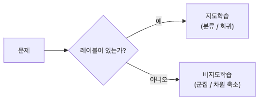

# 지도학습과 비지도학습

머신러닝을 처음 배우면 알고리즘 이름부터 외우기 쉽습니다. 하지만 실제 프로젝트에서 더 먼저 해야 하는 일은 모델 선택이 아니라 문제를 어떤 종류로 볼지 정하는 일입니다. 레이블이 있는지 없는지, 예측하려는 대상이 범주인지 숫자인지, 아니면 데이터 안의 구조를 발견해야 하는지에 따라 출발점이 완전히 달라집니다.

이 글은 Machine Learning 101 시리즈의 두 번째 글입니다. 여기서는 지도학습과 비지도학습의 경계를 정리하고, 분류·회귀·군집이 각각 어떤 질문에 답하는지 비교해 보겠습니다.

## 이 글에서 다룰 문제

- 레이블이 있을 때와 없을 때 같은 알고리즘을 써도 될까요?
- 분류와 회귀는 둘 다 지도학습인데 무엇이 다를까요?
- 군집화는 분류와 왜 전혀 다른 문제로 취급할까요?
- 일부만 레이블이 붙은 데이터는 어떻게 다뤄야 할까요?
- 프로젝트 초기에 어떤 기준으로 패러다임을 먼저 골라야 할까요?

> 지도학습은 `(X, y)` 쌍에서 함수를 맞추는 문제이고, 비지도학습은 `X`만으로 구조를 발견하는 문제입니다. 같은 "머신러닝" 안에 있어도 시작 질문이 다르면 평가 방식과 성공 기준도 함께 달라집니다.

## 왜 중요한가

패러다임을 잘못 고르면 이후 모델 개선은 거의 의미가 없어집니다. 문제 프레이밍이 첫 번째 레버인 이유가 여기에 있습니다. 연속값을 예측해야 하는데 분류처럼 접근하거나, 정답 레이블이 없는데 지도학습 지표를 기대하면 모델보다 문제 정의가 먼저 어긋납니다.

## 한눈에 보는 개념



*레이블이 있으면 지도학습으로, 없으면 구조 탐색 중심의 비지도학습으로 출발점이 갈린다는 점을 한 장에 정리한 그림입니다.*

## 핵심 용어

- **지도학습(Supervised learning)**: `(X, y)` 쌍에서 함수를 학습합니다.
- **비지도학습(Unsupervised learning)**: `X`만 보고 구조를 발견합니다.
- **분류(Classification)**: 이산적인 레이블을 예측합니다.
- **회귀(Regression)**: 연속적인 값을 예측합니다.
- **군집화(Clustering)**: 거리나 밀도를 기준으로 비슷한 점들을 묶습니다.

## Before/After

**Before**: "머신러닝은 회귀 한 줄이면 된다"고 생각해서 패러다임 구분을 건너뜁니다.

**After**: 먼저 **레이블 유무**를 확인하고, 그다음 **분류인지 회귀인지**를 정한 뒤 알고리즘을 고릅니다.

## 실습: 5단계로 패러다임 비교하기

### Step 1 — 데이터 로드

```python
from sklearn.datasets import load_iris
X, y = load_iris(return_X_y=True)
```

### Step 2 — 지도학습 분류

```python
from sklearn.linear_model import LogisticRegression
clf = LogisticRegression(max_iter=1000).fit(X, y)
print("clf acc:", clf.score(X, y))
```

### Step 3 — 회귀 데이터셋

```python
from sklearn.datasets import fetch_california_housing
Xr, yr = fetch_california_housing(return_X_y=True)
```

### Step 4 — 회귀 모델

```python
from sklearn.linear_model import LinearRegression
reg = LinearRegression().fit(Xr, yr)
print("R^2:", reg.score(Xr, yr))
```

### Step 5 — 비지도 군집화

```python
from sklearn.cluster import KMeans
km = KMeans(n_clusters=3, n_init=10).fit(X)
print("inertia:", km.inertia_)
```

**예상 출력:** 분류 예제는 정확도, 회귀 예제는 `R^2`, 군집화 예제는 inertia를 출력합니다. 숫자가 모두 성능처럼 보이지만 **서로 같은 의미가 아니며 직접 비교할 수도 없습니다.**

## 이 코드에서 먼저 봐야 할 점

- `clf.score`는 정확도, `reg.score`는 결정계수(R-squared), `km.inertia_`는 군집 응집도를 뜻합니다. **지표가 다르면 숫자의 의미도 달라집니다.**
- `KMeans(n_init=...)`는 재현성과 안정성에 직접 영향을 줍니다.
- 비지도학습은 정답이 없기 때문에 결과 해석이 더 어렵습니다.

## 실패 신호를 먼저 이렇게 읽습니다

- 팀이 레이블이 무엇인지 답하지 못하면, 알고리즘보다 먼저 **예측 결과가 바꾸려는 행동**이 무엇인지 다시 물어야 합니다.
- 군집 결과를 곧바로 정답 클래스처럼 쓰려 하면, 먼저 **후속 검증 방법**을 정해야 합니다.
- 지표 해석이 자꾸 꼬인다면, 감독된 문제의 점수와 비지도학습의 응집도 숫자를 같은 표에서 읽고 있지 않은지 확인해야 합니다.

## 자주 하는 실수 5가지

1. **회귀 문제를 분류로 풀거나 그 반대로 접근합니다.**
2. **부분적으로만 레이블이 있는 데이터를 버리고 준지도학습 가능성을 놓칩니다.**
3. **군집 결과를 마치 정답처럼 다룹니다.**
4. **시각화도 하지 않은 채 군집 수 `K`를 고정합니다.**
5. **거리 기반 알고리즘 전에 표준화를 생략합니다.**

## 실무에서는 이렇게 나타납니다

스팸 필터와 사기 탐지는 분류, 가격 책정과 수요 예측은 회귀, 고객 세그먼트 분석은 군집화에 기대는 경우가 많습니다. 실제 시스템은 이 셋을 함께 섞어 사용하면서 랭킹과 추천을 만듭니다.

## 시니어 엔지니어는 이렇게 생각합니다

- 순서가 중요합니다. **문제 → 지표 → 패러다임** 순으로 정합니다.
- 비지도학습은 초기에 탐색용으로 매우 유용합니다.
- 업계에서는 준지도학습 상황이 오히려 더 흔합니다.
- 강화학습은 가장 마지막에 꺼내는 카드에 가깝습니다.
- 알고리즘 선택보다 **레이블링 전략**이 더 큰 차이를 만들기도 합니다.

## 체크리스트

- [ ] 분류, 회귀, 군집의 예시를 각각 들 수 있습니다.
- [ ] 각 `.score()` 값 뒤에 있는 의미를 설명할 수 있습니다.
- [ ] KMeans의 `K`가 하이퍼파라미터라는 점을 알고 있습니다.
- [ ] 어떤 알고리즘이 표준화된 입력을 필요로 하는지 알고 있습니다.

## 연습 문제

1. KMeans로 `iris`를 군집화한 뒤 실제 `y`와 교차표를 만들어 보세요.
2. 회귀로 보는 편이 좋은 문제 세 개와 분류로 보는 편이 좋은 문제 세 개를 적어 보세요.
3. 준지도학습이 정답인 상황 하나를 설명해 보세요.

## 정리

패러다임 선택은 모델 성능의 상한선을 정합니다. 지도학습과 비지도학습의 차이를 정확히 잡아야 이후 데이터 준비, 평가, 해석이 모두 같은 방향으로 정렬됩니다.

이 글에서 기억할 핵심은 세 가지입니다. 첫째, 분류와 회귀는 둘 다 지도학습이지만 예측 대상이 다릅니다. 둘째, 군집화는 정답이 없는 구조 탐색 문제입니다. 셋째, 문제 프레이밍을 잘못 잡으면 모델 개선 자체가 무의미해집니다.

다음 글에서는 Train/Test Split을 통해 일반화를 어떻게 측정하는지 살펴보겠습니다.

<!-- toc:begin -->
- [Machine Learning이란 무엇인가?](./01-what-is-machine-learning.md)
- **지도학습과 비지도학습 (현재 글)**
- Train/Test Split (예정)
- Linear Regression (예정)
- Logistic Regression (예정)
- Decision Tree와 Random Forest (예정)
- Clustering (예정)
- Overfitting과 Regularization (예정)
- Model Evaluation (예정)
- ML 프로젝트 전체 흐름 (예정)
<!-- toc:end -->

## 참고 자료

- [scikit-learn — Supervised learning](https://scikit-learn.org/stable/supervised_learning.html)
- [scikit-learn — Unsupervised learning](https://scikit-learn.org/stable/unsupervised_learning.html)
- [Pattern Recognition and Machine Learning — Bishop](https://www.microsoft.com/en-us/research/people/cmbishop/prml-book/)
- [Google — ML Problem Framing](https://developers.google.com/machine-learning/problem-framing)

Tags: MachineLearning, SupervisedLearning, UnsupervisedLearning, Classification, Clustering
