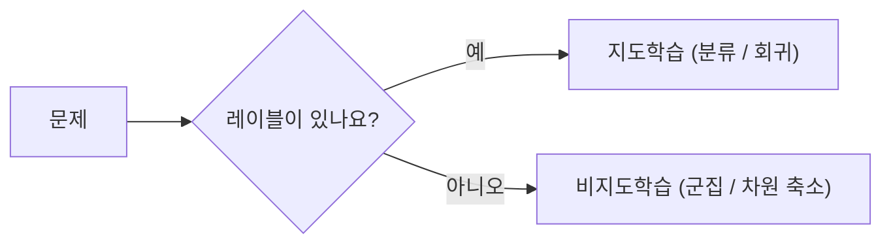

# 지도학습과 비지도학습

## 이 글에서 다룰 문제

- 정답 레이블이 있을 때와 없을 때, 같은 알고리즘을 써도 될까요?
- 분류와 회귀는 둘 다 지도학습인데 무엇이 다를까요?
- 군집화는 분류와 비슷해 보이는데 왜 전혀 다른 문제로 취급할까요?
- 레이블이 일부만 있을 때는 데이터를 버려야 할까요?
- 실제 프로젝트에서는 어떤 기준으로 패러다임을 먼저 고를까요?

머신러닝을 처음 배우면 알고리즘 이름부터 외우기 쉽습니다. 하지만 실무에서 더 먼저 해야 할 일은 알고리즘 선택이 아니라 문제 정의입니다. 같은 데이터라도 레이블이 있는지, 예측하려는 값이 연속형인지, 아니면 데이터 안의 구조를 찾아야 하는지에 따라 출발점이 완전히 달라집니다.

이 글은 그 갈림길을 정리합니다. 지도학습과 비지도학습의 차이를 큰 그림에서 설명하고, 분류·회귀·군집이 각각 어떤 질문에 답하는지 코드와 함께 살펴보겠습니다. 핵심은 간단합니다. **문제 유형을 잘못 잡으면 모델을 아무리 개선해도 성능 향상은 의미가 없다는 점**입니다.

> 지도학습은 `(X, y)` 쌍에서 함수를 배우고, 비지도학습은 `X`만으로 데이터 안의 구조를 찾습니다.

## 왜 중요한가

문제 프레이밍이 틀리면 이후 단계가 모두 어긋납니다. 고객 이탈을 예측해야 하는데 군집화부터 시도하거나, 연속값 예측 문제를 억지로 분류로 바꾸면 지표 해석도 왜곡됩니다. 팀은 모델이 아니라 문제 정의에서 먼저 시간을 잃습니다.

또한 지도학습과 비지도학습은 평가 방식 자체가 다릅니다. 지도학습은 정답이 있으므로 정확도, F1, R^2 같은 지표로 직접 비교할 수 있습니다. 반면 비지도학습은 정답이 없으니 실루엣 점수, 시각화, 도메인 해석을 함께 써야 합니다. 같은 "성능"이라는 말도 의미가 달라집니다.

## 한눈에 보는 개념



## 핵심 용어

- **지도학습**: 입력 `X`와 정답 `y`를 함께 보고 규칙을 학습하는 방식입니다.
- **비지도학습**: 정답 없이 데이터의 구조, 거리, 밀도, 패턴을 찾는 방식입니다.
- **분류**: 이산적인 클래스 레이블을 예측합니다.
- **회귀**: 연속적인 수치를 예측합니다.
- **군집화**: 비슷한 데이터끼리 묶어 잠재 구조를 찾습니다.

## Before / After

**Before**: 머신러닝은 회귀 한 줄이나 분류 한 줄로 끝난다고 생각합니다.

**After**: 레이블 유무를 먼저 확인하고, 그다음 분류인지 회귀인지 판단한 뒤 알고리즘을 고릅니다.

## 5단계로 비교해 보기

### Step 1 — 데이터 로드

먼저 레이블이 있는 대표 분류 데이터셋을 불러옵니다.

```python
from sklearn.datasets import load_iris
X, y = load_iris(return_X_y=True)
```

### Step 2 — 지도학습: 분류

로지스틱 회귀로 붓꽃 품종을 분류해 봅니다.

```python
from sklearn.linear_model import LogisticRegression
clf = LogisticRegression(max_iter=1000).fit(X, y)
print("clf acc:", clf.score(X, y))
```

여기서 `y`는 품종 레이블입니다. 즉, 모델은 정답을 보고 학습합니다. 이것이 지도학습의 전형적인 형태입니다.

### Step 3 — 회귀용 데이터셋

이번에는 집값처럼 연속적인 숫자를 예측하는 회귀 문제를 준비합니다.

```python
from sklearn.datasets import fetch_california_housing
Xr, yr = fetch_california_housing(return_X_y=True)
```

### Step 4 — 지도학습: 회귀

같은 지도학습이지만, 이번에는 숫자를 예측합니다.

```python
from sklearn.linear_model import LinearRegression
reg = LinearRegression().fit(Xr, yr)
print("R^2:", reg.score(Xr, yr))
```

분류와 회귀는 둘 다 정답이 있는 문제입니다. 차이는 `y`의 형태입니다. 분류는 범주를, 회귀는 연속값을 예측합니다.

### Step 5 — 비지도학습: 군집화

이제 레이블 없이 구조를 찾는 쪽을 보겠습니다.

```python
from sklearn.cluster import KMeans
km = KMeans(n_clusters=3, n_init=10).fit(X)
print("inertia:", km.inertia_)
```

KMeans는 `y` 없이도 데이터 간 거리를 바탕으로 그룹을 만듭니다. 이때 결과는 정답이 아니라 가설에 가깝습니다. 군집 0, 1, 2는 클래스 이름이 아니라 알고리즘이 임의로 붙인 묶음 번호입니다.

## 이 코드에서 주목할 점

- `clf.score`는 정확도, `reg.score`는 R^2, `km.inertia_`는 군집 내 응집도를 뜻합니다. 숫자만 보면 비슷해 보여도 의미는 전혀 다릅니다.
- `KMeans(n_init=...)`는 초기 중심점을 여러 번 시도해 더 안정적인 해를 찾게 해 줍니다.
- 비지도학습은 정답이 없으므로 결과 해석 책임이 더 큽니다. 숫자가 나왔다고 끝이 아닙니다.

## 실무에서는 이렇게 구분합니다

스팸 판별, 사기 탐지, 이탈 예측은 대개 분류 문제입니다. 가격 예측, 수요 예측, 리드타임 예측은 회귀 문제입니다. 고객 세그먼트 발굴, 로그 탐색, 이상 패턴 탐색은 군집화처럼 비지도학습이 먼저 등장합니다.

현업에서는 이 셋이 따로 놀지 않습니다. 추천 시스템에서는 먼저 비지도학습으로 데이터 구조를 파악하고, 이후 지도학습으로 클릭률이나 구매 확률을 예측하는 식으로 함께 쓰입니다. 그래서 패러다임을 구분하는 일은 이론 공부가 아니라 설계의 출발점에 가깝습니다.

## 시니어 엔지니어는 이렇게 생각합니다

- 알고리즘보다 먼저 문제와 지표를 정합니다.
- 비지도학습은 답을 주는 도구라기보다 탐색과 가설 생성 도구로 봅니다.
- 레이블이 일부만 있는 상황은 흔하므로 준지도학습 가능성도 함께 검토합니다.
- 강화학습은 입문 단계의 기본 해법이 아니라, 충분한 보상 설계와 환경 정의가 있을 때 꺼내는 카드입니다.
- 좋은 레이블 전략이 알고리즘 교체보다 더 큰 차이를 만드는 경우가 많습니다.

## 자주 하는 실수 5가지

1. 회귀 문제를 분류로 풀거나, 분류 문제를 회귀처럼 다룹니다.
2. 일부 레이블만 있다고 해서 나머지 데이터를 전부 버립니다.
3. 군집 결과를 정답처럼 해석합니다.
4. `K`를 아무 근거 없이 고정합니다.
5. 표준화 없이 거리 기반 알고리즘을 사용합니다.

## 체크리스트

- [ ] 분류, 회귀, 군집의 차이를 예시로 설명할 수 있습니다.
- [ ] `.score()`가 상황마다 다른 뜻을 가진다는 점을 이해했습니다.
- [ ] KMeans의 `K`가 중요한 하이퍼파라미터라는 점을 알고 있습니다.
- [ ] 거리 기반 알고리즘에서 표준화가 왜 필요한지 설명할 수 있습니다.

## 연습 문제

1. `iris` 데이터셋에 KMeans를 적용한 뒤 실제 `y`와 비교 표를 만들어 보세요.
2. 업무에서 만날 수 있는 문제 세 개를 골라 각각 분류, 회귀, 군집 중 어디에 속하는지 정리해 보세요.
3. 레이블이 일부만 있는 상황에서 왜 준지도학습이 유용할 수 있는지 한 문단으로 설명해 보세요.

## 정리 및 다음 글

지도학습과 비지도학습의 차이는 알고리즘 이름보다 문제의 형태에서 시작합니다. 레이블이 있으면 지도학습, 없으면 비지도학습이라는 구분은 단순해 보이지만, 실제 프로젝트에서는 지표 선택과 데이터 준비 방식까지 바꿉니다.

이 글에서 기억할 핵심은 세 가지입니다. 첫째, 분류와 회귀는 모두 지도학습이지만 예측 대상이 다릅니다. 둘째, 군집화는 정답이 없는 탐색 문제이므로 해석 책임이 더 큽니다. 셋째, 문제 프레이밍이 맞아야 모델 개선이 의미를 가집니다. 다음 글에서는 이 모델이 정말 일반화되는지 확인하기 위해 Train/Test Split을 살펴보겠습니다.

<!-- toc:begin -->
- [Machine Learning이란 무엇인가?](./01-what-is-machine-learning.md)
- **지도학습과 비지도학습 (현재 글)**
- Train/Test Split (예정)
- Linear Regression (예정)
- Logistic Regression (예정)
- Decision Tree와 Random Forest (예정)
- Clustering (예정)
- Overfitting과 Regularization (예정)
- Model Evaluation (예정)
- ML 프로젝트 전체 흐름 (예정)
<!-- toc:end -->

## 참고 자료

- [scikit-learn — Supervised learning](https://scikit-learn.org/stable/supervised_learning.html)
- [scikit-learn — Unsupervised learning](https://scikit-learn.org/stable/unsupervised_learning.html)
- [Pattern Recognition and Machine Learning — Bishop](https://www.microsoft.com/en-us/research/people/cmbishop/prml-book/)
- [Google — ML Problem Framing](https://developers.google.com/machine-learning/problem-framing)

Tags: MachineLearning, SupervisedLearning, UnsupervisedLearning, Classification, Clustering
