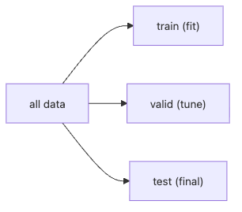

# Train/Test Split

훈련 정확도가 99%라고 해서 실제 서비스에서도 잘 동작한다는 뜻은 아닙니다. 머신러닝 입문에서 가장 자주 생기는 착각도 바로 여기서 나옵니다. 같은 데이터로 학습하고 같은 데이터로 점수를 재면 숫자는 좋아 보이지만, 그 숫자로는 배포 후 성능을 설명할 수 없습니다.

이 글은 Machine Learning 101 시리즈의 세 번째 글입니다. 여기서는 train/test split이 왜 일반화 측정의 최소 장치인지, 그리고 `random_state`, `stratify`, K-fold 교차검증이 각각 어떤 역할을 하는지 정리해 보겠습니다.

## 이 글에서 다룰 문제

- 훈련 세트, 검증 세트, 테스트 세트는 각각 무엇을 맡을까요?
- `random_state`를 왜 항상 고정하라고 할까요?
- `stratify`는 클래스 불균형에서 어떤 도움을 줄까요?
- K-fold 교차검증은 어떤 직관으로 이해하면 좋을까요?
- 분할 단계에서 가장 흔한 누수는 어디서 생길까요?

> Train/test split은 단순한 데이터 나누기가 아닙니다. **모델이 아직 보지 못한 데이터에서 어떻게 행동하는지 측정하는 최소한의 실험 장치**입니다.

## 왜 중요한가

일반화를 측정하지 못하면 모델을 고를 수도, 비교할 수도 없습니다. 훈련 점수는 보기에는 좋지만 그대로 배포할 수 있는 숫자가 아닙니다. 어떤 분할 전략을 썼는지가 결국 모델 선택과 MLOps 게이트의 기준을 결정합니다.

## 한눈에 보는 개념



*학습, 튜닝, 최종 검증을 서로 다른 데이터 조각에 나눠 맡겨야 일반화 성능을 따로 측정할 수 있습니다.*

## 핵심 용어

- **Train**: 모델을 학습시키는 데이터입니다.
- **Validation**: 하이퍼파라미터를 조정하는 데 쓰는 데이터입니다.
- **Test**: 마지막에 한 번만 보는 홀드아웃 데이터입니다.
- **Stratify**: 분할 뒤에도 클래스 비율이 유지되도록 맞춥니다.
- **K-fold**: 데이터를 K개로 나누고 테스트 폴드를 돌아가며 바꿔 가는 방식입니다.

## Before/After

**Before**: 전체 데이터에 학습하고 같은 데이터로 점수를 재서 성능을 과대평가합니다.

**After**: train으로 학습하고 홀드아웃 test로 평가해, 숫자가 현실에 더 가깝도록 만듭니다.

## 실습: 5단계로 분할하고 평가하기

### Step 1 — 데이터

```python
from sklearn.datasets import load_iris
X, y = load_iris(return_X_y=True)
```

### Step 2 — 분할

```python
from sklearn.model_selection import train_test_split
Xtr, Xte, ytr, yte = train_test_split(
    X, y, test_size=0.2, stratify=y, random_state=42
)
```

### Step 3 — 모델

```python
from sklearn.linear_model import LogisticRegression
model = LogisticRegression(max_iter=1000).fit(Xtr, ytr)
```

### Step 4 — 평가

```python
print("train:", model.score(Xtr, ytr))
print("test :", model.score(Xte, yte))
```

### Step 5 — 교차검증

```python
from sklearn.model_selection import cross_val_score
print(cross_val_score(model, X, y, cv=5).mean())
```

**Expected output:** 훈련 점수는 테스트 점수보다 약간 높게 나오고, 교차검증 평균은 그 주변 값에 모이는 편이 자연스럽습니다. 세 숫자가 크게 벌어지면 모델보다 먼저 **분할 전략**을 의심해야 합니다.

## 이 코드에서 먼저 봐야 할 점

- `stratify=y`는 두 분할 모두에서 클래스 비율을 유지합니다.
- 고정된 `random_state`는 결과를 재현 가능하게 만듭니다.
- `cross_val_score`는 훈련과 평가를 K번 반복합니다.

## 실패 신호를 먼저 이렇게 읽습니다

- 테스트 점수가 실행할 때마다 크게 흔들리면 표본 수가 너무 작거나 시드가 떠 있는지 먼저 봐야 합니다.
- train과 test가 모두 지나치게 좋다면, 성능보다 먼저 **전처리 누수**를 점검해야 합니다.
- 시계열이나 사용자 그룹 데이터인데 무작위 분할을 썼다면, 지표가 아니라 **분할 방식 자체가 버그**일 수 있습니다.

## 자주 하는 실수 5가지

1. **테스트 세트로 튜닝해서 성능 누수를 만듭니다.**
2. **분할 전에 전체 데이터에 스케일러를 먼저 학습합니다.**
3. **랜덤 시드를 고정하지 않고 노이즈를 쫓습니다.**
4. **불균형 데이터에서 `stratify`를 무시합니다.**
5. **시계열 데이터를 시간 순서가 아니라 무작위로 나눕니다.**

## 실무에서는 이렇게 나타납니다

A/B 실험, 모델 비교, MLOps 게이팅 모두 올바른 분할 전략에 기대고 있습니다. 결국 의사결정을 지배하는 것은 지표 이름만이 아니라 **어떻게 나눴는가**입니다.

## 시니어 엔지니어는 이렇게 생각합니다

- 테스트 세트는 **정말 한 번만** 봅니다.
- 검증 세트와 테스트 세트는 분리합니다.
- 시계열 데이터는 시간 순서대로 나눕니다.
- 항상 그룹 누수 가능성을 의심합니다.
- 전처리는 분할 이후에 합니다.

## 체크리스트

- [ ] train, valid, test의 역할을 설명할 수 있습니다.
- [ ] `stratify`가 하는 일을 이해했습니다.
- [ ] `random_state`를 항상 고정합니다.
- [ ] `cross_val_score`를 실행할 수 있습니다.

## 연습 문제

1. `test_size`를 0.1부터 0.3까지 바꿔 가며 테스트 점수를 관찰해 보세요.
2. `stratify=None`일 때 train과 test의 클래스 비율을 비교해 보세요.
3. 5-fold와 10-fold 점수의 분산을 비교해 보세요.

## 정리

올바른 분할은 그 뒤에 오는 모든 측정의 전제입니다. train/test split을 정확히 이해해야만 과대평가된 훈련 점수와 실제 일반화 성능을 구분할 수 있습니다.

이 글에서 기억할 핵심은 네 가지입니다. 첫째, test 세트는 마지막에 한 번만 봐야 합니다. 둘째, `stratify`는 클래스 비율을 지켜 줍니다. 셋째, `random_state`는 재현성을 위해 필수입니다. 넷째, 교차검증은 한 번의 분할에서 생길 수 있는 우연을 줄여 줍니다.

다음 글에서는 지도학습의 가장 기본적인 모델인 Linear Regression을 살펴보겠습니다.

<!-- toc:begin -->
- [Machine Learning이란 무엇인가?](./01-what-is-machine-learning.md)
- [지도학습과 비지도학습](./02-supervised-and-unsupervised.md)
- **Train/Test Split (현재 글)**
- Linear Regression (예정)
- Logistic Regression (예정)
- Decision Tree와 Random Forest (예정)
- Clustering (예정)
- Overfitting과 Regularization (예정)
- Model Evaluation (예정)
- ML 프로젝트 전체 흐름 (예정)
<!-- toc:end -->

## 참고 자료

- [scikit-learn — train_test_split](https://scikit-learn.org/stable/modules/generated/sklearn.model_selection.train_test_split.html)
- [scikit-learn — Cross-validation](https://scikit-learn.org/stable/modules/cross_validation.html)
- [Forecasting: Principles and Practice — Hyndman](https://otexts.com/fpp3/)
- [Google — Rules of ML](https://developers.google.com/machine-learning/guides/rules-of-ml)

Tags: MachineLearning, TrainTestSplit, Generalization, CrossValidation, scikit-learn
