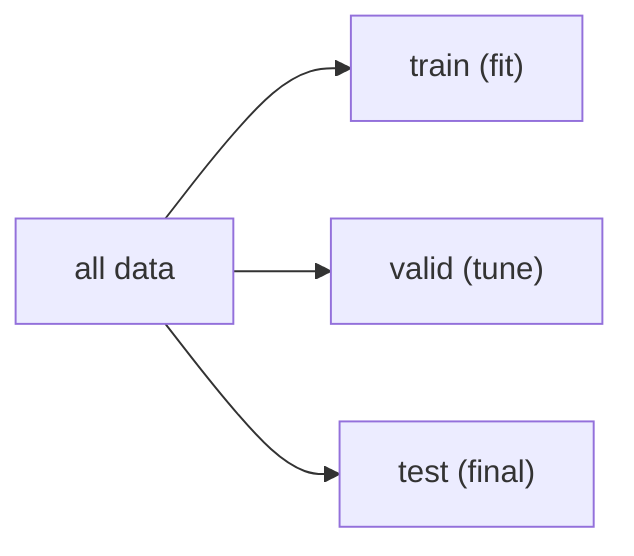

# Train/Test Split

> Machine Learning 101 시리즈 (3/10)


## 이 글에서 다룰 문제

일반화 성능을 측정하지 못하면 모델을 고를 수도 없고 서로 비교할 수도 없습니다. 훈련 점수만 높은 모델은 실제 서비스에 바로 가져가기 어렵습니다.

## 전체 흐름


## Before/After

**Before**: 전체 데이터에 fit한 뒤 같은 데이터로 score를 계산합니다. 그래서 성능을 과대평가하기 쉽습니다.

**After**: train으로 fit하고 test로 score를 재면, 훨씬 현실적인 점수를 볼 수 있습니다.

## 5단계 분할 평가

### 1단계 — 데이터

```python
from sklearn.datasets import load_iris
X, y = load_iris(return_X_y=True)
```

### 2단계 — 분할

```python
from sklearn.model_selection import train_test_split
Xtr, Xte, ytr, yte = train_test_split(
    X, y, test_size=0.2, stratify=y, random_state=42
)
```

### 3단계 — 모델

```python
from sklearn.linear_model import LogisticRegression
model = LogisticRegression(max_iter=1000).fit(Xtr, ytr)
```

### 4단계 — 테스트 평가

```python
print("train:", model.score(Xtr, ytr))
print("test :", model.score(Xte, yte))
```

### 5단계 — K-fold

```python
from sklearn.model_selection import cross_val_score
print(cross_val_score(model, X, y, cv=5).mean())
```

## 이 코드에서 주목할 점

- *stratify=y* 는 클래스 비율을 유지합니다.
- *random_state* 를 고정하면 결과를 재현할 수 있습니다.
- *cross_val_score* 는 훈련과 평가를 K번 반복합니다.

## 자주 하는 실수 5가지

1. test 데이터로 튜닝해서 test 누수를 만듭니다.
2. 스케일러를 전체 데이터에 먼저 fit해서 정보 누수를 일으킵니다.
3. 시드를 고정하지 않아 결과가 흔들립니다.
4. 불균형 데이터인데 *stratify* 를 쓰지 않습니다.
5. 시계열 데이터를 시간 순서 없이 무작위로 나눕니다.

## 실무에서는 이렇게 쓰입니다

A/B 실험, 모델 비교, MLOps 평가 게이트까지, 분할 전략은 조직의 의사결정에 직접 영향을 줍니다.

## 체크리스트

- [ ] *train/valid/test* 의 역할을 안다.
- [ ] *stratify* 의 의미를 안다.
- [ ] *random_state* 를 항상 고정한다.
- [ ] *cross_val_score* 를 쓸 수 있다.

## 정리 및 다음 단계

올바른 분할은 모든 측정의 전제입니다. 다음 글에서는 *Linear Regression* 으로 지도학습의 기본기를 다룹니다.

<!-- toc:begin -->
- [Machine Learning이란 무엇인가?](./01-what-is-machine-learning.md)
- [지도학습과 비지도학습](./02-supervised-and-unsupervised.md)
- **Train/Test Split (현재 글)**
- Linear Regression (예정)
- Logistic Regression (예정)
- Decision Tree와 Random Forest (예정)
- Clustering (예정)
- Overfitting과 Regularization (예정)
- Model Evaluation (예정)
- ML 프로젝트 전체 흐름 (예정)
<!-- toc:end -->

## 참고 자료

- [scikit-learn — train_test_split](https://scikit-learn.org/stable/modules/generated/sklearn.model_selection.train_test_split.html)
- [scikit-learn — Cross-validation](https://scikit-learn.org/stable/modules/cross_validation.html)
- [Forecasting: Principles and Practice — Hyndman](https://otexts.com/fpp3/)
- [Google — Data leakage](https://developers.google.com/machine-learning/guides/rules-of-ml)

Tags: MachineLearning, TrainTestSplit, Generalization, CrossValidation, scikit-learn
