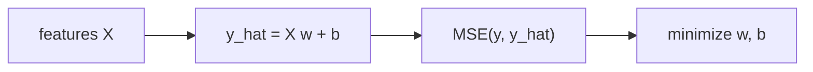

# Linear Regression

> Machine Learning 101 시리즈 (4/10)


## 이 글에서 다룰 문제

선형 회귀는 해석하기 쉽고 빠르면서도 생각보다 강력합니다. 그래서 먼저 베이스라인으로 돌려 봐야 뒤에서 더 복잡한 모델을 쓸 이유를 분명하게 설명할 수 있습니다.

## 전체 흐름


## Before/After

**Before**: “그래프로만 보면 직선 같다”는 인상만 있고 수치 검증은 빠져 있습니다.

**After**: 모델, 지표, 잔차를 함께 보면서 세 단계로 검증합니다.

## 5단계 회귀

### 1단계 — 데이터

```python
from sklearn.datasets import fetch_california_housing
X, y = fetch_california_housing(return_X_y=True)
```

### 2단계 — 분할

```python
from sklearn.model_selection import train_test_split
Xtr, Xte, ytr, yte = train_test_split(X, y, test_size=0.2, random_state=42)
```

### 3단계 — 학습

```python
from sklearn.linear_model import LinearRegression
model = LinearRegression().fit(Xtr, ytr)
```

### 4단계 — 평가

```python
from sklearn.metrics import mean_squared_error, r2_score
pred = model.predict(Xte)
print("MSE:", mean_squared_error(yte, pred))
print("R^2:", r2_score(yte, pred))
```

### 5단계 — 계수 해석

```python
for name, coef in zip(range(Xtr.shape[1]), model.coef_):
    print(f"x{name}: {coef:.3f}")
```

## 이 코드에서 주목할 점

- *coef_* 의 부호와 크기는 해석의 핵심입니다.
- *R^2* 가 낮으면 비선형성이 숨어 있을 가능성을 의심해야 합니다.
- *MSE* 는 오차를 제곱하므로 큰 오차에 특히 민감합니다.

## 자주 하는 실수 5가지

1. 스케일 차이를 무시한 채 계수를 바로 비교합니다.
2. 다중공선성 때문에 계수가 흔들리는 상황을 놓칩니다.
3. 잔차 패턴을 확인하지 않습니다.
4. 이상치가 직선을 끌고 가는데도 그대로 둡니다.
5. 훈련 범위를 벗어난 구간까지 외삽합니다.

## 실무에서는 이렇게 쓰입니다

가격 예측, 수요 분석, A/B 효과 추정처럼 해석이 중요한 영역에서 선형 회귀는 여전히 표준 도구로 쓰입니다.

## 체크리스트

- [ ] *MSE / R^2* 를 둘 다 본다.
- [ ] 잔차 분포를 그린다.
- [ ] 스케일링 후 계수를 본다.
- [ ] 외삽 위험을 명시한다.

## 정리 및 다음 단계

선형 회귀는 모든 회귀 작업의 시작점입니다. 다음 글에서는 *Logistic Regression* 으로 분류를 다룹니다.

<!-- toc:begin -->
- [Machine Learning이란 무엇인가?](./01-what-is-machine-learning.md)
- [지도학습과 비지도학습](./02-supervised-and-unsupervised.md)
- [Train/Test Split](./03-train-test-split.md)
- **Linear Regression (현재 글)**
- Logistic Regression (예정)
- Decision Tree와 Random Forest (예정)
- Clustering (예정)
- Overfitting과 Regularization (예정)
- Model Evaluation (예정)
- ML 프로젝트 전체 흐름 (예정)
<!-- toc:end -->

## 참고 자료

- [scikit-learn — Linear Regression](https://scikit-learn.org/stable/modules/linear_model.html)
- [An Introduction to Statistical Learning — James et al.](https://www.statlearning.com/)
- [Seeing Theory — Regression](https://seeing-theory.brown.edu/regression-analysis/index.html)
- [StatQuest — Linear Regression](https://www.youtube.com/watch?v=nk2CQITm_eo)

Tags: MachineLearning, LinearRegression, Regression, scikit-learn, Beginner
