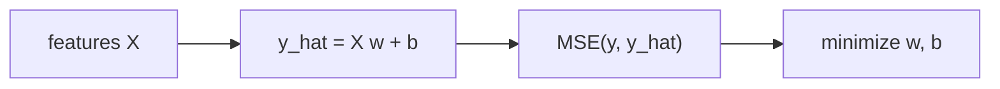

# Linear Regression

> Machine Learning 101 시리즈 (4/10)

<!-- a-grade-intro:begin -->

**핵심 질문**: *직선 하나* 가 *예측의 80%* 를 설명한다면 — *왜 더 복잡한 모델* 이 필요할까요?

> *Linear Regression 은 *가장 단순* 하지만, *모든 회귀 모델* 의 *베이스라인* 이자 *해석 가능성* 의 표준입니다.*

<!-- a-grade-intro:end -->

## 이 글에서 배울 것

- *선형 회귀* 의 *수식* 과 *직관*
- *MSE* 와 *최소제곱법*
- *R^2* 의 의미
- *잔차 분석* 으로 *가정 검증*
- 흔한 함정 5가지

## 왜 중요한가

*해석 가능* 하고 *빠르며 강력*. *베이스라인* 으로 *반드시 시작* 해야 *복잡한 모델* 을 정당화할 수 있습니다.

## 개념 한눈에 보기



## 핵심 용어 정리

- **가중치 w**: *피처 영향력*.
- **절편 b**: *기준값*.
- **MSE**: *제곱 오차의 평균*.
- **R^2**: *분산 설명 비율*.
- **잔차**: *y - y_hat*.

## Before/After

**Before**: *“그래프로만 보면 직선 같다”* — *수치 검증 없음*.

**After**: *모델/지표/잔차* 로 *세 단계 검증*.

## 실습: 5단계 회귀

### 1단계 — 데이터

```python
from sklearn.datasets import fetch_california_housing
X, y = fetch_california_housing(return_X_y=True)
```

### 2단계 — 분할

```python
from sklearn.model_selection import train_test_split
Xtr, Xte, ytr, yte = train_test_split(X, y, test_size=0.2, random_state=42)
```

### 3단계 — 학습

```python
from sklearn.linear_model import LinearRegression
model = LinearRegression().fit(Xtr, ytr)
```

### 4단계 — 평가

```python
from sklearn.metrics import mean_squared_error, r2_score
pred = model.predict(Xte)
print("MSE:", mean_squared_error(yte, pred))
print("R^2:", r2_score(yte, pred))
```

### 5단계 — 계수 해석

```python
for name, coef in zip(range(Xtr.shape[1]), model.coef_):
    print(f"x{name}: {coef:.3f}")
```

## 이 코드에서 주목할 점

- *coef_* 의 *부호/크기* 가 *해석* 의 핵심.
- *R^2* 가 *낮다* 면 *비선형성* 의 신호.
- *MSE* 는 *제곱* 이라 *큰 오차* 에 민감.

## 자주 하는 실수 5가지

1. ***스케일 차이* 를 무시하고 *계수 비교*.**
2. ***다중공선성* 으로 *계수가 흔들림*.**
3. ***잔차의 패턴* 을 보지 않음.**
4. ***이상치* 가 *직선* 을 끌고 감.**
5. ***외삽* 으로 *훈련 범위 밖* 예측.**

## 실무에서는 이렇게 쓰입니다

가격, 수요, A/B 효과 추정 — *해석이 필요한 영역* 의 *표준 도구*.

## 시니어 엔지니어는 이렇게 생각합니다

- *베이스라인* 으로 시작.
- *해석 가능성* 은 *비즈니스 도구*.
- *잔차* 가 *모델의 일기장*.
- *스케일링* 으로 *계수* 를 비교 가능하게.
- *Ridge/Lasso* 로 *정규화* 를 더한다.

## 체크리스트

- [ ] *MSE / R^2* 를 *둘 다* 본다.
- [ ] *잔차 분포* 를 그린다.
- [ ] *스케일링* 후 *계수* 를 본다.
- [ ] *외삽 위험* 을 명시.

## 연습 문제

1. *PolynomialFeatures(degree=2)* 로 *R^2* 가 어떻게 변하는지 보세요.
2. *잔차 vs y_hat* 산점도를 그리고 패턴을 설명하세요.
3. *Ridge(alpha=1.0)* 와 *LinearRegression* 의 *계수 크기* 를 비교하세요.

## 정리 및 다음 단계

선형 회귀는 *모든 회귀 작업의 시작점* 입니다. 다음 글에서는 *Logistic Regression* 으로 *분류* 를 다룹니다.

<!-- toc:begin -->
- [Machine Learning이란 무엇인가?](./01-what-is-machine-learning.md)
- [지도학습과 비지도학습](./02-supervised-and-unsupervised.md)
- [Train/Test Split](./03-train-test-split.md)
- **Linear Regression (현재 글)**
- Logistic Regression (예정)
- Decision Tree와 Random Forest (예정)
- Clustering (예정)
- Overfitting과 Regularization (예정)
- Model Evaluation (예정)
- ML 프로젝트 전체 흐름 (예정)
<!-- toc:end -->

## 참고 자료

- [scikit-learn — Linear Regression](https://scikit-learn.org/stable/modules/linear_model.html)
- [An Introduction to Statistical Learning — James et al.](https://www.statlearning.com/)
- [Seeing Theory — Regression](https://seeing-theory.brown.edu/regression-analysis/index.html)
- [StatQuest — Linear Regression](https://www.youtube.com/watch?v=nk2CQITm_eo)

Tags: MachineLearning, LinearRegression, Regression, scikit-learn, Beginner
