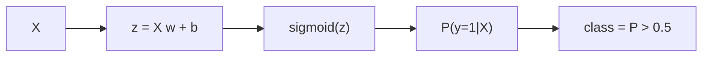

# Logistic Regression

## 이 글에서 다룰 문제

- 0 또는 1을 예측하는데 왜 이름은 회귀일까요?
- 시그모이드는 선형 점수를 어떻게 확률로 바꿀까요?
- 왜 0.5 임계값을 늘 정답처럼 쓰면 안 될까요?
- 정확도 95%가 왜 불균형 데이터에서는 별 의미가 없을까요?
- 실무에서는 정밀도와 재현율 중 무엇을 먼저 봐야 할까요?

로지스틱 회귀는 분류 입문에서 거의 빠지지 않는 모델입니다. 단순하고 빠르며, 출력이 확률이라 해석도 쉽습니다. 그래서 많은 팀이 첫 번째 베이스라인으로 사용합니다. 그런데 입문 단계에서는 이름 때문에 헷갈리고, 실무 단계에서는 임계값과 지표 해석 때문에 다시 한 번 헷갈립니다.

이 글에서는 로지스틱 회귀를 "분류를 위한 확률 모델"이라는 관점으로 정리하겠습니다. 시그모이드, 임계값, 정밀도·재현율, 불균형 데이터에서의 판단 기준을 함께 보면서 왜 이 모델이 오래 살아남았는지 설명하겠습니다.

> 로지스틱 회귀는 클래스 레이블을 바로 예측하는 모델이 아니라, 먼저 확률을 예측한 뒤 임계값으로 클래스를 정하는 모델입니다.

## 왜 중요한가

이진 분류 문제는 생각보다 훨씬 자주 등장합니다. 스팸인지 아닌지, 사기인지 아닌지, 이탈할지 아닐지, 구매할지 아닐지처럼 많은 비즈니스 문제가 결국 "예/아니오" 판단으로 귀결됩니다. 이때 로지스틱 회귀는 단순한 베이스라인을 넘어, 확률 기반 의사결정의 기준점이 됩니다.

또한 이 모델은 설명 가능성이 높습니다. 가중치 방향을 보면 어떤 피처가 양성 확률을 높이는지 감을 잡을 수 있고, `predict_proba` 결과를 후속 시스템이 바로 사용할 수도 있습니다. 그래서 더 복잡한 모델을 쓰더라도 로지스틱 회귀를 먼저 돌려 보는 습관이 실무에서 꽤 유용합니다.

## 한눈에 보는 개념



## 핵심 용어

- **시그모이드**: 아무 실수 값이나 `(0, 1)` 구간의 값으로 바꾸는 함수입니다.
- **확률 출력**: 모델이 클래스 1이라고 믿는 정도입니다.
- **임계값**: 확률을 클래스 레이블로 바꾸는 기준선입니다.
- **정밀도**: 양성이라고 예측한 것 중 실제 양성의 비율입니다.
- **재현율**: 실제 양성 중 모델이 놓치지 않고 잡아낸 비율입니다.

## Before / After

**Before**: 정확도 95%면 충분하다고 생각합니다.

**After**: 정밀도, 재현율, F1, AUC를 함께 보고 임계값까지 조정합니다.

## 5단계로 분류해 보기

### Step 1 — 데이터 준비

이진 분류 예제로 유방암 데이터셋을 사용합니다.

```python
from sklearn.datasets import load_breast_cancer
X, y = load_breast_cancer(return_X_y=True)
```

### Step 2 — 분할과 스케일링

학습용과 평가용을 나누고, 피처 크기를 맞춥니다.

```python
from sklearn.model_selection import train_test_split
from sklearn.preprocessing import StandardScaler
Xtr, Xte, ytr, yte = train_test_split(X, y, test_size=0.2, stratify=y, random_state=42)
sc = StandardScaler().fit(Xtr)
Xtr, Xte = sc.transform(Xtr), sc.transform(Xte)
```

로지스틱 회귀는 선형 모델이므로 스케일 차이에 영향을 받습니다. 스케일링을 하면 최적화가 더 안정적으로 수렴합니다.

### Step 3 — 학습

이제 모델을 학습합니다.

```python
from sklearn.linear_model import LogisticRegression
model = LogisticRegression(max_iter=1000).fit(Xtr, ytr)
```

### Step 4 — 평가

기본 예측 결과를 분류 리포트로 확인합니다.

```python
from sklearn.metrics import classification_report
print(classification_report(yte, model.predict(Xte)))
```

이 보고서에는 정확도뿐 아니라 정밀도, 재현율, F1이 함께 들어 있습니다. 분류 문제에서는 이 조합을 함께 읽는 습관이 중요합니다.

### Step 5 — 임계값 조정

확률 출력에 기준선을 바꿔 가며 결과를 비교합니다.

```python
import numpy as np
prob = model.predict_proba(Xte)[:, 1]
for t in [0.3, 0.5, 0.7]:
    pred = (prob >= t).astype(int)
    print(t, (pred == yte).mean())
```

여기서 중요한 점은 0.5가 법칙이 아니라 기본값이라는 사실입니다. 사기 탐지처럼 양성을 놓치는 비용이 크면 임계값을 낮춰 재현율을 올릴 수 있고, 잘못된 양성 판정 비용이 크면 임계값을 높여 정밀도를 올릴 수 있습니다.

## 이 코드에서 주목할 점

- `predict_proba`는 레이블이 아니라 확률을 반환합니다.
- 임계값은 정밀도와 재현율의 균형을 조절하는 손잡이입니다.
- `StandardScaler`는 수렴을 돕고, 피처 스케일 차이 때문에 특정 변수만 과도하게 영향력을 갖는 일을 줄여 줍니다.

## 실무에서는 이렇게 쓰입니다

스팸 필터링, 사기 탐지, 이탈 예측처럼 다운스트림 시스템이 확률을 필요로 하는 곳에서 로지스틱 회귀는 여전히 유용합니다. 운영 팀은 확률 점수를 받아 후속 규칙 엔진에 넘기고, 제품 팀은 그 점수에 따라 서로 다른 액션을 취할 수 있습니다.

또한 불균형 데이터에서 이 모델은 특히 좋은 교육 도구이기도 합니다. 클래스 가중치, 임계값 조정, 정밀도-재현율 곡선을 통해 "좋은 분류"가 무엇인지 팀과 함께 합의하기 쉽기 때문입니다.

## 시니어 엔지니어는 이렇게 생각합니다

- 임계값은 수학 문제가 아니라 비용 문제입니다.
- 불균형 데이터에서는 정확도보다 정밀도-재현율 곡선을 먼저 봅니다.
- `class_weight` 같은 옵션으로 베이스라인을 빠르게 보강할 수 있습니다.
- 해석 가능성은 모델 단순함의 부산물이 아니라 실무 레버리지입니다.
- 확률을 쓴다면 보정(calibration) 여부도 따로 확인합니다.

## 자주 하는 실수 5가지

1. 원시 확률을 그대로 믿고 보정 여부를 확인하지 않습니다.
2. 임계값을 항상 0.5로 고정합니다.
3. 불균형 데이터에서 정확도만 보고 성능을 판단합니다.
4. 스케일링을 생략합니다.
5. 다중 클래스 문제에서 설정을 명시하지 않고 기본값에만 의존합니다.

## 체크리스트

- [ ] `predict_proba`를 활용해 후속 의사결정을 설계할 수 있습니다.
- [ ] 정밀도와 재현율을 함께 읽을 수 있습니다.
- [ ] 임계값을 비용 관점에서 정해야 한다는 점을 이해했습니다.
- [ ] 스케일링이 왜 필요한지 설명할 수 있습니다.

## 연습 문제

1. 임계값을 0.1부터 0.9까지 바꿔 가며 정밀도와 재현율을 비교해 보세요.
2. `class_weight="balanced"`를 적용했을 때 결과가 어떻게 달라지는지 확인해 보세요.
3. 다중 클래스 데이터셋에 `multi_class="multinomial"` 설정을 적용해 보세요.

## 정리 및 다음 글

로지스틱 회귀는 분류의 출발점입니다. 선형 점수를 시그모이드로 확률로 바꾸고, 그 확률에 임계값을 적용해 최종 판단을 내린다는 구조를 이해하면 이름 때문에 생기는 혼란도 줄어듭니다.

특히 기억할 점은 세 가지입니다. 첫째, 로지스틱 회귀는 확률 모델입니다. 둘째, 0.5 임계값은 절대 기준이 아닙니다. 셋째, 불균형 데이터에서는 정확도만 보면 쉽게 속습니다. 다음 글에서는 비선형 경계를 만들 수 있는 Decision Tree와 Random Forest를 살펴보겠습니다.

<!-- toc:begin -->
- [Machine Learning이란 무엇인가?](./01-what-is-machine-learning.md)
- [지도학습과 비지도학습](./02-supervised-and-unsupervised.md)
- [Train/Test Split](./03-train-test-split.md)
- [Linear Regression](./04-linear-regression.md)
- **Logistic Regression (현재 글)**
- Decision Tree와 Random Forest (예정)
- Clustering (예정)
- Overfitting과 Regularization (예정)
- Model Evaluation (예정)
- ML 프로젝트 전체 흐름 (예정)
<!-- toc:end -->

## 참고 자료

- [scikit-learn — Logistic Regression](https://scikit-learn.org/stable/modules/linear_model.html#logistic-regression)
- [scikit-learn — Classification metrics](https://scikit-learn.org/stable/modules/model_evaluation.html#classification-metrics)
- [Google — Classification thresholds](https://developers.google.com/machine-learning/crash-course/classification/thresholding)
- [StatQuest — Logistic Regression](https://www.youtube.com/watch?v=yIYKR4sgzI8)

Tags: MachineLearning, LogisticRegression, Classification, scikit-learn, Beginner
