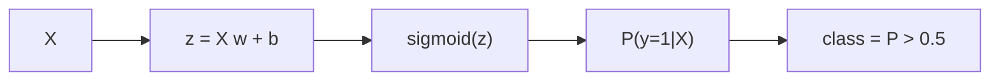

# Logistic Regression

> Machine Learning 101 시리즈 (5/10)


## 이 글에서 다룰 문제

*분류 베이스라인* 의 표준. *해석 가능* 하고 *빠르며*, *불균형 데이터* 에서도 *임계값 조정* 으로 강력.

## 전체 흐름


## Before/After

**Before**: *“정확도 95%”* — *불균형* 일 때 *무의미*.

**After**: *정밀도/재현율/F1/AUC* 를 *함께* 본다.

## 5단계 분류

### 1단계 — 데이터

```python
from sklearn.datasets import load_breast_cancer
X, y = load_breast_cancer(return_X_y=True)
```

### 2단계 — 분할 + 스케일

```python
from sklearn.model_selection import train_test_split
from sklearn.preprocessing import StandardScaler
Xtr, Xte, ytr, yte = train_test_split(X, y, test_size=0.2, stratify=y, random_state=42)
sc = StandardScaler().fit(Xtr)
Xtr, Xte = sc.transform(Xtr), sc.transform(Xte)
```

### 3단계 — 학습

```python
from sklearn.linear_model import LogisticRegression
model = LogisticRegression(max_iter=1000).fit(Xtr, ytr)
```

### 4단계 — 평가

```python
from sklearn.metrics import classification_report
print(classification_report(yte, model.predict(Xte)))
```

### 5단계 — 임계값 조정

```python
import numpy as np
prob = model.predict_proba(Xte)[:, 1]
for t in [0.3, 0.5, 0.7]:
    pred = (prob >= t).astype(int)
    print(t, (pred == yte).mean())
```

## 이 코드에서 주목할 점

- *predict_proba* 는 *확률* 을 반환.
- *임계값* 이 *정밀도/재현율* 의 *트레이드오프*.
- *StandardScaler* 가 *수렴* 을 돕는다.

## 자주 하는 실수 5가지

1. ***확률 보정* 없이 *확률 그대로* 사용.**
2. ***임계값* 을 *항상 0.5* 로 두기.**
3. ***불균형 데이터* 에 *정확도* 만 보기.**
4. ***스케일링* 누락.**
5. ***다중 클래스* 에 *기본 설정* 그대로 사용 (multinomial 명시).**

## 실무에서는 이렇게 쓰입니다

스팸/사기/이탈 — *확률* 이 필요한 *모든 의사결정 시스템*.

## 체크리스트

- [ ] *predict_proba* 를 사용한다.
- [ ] *정밀도/재현율* 을 *함께* 본다.
- [ ] *임계값* 을 *비용* 으로 정한다.
- [ ] *스케일링* 을 *항상* 적용.

## 정리 및 다음 단계

Logistic Regression 은 *분류의 기본기* 입니다. 다음 글에서는 *Decision Tree와 Random Forest* 로 *비선형 모델* 을 다룹니다.

<!-- toc:begin -->
- [Machine Learning이란 무엇인가?](./01-what-is-machine-learning.md)
- [지도학습과 비지도학습](./02-supervised-and-unsupervised.md)
- [Train/Test Split](./03-train-test-split.md)
- [Linear Regression](./04-linear-regression.md)
- **Logistic Regression (현재 글)**
- Decision Tree와 Random Forest (예정)
- Clustering (예정)
- Overfitting과 Regularization (예정)
- Model Evaluation (예정)
- ML 프로젝트 전체 흐름 (예정)
<!-- toc:end -->

## 참고 자료

- [scikit-learn — Logistic Regression](https://scikit-learn.org/stable/modules/linear_model.html#logistic-regression)
- [scikit-learn — Classification metrics](https://scikit-learn.org/stable/modules/model_evaluation.html#classification-metrics)
- [Google — Classification thresholds](https://developers.google.com/machine-learning/crash-course/classification/thresholding)
- [StatQuest — Logistic Regression](https://www.youtube.com/watch?v=yIYKR4sgzI8)

Tags: MachineLearning, LogisticRegression, Classification, scikit-learn, Beginner
