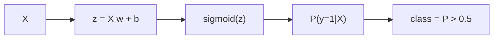

# Logistic Regression

0 또는 1을 예측하는데 왜 이름은 회귀인지, 입문 단계에서 가장 많이 받는 질문 중 하나입니다. 이 혼란은 자연스럽습니다. 로지스틱 회귀는 클래스를 곧바로 내놓는 모델처럼 보이지만, 실제로는 먼저 연속적인 확률을 계산한 뒤 임계값을 기준으로 분류를 결정합니다. 그래서 분류 문제를 다루지만 내부 동작은 확률 모델로 이해하는 편이 맞습니다.

이 글은 Machine Learning 101 시리즈의 다섯 번째 글입니다. 여기서는 시그모이드 함수, 임계값, 정밀도·재현율·F1의 의미를 함께 보면서 로지스틱 회귀를 분류의 가장 기본적인 기준선으로 정리해 보겠습니다.

## 이 글에서 다룰 문제

- 0 또는 1을 예측하는데 왜 이름은 회귀일까요?
- 시그모이드는 선형 점수를 어떻게 확률로 바꿀까요?
- 왜 0.5 임계값을 항상 정답처럼 쓰면 안 될까요?
- 정밀도, 재현율, F1은 각각 무엇을 말해 줄까요?
- 다중 클래스 분류로는 어떻게 확장할 수 있을까요?

> 로지스틱 회귀는 먼저 연속적인 확률을 예측하고, 그다음 임계값으로 클래스를 결정합니다. 분류 모델을 점수판이 아니라 확률 엔진으로 봐야 이후 판단 기준도 자연스럽게 정리됩니다.

## 왜 중요한가

로지스틱 회귀는 분류 문제의 표준 베이스라인입니다. 해석이 가능하고 빠르며, 임계값을 조정하면 불균형 데이터에서도 꽤 경쟁력 있게 동작합니다.

## 한눈에 보는 개념



## 핵심 용어

- **시그모이드**: 어떤 실수 값이든 `(0, 1)` 구간으로 매핑합니다.
- 확률: 클래스 1일 것이라는 모델의 믿음입니다.
- 임계값: 확률을 클래스 레이블로 바꾸는 기준선입니다.
- 정밀도: 양성이라고 예측한 것 중 실제 양성의 비율입니다.
- 재현율: 실제 양성 중 모델이 잡아낸 비율입니다.

## Before/After

**Before**: "정확도 95%"라는 숫자만 보고 만족합니다. 불균형 데이터에서는 거의 의미가 없습니다.

**After**: 정밀도, 재현율, F1, AUC를 함께 보고 임계값까지 조정합니다.

## 실습: 5단계로 보는 분류

### Step 1 — 데이터

```python
from sklearn.datasets import load_breast_cancer
X, y = load_breast_cancer(return_X_y=True)
```

### Step 2 — 분할과 스케일링

```python
from sklearn.model_selection import train_test_split
from sklearn.preprocessing import StandardScaler
Xtr, Xte, ytr, yte = train_test_split(X, y, test_size=0.2, stratify=y, random_state=42)
sc = StandardScaler().fit(Xtr)
Xtr, Xte = sc.transform(Xtr), sc.transform(Xte)
```

### Step 3 — 학습

```python
from sklearn.linear_model import LogisticRegression
model = LogisticRegression(max_iter=1000).fit(Xtr, ytr)
```

### Step 4 — 평가

```python
from sklearn.metrics import classification_report
print(classification_report(yte, model.predict(Xte)))
```

### Step 5 — 임계값 조정

```python
prob = model.predict_proba(Xte)[:, 1]
for t in [0.3, 0.5, 0.7]:
    pred = (prob >= t).astype(int)
    print(t, (pred == yte).mean())
```

## 이 코드에서 먼저 봐야 할 점

- `predict_proba`는 레이블이 아니라 확률을 반환합니다.
- 임계값은 정밀도-재현율 절충을 조절하는 손잡이입니다.
- `StandardScaler`는 최적화가 수렴하는 데 도움을 줍니다.

## 자주 하는 실수 5가지

1. **원시 확률이 이미 보정되어 있다고 가정합니다.**
2. **항상 0.5를 임계값으로 사용합니다.**
3. **불균형 데이터에서 정확도만 보고합니다.**
4. **피처 스케일링을 빼먹습니다.**
5. **다중 클래스에서 명시적 multinomial 설정 없이 기본값만 믿습니다.**

## 실무에서는 이렇게 나타납니다

스팸 필터링, 사기 탐지, 이탈 예측처럼 다운스트림 시스템이 **비용을 저울질해야 하는 문제**에서는 확률 출력이 필수입니다. 그래서 로지스틱 회귀는 단순한 분류 모델이 아니라 운영 의사결정의 입력 신호가 됩니다.

## 시니어 엔지니어는 이렇게 생각합니다

- 임계값은 **비즈니스 비용**이 결정합니다.
- 항상 정밀도-재현율 곡선을 그립니다.
- 불균형에는 class weight를 검토합니다.
- 해석 가능성은 중요한 레버리지입니다.
- 확률 보정은 별도로 검증합니다.

## 체크리스트

- [ ] 후속 의사결정에 `predict_proba`를 사용합니다.
- [ ] 정밀도와 재현율을 함께 보고합니다.
- [ ] 비용 기준으로 임계값을 정합니다.
- [ ] 항상 피처를 스케일링합니다.

## 연습 문제

1. 임계값을 0.1부터 0.9까지 바꿔 가며 정밀도와 재현율을 그려 보세요.
2. `class_weight="balanced"`를 적용했을 때 결과를 비교해 보세요.
3. 다중 클래스 데이터셋에 `multi_class="multinomial"`을 적용해 보세요.

## 정리

로지스틱 회귀는 분류의 기초입니다. 선형 점수를 시그모이드로 확률로 바꾸고, 그 확률에 임계값을 적용해 최종 클래스를 정한다는 구조를 이해하면 이름 때문에 생기는 혼란도 사라집니다.

이 글에서 기억할 핵심은 네 가지입니다. 첫째, 로지스틱 회귀는 확률 모델입니다. 둘째, 0.5는 기본 임계값일 뿐 절대 기준이 아닙니다. 셋째, 불균형 데이터에서는 정확도만으로는 부족합니다. 넷째, 분류 문제는 결국 비용 구조에 맞춰 임계값을 조정해야 합니다.

다음 글에서는 비선형 모델의 대표 예시인 Decision Tree와 Random Forest를 살펴보겠습니다.

<!-- toc:begin -->
- [Machine Learning이란 무엇인가?](./01-what-is-machine-learning.md)
- [지도학습과 비지도학습](./02-supervised-and-unsupervised.md)
- [Train/Test Split](./03-train-test-split.md)
- [Linear Regression](./04-linear-regression.md)
- **Logistic Regression (현재 글)**
- Decision Tree와 Random Forest (예정)
- Clustering (예정)
- Overfitting과 Regularization (예정)
- Model Evaluation (예정)
- ML 프로젝트 전체 흐름 (예정)
<!-- toc:end -->

## 참고 자료

- [scikit-learn — Logistic Regression](https://scikit-learn.org/stable/modules/linear_model.html#logistic-regression)
- [scikit-learn — Classification metrics](https://scikit-learn.org/stable/modules/model_evaluation.html#classification-metrics)
- [Google — Classification thresholds](https://developers.google.com/machine-learning/crash-course/classification/thresholding)
- [StatQuest — Logistic Regression](https://www.youtube.com/watch?v=yIYKR4sgzI8)

Tags: MachineLearning, LogisticRegression, Classification, scikit-learn, Beginner
