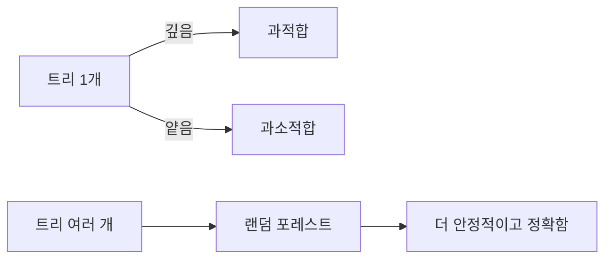

# Decision Tree와 Random Forest

## 이 글에서 다룰 문제

- if-else 규칙 덩어리 같은 결정 트리가 왜 강력할까요?
- 단일 트리는 왜 쉽게 과적합될까요?
- 랜덤 포레스트는 여러 트리를 묶어서 무엇을 개선할까요?
- `max_depth`와 `n_estimators`는 각각 어떤 역할을 할까요?
- feature importance를 어디까지 믿어야 할까요?

표 형태 데이터에서는 여전히 트리 계열 모델이 강합니다. 고객 정보, 거래 로그, 클릭 기록처럼 열과 행으로 잘 정리된 데이터에서는 복잡한 신경망보다 결정 트리나 랜덤 포레스트가 더 빠르고 더 강한 베이스라인이 되는 경우가 많습니다. 그래서 많은 실무 팀이 딥러닝으로 가기 전에 먼저 트리 계열을 확인합니다.

이 글에서는 단일 결정 트리의 장단점부터 시작해, 랜덤 포레스트가 어떻게 분산을 줄이며 더 안정적인 성능을 내는지 설명하겠습니다. 코드 예제를 통해 과적합 제어, 앙상블의 의미, 피처 중요도의 한계까지 함께 보겠습니다.

> 결정 트리는 해석 가능한 비선형 모델이고, 랜덤 포레스트는 많은 트리를 묶어 안정성과 정확도를 높인 앙상블입니다.

## 왜 중요한가

트리 모델은 피처 스케일링이 거의 필요 없고, 비선형 관계를 자연스럽게 잡아내며, 표 데이터에서 강한 기본 성능을 냅니다. 그래서 데이터가 복잡하지 않아도 빠르게 쓸 수 있고, 비교 기준으로도 유용합니다.

다만 단일 트리는 조금만 깊어져도 훈련 데이터를 지나치게 외우기 쉽습니다. 그래서 입문자는 "트리는 해석 가능하다"는 장점만 기억하고, 실제로는 높은 분산 때문에 실전에서 흔들리는 모습을 놓치기 쉽습니다. 랜덤 포레스트는 바로 그 문제를 해결하려는 방향에서 나왔습니다.

## 한눈에 보는 개념



## 핵심 용어

- **분할(Split)**: 하나의 피처와 임계값으로 데이터를 둘로 나누는 연산입니다.
- **Gini / Entropy**: 분할의 순도를 계산하는 대표 기준입니다.
- **Pruning**: 트리 깊이, 리프 크기 등을 제한해 과적합을 줄이는 방법입니다.
- **Bagging**: 부트스트랩 샘플을 여러 번 뽑아 모델을 평균내는 방식입니다.
- **Feature importance**: 분할에 기여한 정도를 수치화한 값입니다.

## Before / After

**Before**: 트리는 해석 가능하니 단일 트리 하나면 충분하다고 생각합니다.

**After**: 단일 트리는 분산이 크다는 점을 이해하고, 랜덤 포레스트로 안정성을 먼저 확보합니다.

## 5단계로 살펴보기

### Step 1 — 데이터 준비

분류 예제로 유방암 데이터셋을 사용합니다.

```python
from sklearn.datasets import load_breast_cancer
X, y = load_breast_cancer(return_X_y=True)
```

### Step 2 — 데이터 분할

학습용과 테스트용을 나눕니다.

```python
from sklearn.model_selection import train_test_split
Xtr, Xte, ytr, yte = train_test_split(X, y, test_size=0.2, stratify=y, random_state=42)
```

### Step 3 — 단일 결정 트리

깊이를 제한한 트리를 먼저 학습합니다.

```python
from sklearn.tree import DecisionTreeClassifier
tree = DecisionTreeClassifier(max_depth=4, random_state=0).fit(Xtr, ytr)
print("tree:", tree.score(Xte, yte))
```

`max_depth`를 제한하는 이유는 분명합니다. 트리를 끝까지 키우면 훈련 데이터에 맞춘 세세한 규칙까지 모두 외우기 쉽기 때문입니다.

### Step 4 — Random Forest

이제 여러 트리를 묶어 봅니다.

```python
from sklearn.ensemble import RandomForestClassifier
rf = RandomForestClassifier(n_estimators=200, random_state=0).fit(Xtr, ytr)
print("rf  :", rf.score(Xte, yte))
```

랜덤 포레스트는 데이터를 조금씩 다르게 뽑고, 피처도 일부만 보게 하면서 트리를 여러 개 학습합니다. 그 결과 개별 트리의 요동을 평균내어 더 견고한 예측을 만듭니다.

### Step 5 — 피처 중요도

모델이 어떤 피처를 자주 사용했는지 확인합니다.

```python
import numpy as np
order = np.argsort(rf.feature_importances_)[::-1][:5]
print("top:", order)
```

이 수치는 유용한 출발점이지만, 곧바로 인과 해석으로 뛰어가면 위험합니다. 상관된 피처가 많으면 중요도가 분산될 수 있고, 중요한 피처가 낮게 보일 수도 있습니다.

## 이 코드에서 주목할 점

- `max_depth`는 과적합을 제어하는 가장 직접적인 손잡이입니다.
- `n_estimators`를 늘리면 대체로 더 안정적이지만, 일정 시점부터는 수확 체감이 나타납니다.
- `feature_importances_`는 상관 피처가 많을 때 해석이 흔들릴 수 있습니다.

## 실무에서는 이렇게 쓰입니다

신용 평가, 클릭 예측, 추천 시스템의 피처 모델처럼 표 데이터 중심 작업에서 랜덤 포레스트와 그 친척들인 GBDT 계열은 오랫동안 주력 모델이었습니다. 빠르게 성능을 확인하고, 피처 엔지니어링 효과를 점검하고, 팀 내 공통 베이스라인을 세우는 데 특히 좋습니다.

물론 최신 실무에서는 XGBoost, LightGBM, CatBoost 같은 그래디언트 부스팅 모델이 더 강한 경우가 많습니다. 그래도 랜덤 포레스트는 구현이 단순하고 안정적이며, 입문자가 앙상블 개념을 익히기에 좋은 출발점입니다.

## 시니어 엔지니어는 이렇게 생각합니다

- 랜덤 포레스트는 "베이스라인 + 조금 더"의 기본 선택지입니다.
- 표 데이터에서는 GBDT 비교를 거의 항상 함께 봅니다.
- 단순 중요도보다 permutation importance가 더 믿을 만한 경우가 많습니다.
- 개별 예측 설명이 필요하면 SHAP 같은 도구를 붙입니다.
- 범주형 피처 처리는 모델별 특성을 따로 고려합니다.

## 자주 하는 실수 5가지

1. 깊이 제한 없이 단일 트리만 사용합니다.
2. feature importance를 인과 관계로 읽습니다.
3. 트리에 표준화가 필요하다고 오해합니다.
4. 훈련 정확도 100%를 보고 안심합니다.
5. GBDT 계열과의 비교를 생략합니다.

## 체크리스트

- [ ] `max_depth` 같은 복잡도 제어 값을 명시할 수 있습니다.
- [ ] 포레스트에서 트리 개수가 안정성에 어떤 영향을 주는지 이해했습니다.
- [ ] feature importance의 한계를 설명할 수 있습니다.
- [ ] 트리 베이스라인 뒤에 GBDT 비교가 왜 필요한지 알고 있습니다.

## 연습 문제

1. `max_depth`를 1부터 20까지 바꿔 가며 테스트 점수 변화를 기록해 보세요.
2. 랜덤 포레스트와 그래디언트 부스팅 모델을 같은 데이터셋에서 비교해 보세요.
3. 기본 importance와 permutation importance가 어떻게 다른지 확인해 보세요.

## 정리 및 다음 글

결정 트리는 규칙 기반 직관이 뚜렷한 모델이지만, 단일 트리만으로는 쉽게 흔들립니다. 랜덤 포레스트는 많은 트리를 묶어 그 흔들림을 줄이고, 표 데이터에서 강한 베이스라인을 제공합니다.

이 글에서 기억할 핵심은 세 가지입니다. 첫째, 트리는 비선형 관계를 잘 잡지만 과적합되기 쉽습니다. 둘째, 랜덤 포레스트는 여러 트리의 평균으로 분산을 줄입니다. 셋째, 중요도 수치는 출발점이지 인과 결론이 아닙니다. 다음 글에서는 비지도학습 대표 주제인 Clustering을 살펴보겠습니다.

<!-- toc:begin -->
- [Machine Learning이란 무엇인가?](./01-what-is-machine-learning.md)
- [지도학습과 비지도학습](./02-supervised-and-unsupervised.md)
- [Train/Test Split](./03-train-test-split.md)
- [Linear Regression](./04-linear-regression.md)
- [Logistic Regression](./05-logistic-regression.md)
- **Decision Tree와 Random Forest (현재 글)**
- Clustering (예정)
- Overfitting과 Regularization (예정)
- Model Evaluation (예정)
- ML 프로젝트 전체 흐름 (예정)
<!-- toc:end -->

## 참고 자료

- [scikit-learn — Decision Trees](https://scikit-learn.org/stable/modules/tree.html)
- [scikit-learn — Ensemble methods](https://scikit-learn.org/stable/modules/ensemble.html)
- [Random Forests — Breiman (2001)](https://link.springer.com/article/10.1023/A:1010933404324)
- [StatQuest — Random Forests](https://www.youtube.com/watch?v=J4Wdy0Wc_xQ)

Tags: MachineLearning, DecisionTree, RandomForest, Ensemble, scikit-learn
