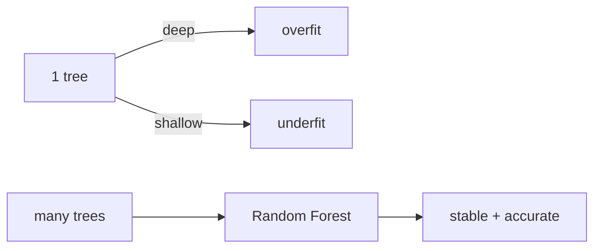

# Decision Tree와 Random Forest

거대한 `if-else` 규칙 묶음이 때로는 신경망보다 표 데이터에서 더 잘 동작한다는 사실이 처음에는 이상하게 느껴질 수 있습니다. 하지만 고객 정보, 거래 로그, 클릭 기록처럼 열과 행으로 정리된 데이터에서는 트리 계열이 여전히 매우 강한 베이스라인입니다. 이유는 단순합니다. 비선형 관계를 자연스럽게 잡고, 전처리 요구도 비교적 적기 때문입니다.

이 글은 Machine Learning 101 시리즈의 여섯 번째 글입니다. 여기서는 결정 트리의 분할 기준, 단일 트리의 과적합 문제, 그리고 랜덤 포레스트가 여러 트리를 묶어 어떻게 더 안정적인 앙상블이 되는지 정리하겠습니다.

## 이 글에서 다룰 문제

- 결정 트리는 피처 공간을 어떤 기준으로 나눌까요?
- Gini와 entropy는 무엇을 측정할까요?
- 단일 트리는 왜 쉽게 과적합될까요?
- 랜덤 포레스트는 bagging으로 무엇을 개선할까요?
- feature importance는 어디까지 믿어야 할까요?

> 결정 트리는 해석 가능한 비선형 모델입니다. 랜덤 포레스트는 그런 트리를 여러 개 모아 분산을 줄인, 더 견고한 앙상블입니다.

## 왜 중요한가

랜덤 포레스트와 그래디언트 부스팅 트리는 지금도 표 데이터에서 강력한 기본 선택지입니다. 딥러닝으로 가기 전에 반드시 비교해야 할 베이스라인입니다.

## 한눈에 보는 개념



## 핵심 용어

- **분할(Split)**: 하나의 피처와 임계값으로 데이터를 나눕니다.
- **Gini / entropy**: 불순도를 재는 기준입니다.
- **Pruning**: 깊이나 리프 크기를 제한합니다.
- **Bagging**: 부트스트랩 샘플을 평균내는 방식입니다.
- **Feature importance**: 각 피처가 분할에 기여한 정도입니다.

## Before/After

**Before**: "트리는 해석 가능하다"에서 설명이 끝납니다. 단일 트리는 분산이 매우 큽니다.

**After**: 포레스트로 분산을 줄이고, 설명은 SHAP 같은 도구까지 포함해 생각합니다.

## 실습: 5단계로 보는 트리와 포레스트

### Step 1 — 데이터

```python
from sklearn.datasets import load_breast_cancer
X, y = load_breast_cancer(return_X_y=True)
```

### Step 2 — 분할

```python
from sklearn.model_selection import train_test_split
Xtr, Xte, ytr, yte = train_test_split(X, y, test_size=0.2, stratify=y, random_state=42)
```

### Step 3 — 단일 트리

```python
from sklearn.tree import DecisionTreeClassifier
tree = DecisionTreeClassifier(max_depth=4, random_state=0).fit(Xtr, ytr)
print("tree:", tree.score(Xte, yte))
```

### Step 4 — Random Forest

```python
from sklearn.ensemble import RandomForestClassifier
rf = RandomForestClassifier(n_estimators=200, random_state=0).fit(Xtr, ytr)
print("rf  :", rf.score(Xte, yte))
```

### Step 5 — 피처 중요도

```python
import numpy as np
order = np.argsort(rf.feature_importances_)[::-1][:5]
print("top:", order)
```

## 이 코드에서 먼저 봐야 할 점

- `max_depth`는 과적합을 막는 가장 중요한 손잡이입니다.
- `n_estimators`가 많을수록 더 안정적이지만, 증가 효과는 점점 줄어듭니다.
- `feature_importances_`는 상관된 피처들 사이에 기여도를 나눠 가집니다.

## 자주 하는 실수 5가지

1. **깊이 제한 없이 하나의 깊은 트리만 사용합니다.**
2. **feature importance를 인과 해석으로 읽습니다.**
3. **트리에는 필요하지 않은 표준화를 습관적으로 합니다.**
4. **훈련 정확도 100%를 믿고 안심합니다.**
5. **그래디언트 부스팅 트리와의 비교를 건너뜁니다.**

## 실무에서는 이렇게 나타납니다

신용 점수, 클릭 예측, 추천 피처 모델처럼 표 데이터 중심의 ML 시스템은 지금도 트리 앙상블 위에서 돌아갑니다. 여전히 **tabular ML의 주력 모델**입니다.

## 시니어 엔지니어는 이렇게 생각합니다

- 랜덤 포레스트는 **베이스라인 + 약간 더**입니다.
- 보통은 그래디언트 부스팅이 더 강합니다.
- permutation importance가 더 믿을 만한 경우가 많습니다.
- 인스턴스 수준 해석이 필요하면 SHAP를 더합니다.
- 범주형 피처 처리는 모델 특성에 맞춰 따로 봅니다.

## 체크리스트

- [ ] `max_depth`를 명시적으로 설정합니다.
- [ ] 포레스트에 충분한 개수의 트리를 사용합니다.
- [ ] feature importance의 한계를 알고 있습니다.
- [ ] GBDT 모델과 비교합니다.

## 연습 문제

1. `max_depth`를 1부터 20까지 바꿔 가며 테스트 점수를 그려 보세요.
2. 랜덤 포레스트와 그래디언트 부스팅을 비교해 보세요.
3. 기본 importance와 permutation importance를 비교해 보세요.

## 정리

트리와 포레스트는 표 데이터 ML의 주력 도구입니다. 단일 트리는 해석이 쉽지만 흔들리기 쉽고, 랜덤 포레스트는 여러 트리의 평균으로 그 흔들림을 줄입니다.

이 글에서 기억할 핵심은 네 가지입니다. 첫째, 결정 트리는 분할 기준으로 피처 공간을 잘라 나갑니다. 둘째, 깊은 단일 트리는 과적합되기 쉽습니다. 셋째, 랜덤 포레스트는 bagging으로 분산을 줄입니다. 넷째, feature importance는 유용하지만 인과 설명은 아닙니다.

다음 글에서는 비지도학습 대표 주제인 Clustering으로 넘어가겠습니다.

<!-- toc:begin -->
- [Machine Learning이란 무엇인가?](./01-what-is-machine-learning.md)
- [지도학습과 비지도학습](./02-supervised-and-unsupervised.md)
- [Train/Test Split](./03-train-test-split.md)
- [Linear Regression](./04-linear-regression.md)
- [Logistic Regression](./05-logistic-regression.md)
- **Decision Tree와 Random Forest (현재 글)**
- Clustering (예정)
- Overfitting과 Regularization (예정)
- Model Evaluation (예정)
- ML 프로젝트 전체 흐름 (예정)
<!-- toc:end -->

## 참고 자료

- [scikit-learn — Decision Trees](https://scikit-learn.org/stable/modules/tree.html)
- [scikit-learn — Ensemble methods](https://scikit-learn.org/stable/modules/ensemble.html)
- [Random Forests — Breiman (2001)](https://link.springer.com/article/10.1023/A:1010933404324)
- [StatQuest — Random Forests](https://www.youtube.com/watch?v=J4Wdy0Wc_xQ)

Tags: MachineLearning, DecisionTree, RandomForest, Ensemble, scikit-learn
