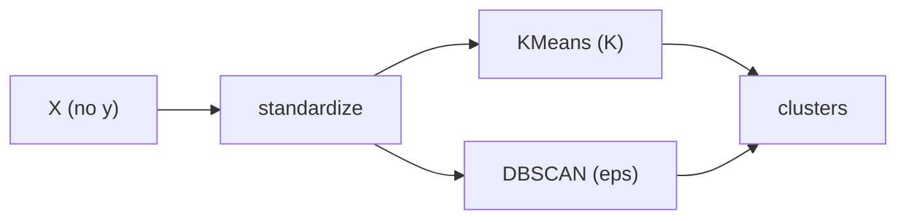

# Clustering

> Machine Learning 101 시리즈 (7/10)

<!-- a-grade-intro:begin -->

**핵심 질문**: *정답이 없는데* — *어떻게 군집* 이 *맞다고* 판단할까요?

> *Clustering 은 *데이터의 잠재 구조* 를 *유사도* 로 *드러내는* 비지도학습입니다.*

<!-- a-grade-intro:end -->

## 이 글에서 배울 것

- *KMeans* 와 *DBSCAN* 의 차이
- *K 결정* 방법 (Elbow / Silhouette)
- *표준화* 의 *결정적* 영향
- *군집 결과 해석* 의 책임
- 흔한 함정 5가지

## 왜 중요한가

세그먼테이션, 이상치 탐지, 데이터 *EDA* 의 시작점. *지도학습 전 단계* 에 자주 등장.

## 개념 한눈에 보기



## 핵심 용어 정리

- **KMeans**: *K 개의 중심점*.
- **DBSCAN**: *밀도 기반*.
- **Inertia**: *중심까지의 거리합*.
- **Silhouette**: *응집도/분리도*.
- **Elbow**: *K 증가 시* *기울기 꺾임*.

## Before/After

**Before**: *“K=3, 끝”* — *근거* 없음.

**After**: *Elbow + Silhouette + 도메인* 으로 *K 결정*.

## 실습: 5단계 군집

### 1단계 — 데이터

```python
from sklearn.datasets import load_iris
from sklearn.preprocessing import StandardScaler
X = StandardScaler().fit_transform(load_iris().data)
```

### 2단계 — KMeans

```python
from sklearn.cluster import KMeans
km = KMeans(n_clusters=3, n_init=10, random_state=0).fit(X)
print("inertia:", km.inertia_)
```

### 3단계 — Silhouette

```python
from sklearn.metrics import silhouette_score
print("sil:", silhouette_score(X, km.labels_))
```

### 4단계 — Elbow

```python
ks = list(range(2, 8))
scores = [KMeans(n_clusters=k, n_init=10, random_state=0).fit(X).inertia_ for k in ks]
print(list(zip(ks, scores)))
```

### 5단계 — DBSCAN

```python
from sklearn.cluster import DBSCAN
db = DBSCAN(eps=0.5, min_samples=5).fit(X)
print("labels:", set(db.labels_))
```

## 이 코드에서 주목할 점

- *KMeans* 는 *K 명시*, *DBSCAN* 은 *eps 명시*.
- *표준화* 가 *결과* 를 완전히 바꿈.
- *DBSCAN* 의 *-1* 은 *노이즈*.

## 자주 하는 실수 5가지

1. ***표준화* 없이 *거리 기반* 사용.**
2. ***K* 를 *시각적 검증* 없이 결정.**
3. ***KMeans* 가 *볼록 군집* 만 잘 잡음을 잊음.**
4. ***군집 = 정답* 으로 해석.**
5. ***DBSCAN eps* 를 *데이터 스케일* 무시하고 고정.**

## 실무에서는 이렇게 쓰입니다

고객 세그먼테이션, 이미지 색상 양자화, 이상치 탐지 — *비지도 EDA* 의 표준.

## 시니어 엔지니어는 이렇게 생각합니다

- *클러스터* 는 *가설* 일 뿐.
- *실측 검증* 으로 *유의성* 평가.
- *시각화* 가 *결정의 근거*.
- *밀도 기반* 은 *이상치* 에 강함.
- *비즈니스 의미* 가 *K* 를 결정.

## 체크리스트

- [ ] *표준화* 를 적용한다.
- [ ] *Elbow + Silhouette* 를 *함께* 본다.
- [ ] *DBSCAN* 의 *노이즈* 를 안다.
- [ ] *결과* 를 *가설* 로 해석한다.

## 연습 문제

1. *K* 를 2~7 로 바꿔 *Silhouette* 를 비교하세요.
2. *표준화 유/무* 의 *KMeans* 결과 차이를 보세요.
3. *DBSCAN eps* 를 0.3, 0.5, 1.0 으로 *바꿔* 군집 수를 비교하세요.

## 정리 및 다음 단계

클러스터링은 *데이터의 잠재 구조* 를 드러냅니다. 다음 글에서는 *Overfitting과 Regularization* 으로 *모델의 한계* 를 다룹니다.

<!-- toc:begin -->
- [Machine Learning이란 무엇인가?](./01-what-is-machine-learning.md)
- [지도학습과 비지도학습](./02-supervised-and-unsupervised.md)
- [Train/Test Split](./03-train-test-split.md)
- [Linear Regression](./04-linear-regression.md)
- [Logistic Regression](./05-logistic-regression.md)
- [Decision Tree와 Random Forest](./06-decision-tree-and-random-forest.md)
- **Clustering (현재 글)**
- Overfitting과 Regularization (예정)
- Model Evaluation (예정)
- ML 프로젝트 전체 흐름 (예정)
<!-- toc:end -->

## 참고 자료

- [scikit-learn — Clustering](https://scikit-learn.org/stable/modules/clustering.html)
- [scikit-learn — Silhouette analysis](https://scikit-learn.org/stable/auto_examples/cluster/plot_kmeans_silhouette_analysis.html)
- [DBSCAN — Ester et al. (1996)](https://www.aaai.org/Papers/KDD/1996/KDD96-037.pdf)
- [StatQuest — KMeans](https://www.youtube.com/watch?v=4b5d3muPQmA)

Tags: MachineLearning, Clustering, KMeans, DBSCAN, UnsupervisedLearning
