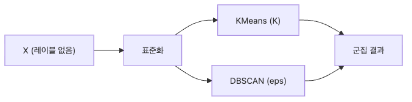

# Clustering

레이블이 없는 데이터에서 군집을 찾는 일은 분류보다 더 애매하게 느껴질 수 있습니다. 정답이 없으니 점수가 높다고 바로 안심할 수도 없고, 반대로 숫자가 조금 낮다고 틀렸다고 말하기도 어렵기 때문입니다. 그래서 군집화는 알고리즘 자체보다도 결과를 어떻게 해석할지까지 함께 생각해야 하는 주제입니다.

이 글은 Machine Learning 101 시리즈의 일곱 번째 글입니다. 여기서는 KMeans와 DBSCAN의 차이, `K`를 고르는 감각, 표준화가 군집 결과를 왜 바꿔 놓는지, 그리고 군집을 왜 정답이 아니라 가설로 봐야 하는지를 정리하겠습니다.

## 이 글에서 다룰 문제

- 정답 레이블이 없는데 군집이 좋은지 어떻게 판단할까요?
- KMeans와 DBSCAN은 어떤 상황에서 다르게 써야 할까요?
- `K`는 어떤 기준으로 정해야 할까요?
- 왜 표준화가 군집화 결과를 크게 바꿀까요?
- 군집 결과를 왜 정답이 아니라 가설로 해석해야 할까요?

> 클러스터링은 유사성을 통해 데이터의 잠재 구조를 드러냅니다. 하지만 검증은 지표만으로 끝나지 않습니다. **숫자와 해석 판단이 함께 들어가야** 비로소 의미 있는 결과가 됩니다.

## 왜 중요한가

군집화는 세그먼테이션, 이상 탐지, 탐색적 데이터 분석의 기본 도구입니다. 많은 경우 지도학습 모델보다 먼저 등장합니다.

## 한눈에 보는 개념



*표준화된 입력을 KMeans나 DBSCAN에 넣으면 서로 다른 기준으로 데이터의 잠재 구조를 묶어 볼 수 있습니다.*

## 핵심 용어

- **KMeans**: 군집 내 거리 합이 작아지도록 `K`개의 중심점을 찾습니다.
- **DBSCAN**: 밀도를 기준으로 군집을 만들고 노이즈를 분리합니다.
- **Inertia**: 중심점까지의 제곱거리 합입니다.
- **Silhouette**: 응집도와 분리도를 함께 보는 지표입니다.
- **Elbow**: `K`를 더 늘려도 개선 폭이 크지 않아지는 지점입니다.

## Before/After

**Before**: "`K = 3`이면 됐다"고 근거 없이 끝냅니다.

**After**: Elbow, Silhouette, 도메인 지식을 함께 써서 `K`를 고릅니다.

## 실습: 5단계로 보는 군집화

### Step 1 — 데이터

```python
from sklearn.datasets import load_iris
from sklearn.preprocessing import StandardScaler
X = StandardScaler().fit_transform(load_iris().data)
```

### Step 2 — KMeans

```python
from sklearn.cluster import KMeans
km = KMeans(n_clusters=3, n_init=10, random_state=0).fit(X)
print("inertia:", km.inertia_)
```

### Step 3 — Silhouette

```python
from sklearn.metrics import silhouette_score
print("sil:", silhouette_score(X, km.labels_))
```

### Step 4 — Elbow

```python
ks = list(range(2, 8))
scores = [KMeans(n_clusters=k, n_init=10, random_state=0).fit(X).inertia_ for k in ks]
print(list(zip(ks, scores)))
```

### Step 5 — DBSCAN

```python
from sklearn.cluster import DBSCAN
db = DBSCAN(eps=0.5, min_samples=5).fit(X)
print("labels:", set(db.labels_))
```

**예상 출력:** KMeans는 inertia와 silhouette 점수를 내고, DBSCAN은 `-1`을 포함할 수 있는 레이블 집합을 반환합니다. `-1`이 보이면 그 점들은 어느 군집에도 자연스럽게 속하지 않는 **노이즈 후보**라는 뜻입니다.

## 이 코드에서 먼저 봐야 할 점

- KMeans는 `K`가 필요하고, DBSCAN은 `eps`가 필요합니다.
- 표준화 여부가 결과 전체를 바꿉니다.
- DBSCAN에서 `-1` 레이블은 노이즈를 뜻합니다.

## 실패 신호를 먼저 이렇게 읽습니다

- 표준화 전후로 군집이 크게 바뀌면, 데이터 구조보다 **거리 스케일**이 더 많은 일을 하고 있던 것입니다.
- Elbow와 Silhouette이 서로 다른 답을 가리키면, 그림을 직접 보고 **비즈니스 의미**까지 포함해 결정해야 합니다.
- DBSCAN이 거의 전부를 노이즈로 보내면, 데이터에 구조가 없다고 결론 내리기보다 `eps`, `min_samples`, 스케일을 먼저 다시 봐야 합니다.

## 자주 하는 실수 5가지

1. **표준화 없이 거리 기반 방법을 사용합니다.**
2. **시각적 확인 없이 `K`를 고릅니다.**
3. **KMeans가 볼록한 군집에 더 잘 맞는다는 점을 잊습니다.**
4. **군집 레이블을 정답처럼 다룹니다.**
5. **데이터 스케일을 고려하지 않고 DBSCAN의 `eps`를 고정합니다.**

## 실무에서는 이렇게 나타납니다

고객 세그먼테이션, 색상 양자화, 이상 탐지 같은 문제는 군집화를 비지도 탐색의 표준 도구로 사용합니다.

## 시니어 엔지니어는 이렇게 생각합니다

- 군집은 답이 아니라 가설입니다.
- 다운스트림 결과로 다시 검증합니다.
- 시각화가 실제 의사결정을 크게 좌우합니다.
- 밀도 기반 방법은 이상치에 더 자연스럽게 대응합니다.
- 최종 `K`는 결국 비즈니스 의미까지 포함해 정합니다.

## 체크리스트

- [ ] 거리 기반 방법 전에 항상 표준화합니다.
- [ ] Elbow와 Silhouette을 함께 봅니다.
- [ ] DBSCAN의 노이즈 레이블 의미를 알고 있습니다.
- [ ] 군집 결과를 가설로 다룹니다.

## 연습 문제

1. `K`를 2부터 7까지 바꿔 가며 Silhouette 점수를 비교해 보세요.
2. 표준화 전후의 KMeans 결과를 비교해 보세요.
3. `eps`를 0.3, 0.5, 1.0으로 바꿔 DBSCAN 군집 수를 세어 보세요.

## 정리

클러스터링은 숨겨진 구조를 드러내는 도구입니다. KMeans는 빠르고 단순하지만 `K`를 요구하고, DBSCAN은 노이즈를 자연스럽게 다루지만 밀도 파라미터 선택이 중요합니다.

이 글에서 기억할 핵심은 네 가지입니다. 첫째, 군집화는 정답 맞히기보다 구조 탐색에 가깝습니다. 둘째, 표준화는 결과를 바꿀 정도로 중요합니다. 셋째, Elbow와 Silhouette은 보조 도구이지 최종 판단 자체는 아닙니다. 넷째, 군집 레이블은 항상 해석 단계를 거쳐야 합니다.

다음 글에서는 Overfitting과 Regularization을 통해 모델이 잡음을 외우는 문제와 이를 제어하는 방법을 살펴보겠습니다.

<!-- toc:begin -->
- [Machine Learning이란 무엇인가?](./01-what-is-machine-learning.md)
- [지도학습과 비지도학습](./02-supervised-and-unsupervised.md)
- [Train/Test Split](./03-train-test-split.md)
- [Linear Regression](./04-linear-regression.md)
- [Logistic Regression](./05-logistic-regression.md)
- [Decision Tree와 Random Forest](./06-decision-tree-and-random-forest.md)
- **Clustering (현재 글)**
- Overfitting과 Regularization (예정)
- Model Evaluation (예정)
- ML 프로젝트 전체 흐름 (예정)
<!-- toc:end -->

## 참고 자료

- [scikit-learn — Clustering](https://scikit-learn.org/stable/modules/clustering.html)
- [scikit-learn — Silhouette analysis](https://scikit-learn.org/stable/auto_examples/cluster/plot_kmeans_silhouette_analysis.html)
- [DBSCAN — Ester et al. (1996)](https://www.aaai.org/Papers/KDD/1996/KDD96-037.pdf)
- [StatQuest — KMeans](https://www.youtube.com/watch?v=4b5d3muPQmA)

Tags: MachineLearning, Clustering, KMeans, DBSCAN, UnsupervisedLearning
