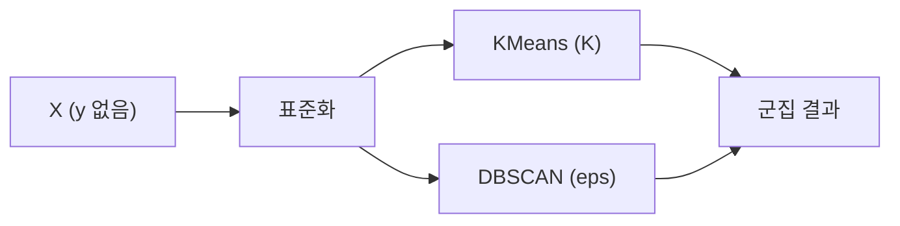

# Clustering

## 이 글에서 다룰 문제

- 정답 레이블이 없는데 군집이 잘됐는지 어떻게 판단할까요?
- KMeans와 DBSCAN은 어떤 상황에서 다르게 써야 할까요?
- 왜 군집화에서는 표준화가 결과를 완전히 바꿔 놓을까요?
- `K=3` 같은 선택은 무엇을 근거로 해야 할까요?
- 군집 결과를 왜 정답이 아니라 가설로 봐야 할까요?

클러스터링은 비지도학습을 배울 때 가장 먼저 만나는 주제입니다. 고객을 몇 개 그룹으로 나누고 싶을 때, 이상한 패턴을 먼저 찾아보고 싶을 때, 레이블이 없는 데이터를 탐색하고 싶을 때 자연스럽게 등장합니다. 그래서 입문자에게는 분류보다 어렵게 느껴지기도 합니다. 정답이 없으니 맞았는지 틀렸는지를 바로 확인할 수 없기 때문입니다.

이 글에서는 KMeans와 DBSCAN을 중심으로 군집화의 기본 감각을 잡아 보겠습니다. `K` 선택, 표준화, 실루엣 점수, 노이즈 포인트 해석까지 함께 보면서 비지도 결과를 어떻게 읽어야 하는지 설명하겠습니다.

> 클러스터링은 정답을 맞히는 작업이 아니라, 데이터 안의 잠재 구조에 가설을 세우는 작업입니다.

## 왜 중요한가

많은 프로젝트는 지도학습부터 시작하지 않습니다. 어떤 데이터가 있는지, 비슷한 사용자 묶음이 있는지, 이상한 패턴이 어디에 몰려 있는지 먼저 봐야 할 때가 많습니다. 이 탐색 단계에서 군집화는 빠르고 강력한 렌즈가 됩니다.

다만 군집화는 숫자 하나로 끝나는 기술이 아닙니다. 결과는 데이터 스케일, 거리 정의, 시각화 방식, 도메인 해석에 크게 의존합니다. 그래서 "모델 성능"보다 "해석 책임"이 더 중요해지는 영역이기도 합니다.

## 한눈에 보는 개념



## 핵심 용어

- **KMeans**: 중심점 `K`개를 두고 군집 내 거리를 최소화하는 방식입니다.
- **DBSCAN**: 밀도가 높은 영역을 하나의 군집으로 보는 방식입니다.
- **Inertia**: 각 점이 속한 중심점까지의 제곱거리 합입니다.
- **Silhouette**: 군집 응집도와 군집 간 분리도를 함께 보는 지표입니다.
- **Elbow**: `K`를 늘렸을 때 개선 폭이 급격히 줄어드는 지점입니다.

## Before / After

**Before**: `K=3`이면 적당하다고 생각하고 끝냅니다.

**After**: Elbow, Silhouette, 시각화, 도메인 의미를 함께 보고 군집 수를 정합니다.

## 5단계로 군집화해 보기

### Step 1 — 데이터와 표준화

붓꽃 데이터셋을 불러오고 표준화부터 적용합니다.

```python
from sklearn.datasets import load_iris
from sklearn.preprocessing import StandardScaler
X = StandardScaler().fit_transform(load_iris().data)
```

거리 기반 알고리즘은 스케일에 매우 민감합니다. 어떤 피처 하나만 범위가 크면 그 피처가 사실상 군집 결과를 지배할 수 있습니다.

### Step 2 — KMeans

기본 군집 수를 3으로 두고 학습합니다.

```python
from sklearn.cluster import KMeans
km = KMeans(n_clusters=3, n_init=10, random_state=0).fit(X)
print("inertia:", km.inertia_)
```

### Step 3 — Silhouette

군집 품질을 하나의 보조 지표로 확인합니다.

```python
from sklearn.metrics import silhouette_score
print("sil:", silhouette_score(X, km.labels_))
```

Silhouette 값이 높을수록 군집 내부는 촘촘하고, 군집 간 거리는 멀다는 뜻입니다. 다만 이 값 하나만으로 정답을 선언할 수는 없습니다.

### Step 4 — Elbow

군집 수를 바꿔 가며 inertia 변화를 봅니다.

```python
ks = list(range(2, 8))
scores = [KMeans(n_clusters=k, n_init=10, random_state=0).fit(X).inertia_ for k in ks]
print(list(zip(ks, scores)))
```

`K`를 늘릴수록 inertia는 거의 항상 감소합니다. 그래서 숫자가 줄었다는 사실 자체보다, 개선 폭이 어디서 둔해지는지를 보는 편이 낫습니다.

### Step 5 — DBSCAN

이번에는 밀도 기반 군집화도 시도해 봅니다.

```python
from sklearn.cluster import DBSCAN
db = DBSCAN(eps=0.5, min_samples=5).fit(X)
print("labels:", set(db.labels_))
```

DBSCAN에서 `-1`은 노이즈 포인트를 뜻합니다. 즉, 어떤 데이터는 어느 군집에도 속하지 않는다고 판단할 수 있습니다. 이 점이 KMeans와 큰 차이입니다.

## 이 코드에서 주목할 점

- KMeans는 `K`를, DBSCAN은 `eps`를 직접 정해야 합니다.
- 표준화 여부에 따라 군집 결과가 크게 달라집니다.
- DBSCAN의 `-1` 레이블은 오류가 아니라 노이즈라는 뜻입니다.

## 실무에서는 이렇게 쓰입니다

고객 세그먼테이션, 색상 양자화, 로그 패턴 탐색, 이상치 탐지 같은 작업에서 군집화는 탐색 단계의 기본 도구입니다. 특히 레이블을 아직 만들지 못했거나, 데이터 이해가 먼저 필요한 프로젝트에서 자주 등장합니다.

하지만 운영 시스템에 바로 연결할 때는 주의가 필요합니다. 군집 레이블은 사람에게 설명 가능한 이름이 아니므로, "프리미엄 고객군"처럼 도메인 이름을 붙이는 별도 해석 단계가 필요합니다. 그래서 군집화는 모델링이 아니라 분석 설계에 더 가깝게 느껴질 때도 많습니다.

## 시니어 엔지니어는 이렇게 생각합니다

- 군집은 답이 아니라 가설입니다.
- 군집 품질은 다운스트림 결과와 함께 검증합니다.
- 시각화와 도메인 해석이 의사결정의 절반 이상을 차지합니다.
- 밀도 기반 방법은 이상치에 더 자연스럽게 대응합니다.
- 최종 `K`는 비즈니스 의미까지 포함해 결정합니다.

## 자주 하는 실수 5가지

1. 표준화 없이 거리 기반 군집화를 수행합니다.
2. 시각화나 보조 지표 없이 `K`를 결정합니다.
3. KMeans가 볼록한 군집에 더 잘 맞는다는 점을 잊습니다.
4. 군집 레이블을 정답처럼 해석합니다.
5. DBSCAN의 `eps`를 데이터 스케일과 무관하게 고정합니다.

## 체크리스트

- [ ] 거리 기반 군집화 전에 표준화를 적용할 수 있습니다.
- [ ] Elbow와 Silhouette을 함께 읽을 수 있습니다.
- [ ] DBSCAN의 노이즈 레이블 의미를 설명할 수 있습니다.
- [ ] 군집 결과를 가설로 해석해야 한다는 점을 이해했습니다.

## 연습 문제

1. `K`를 2부터 7까지 바꾸며 Silhouette 점수를 비교해 보세요.
2. 표준화 전후의 KMeans 결과를 비교해 보세요.
3. `eps`를 0.3, 0.5, 1.0으로 바꿔 DBSCAN 군집 수를 비교해 보세요.

## 정리 및 다음 글

클러스터링은 레이블 없는 데이터를 이해하기 위한 핵심 도구입니다. KMeans는 중심점 기반으로 빠르고 단순하며, DBSCAN은 밀도 기반이라 노이즈와 복잡한 모양을 더 자연스럽게 다룰 수 있습니다.

중요한 점은 군집화가 정답을 주지 않는다는 사실입니다. 표준화, `K` 선택, 시각화, 도메인 해석이 모두 필요합니다. 그래서 군집 결과는 결론이라기보다 다음 분석 단계로 이어지는 가설에 가깝습니다. 다음 글에서는 모델이 훈련 데이터를 외워 버리는 문제인 Overfitting과 이를 막는 Regularization을 살펴보겠습니다.

<!-- toc:begin -->
- [Machine Learning이란 무엇인가?](./01-what-is-machine-learning.md)
- [지도학습과 비지도학습](./02-supervised-and-unsupervised.md)
- [Train/Test Split](./03-train-test-split.md)
- [Linear Regression](./04-linear-regression.md)
- [Logistic Regression](./05-logistic-regression.md)
- [Decision Tree와 Random Forest](./06-decision-tree-and-random-forest.md)
- **Clustering (현재 글)**
- Overfitting과 Regularization (예정)
- Model Evaluation (예정)
- ML 프로젝트 전체 흐름 (예정)
<!-- toc:end -->

## 참고 자료

- [scikit-learn — Clustering](https://scikit-learn.org/stable/modules/clustering.html)
- [scikit-learn — Silhouette analysis](https://scikit-learn.org/stable/auto_examples/cluster/plot_kmeans_silhouette_analysis.html)
- [DBSCAN — Ester et al. (1996)](https://www.aaai.org/Papers/KDD/1996/KDD96-037.pdf)
- [StatQuest — KMeans](https://www.youtube.com/watch?v=4b5d3muPQmA)

Tags: MachineLearning, Clustering, KMeans, DBSCAN, UnsupervisedLearning
