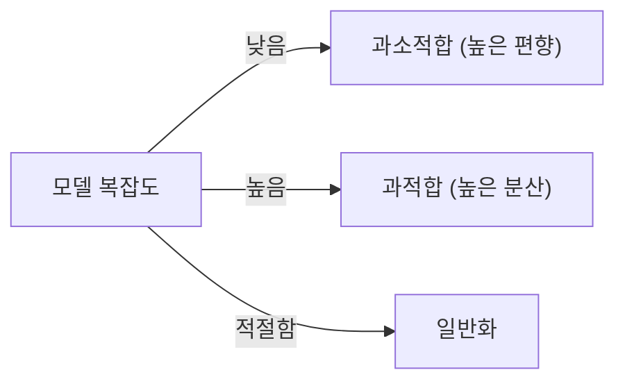

# Overfitting과 Regularization

## 이 글에서 다룰 문제

- 훈련 점수는 높은데 테스트 점수가 낮으면 무엇을 의심해야 할까요?
- 과적합과 과소적합은 어떻게 구분할까요?
- 정규화는 모델에 어떤 제약을 걸어 일반화를 되찾게 할까요?
- Ridge와 Lasso는 각각 어떤 상황에서 다르게 느껴질까요?
- `alpha`는 왜 감으로 정하면 안 될까요?

머신러닝 모델은 복잡해질수록 더 많은 패턴을 잡아낼 수 있습니다. 문제는 그 패턴 중 일부가 진짜 신호가 아니라 잡음일 수 있다는 점입니다. 훈련 데이터에만 지나치게 잘 맞는 상태를 과적합이라고 부르고, 반대로 너무 단순해서 훈련 데이터조차 제대로 설명하지 못하면 과소적합이라고 부릅니다.

이 글에서는 과적합과 과소적합을 구분하는 기본 감각을 먼저 잡고, 이를 완화하는 대표 도구인 정규화까지 연결해 보겠습니다. 특히 선형 모델에서 자주 쓰는 Ridge와 Lasso를 중심으로, 왜 정규화가 일반화 성능의 핵심 레버인지 설명하겠습니다.

> 과적합은 잡음을 외운 상태이고, 정규화는 모델의 자유도를 줄여 일반화 성능을 되찾게 하는 장치입니다.

## 왜 중요한가

실무에서 모델 개선은 새로운 알고리즘을 들여오는 일보다 과적합을 줄이는 일에서 더 자주 나옵니다. 특히 피처가 많거나 모델 용량이 큰 상황에서는 규제가 없으면 훈련셋에만 강한 모델이 되기 쉽습니다.

또한 과적합은 눈에 잘 띄지 않습니다. 훈련 점수만 보면 성능이 좋아 보이기 때문입니다. 그래서 학습 곡선, 검증 점수, 정규화 강도 같은 개념을 이해하지 못하면 모델이 실제로는 퇴화하고 있는데도 개선했다고 착각하기 쉽습니다.

## 한눈에 보는 개념



## 핵심 용어

- **과적합**: 훈련 성능은 매우 좋지만 테스트 성능이 약한 상태입니다.
- **과소적합**: 훈련과 테스트 모두 성능이 낮은 상태입니다.
- **편향(Bias)**: 모델 가정이 너무 단순해서 생기는 오차입니다.
- **분산(Variance)**: 데이터가 조금만 바뀌어도 예측이 크게 흔들리는 성질입니다.
- **L1 / L2 정규화**: 계수 크기에 패널티를 주는 방법입니다.

## Before / After

**Before**: 성능이 안 나오면 모델을 더 크게 만들 생각부터 합니다.

**After**: 먼저 학습 곡선과 검증 점수로 상태를 진단한 뒤 정규화를 적용합니다.

## 5단계로 정규화 비교하기

### Step 1 — 데이터 준비

회귀 예제로 캘리포니아 주택 데이터셋을 사용하고, 스케일링도 함께 적용합니다.

```python
from sklearn.datasets import fetch_california_housing
from sklearn.model_selection import train_test_split
from sklearn.preprocessing import StandardScaler
X, y = fetch_california_housing(return_X_y=True)
Xtr, Xte, ytr, yte = train_test_split(X, y, test_size=0.2, random_state=42)
sc = StandardScaler().fit(Xtr); Xtr, Xte = sc.transform(Xtr), sc.transform(Xte)
```

L1, L2 계열은 피처 스케일에 민감하므로 표준화가 중요합니다.

### Step 2 — 기본 선형 회귀

정규화 없는 기준 모델을 먼저 봅니다.

```python
from sklearn.linear_model import LinearRegression
lin = LinearRegression().fit(Xtr, ytr)
print("lin :", lin.score(Xte, yte))
```

### Step 3 — Ridge (L2)

모든 계수를 부드럽게 줄이는 Ridge를 적용합니다.

```python
from sklearn.linear_model import Ridge
ridge = Ridge(alpha=1.0).fit(Xtr, ytr)
print("ridge:", ridge.score(Xte, yte))
```

### Step 4 — Lasso (L1)

이번에는 일부 계수를 아예 0으로 만들 수 있는 Lasso를 봅니다.

```python
from sklearn.linear_model import Lasso
lasso = Lasso(alpha=0.01).fit(Xtr, ytr)
print("lasso:", lasso.score(Xte, yte), "nz:", (lasso.coef_ != 0).sum())
```

### Step 5 — `alpha` 스윕

정규화 강도를 바꿔 가며 성능이 어떻게 변하는지 확인합니다.

```python
import numpy as np
for a in np.logspace(-3, 2, 6):
    s = Ridge(alpha=a).fit(Xtr, ytr).score(Xte, yte)
    print(f"alpha={a:.3g}  R^2={s:.3f}")
```

`alpha`가 너무 작으면 규제가 약해 과적합을 충분히 막지 못하고, 너무 크면 모델이 지나치게 단순해질 수 있습니다. 그래서 감으로 정하기보다 검증을 통해 찾는 편이 맞습니다.

## 이 코드에서 주목할 점

- Lasso는 일부 계수를 0으로 만들어 피처 선택 효과를 냅니다.
- Ridge는 모든 계수를 조금씩 줄이며 더 부드럽게 규제합니다.
- `alpha`는 한 번 찍어 보는 값이 아니라 교차검증으로 정해야 하는 하이퍼파라미터입니다.

## 실무에서는 이렇게 쓰입니다

광고 CTR, 검색 랭킹, 유전체 데이터처럼 피처가 많고 상관관계가 복잡한 문제에서는 정규화가 특히 중요합니다. 단순히 점수를 조금 높이는 문제가 아니라, 모델이 재학습될 때마다 흔들리지 않게 만들고 해석 가능성을 유지하는 일과도 연결됩니다.

또한 정규화는 선형 모델에만 있는 개념이 아닙니다. 더 많은 데이터, 드롭아웃, 데이터 증강, 조기 종료 같은 기법도 넓게 보면 모두 모델 자유도를 다루는 방식입니다. 그래서 과적합을 이해하면 이후 더 복잡한 모델로 넘어갈 때도 중심 감각을 잃지 않게 됩니다.

## 시니어 엔지니어는 이렇게 생각합니다

- 학습 곡선을 먼저 보고 문제 유형을 구분합니다.
- 더 많은 데이터는 가장 강력한 정규화 수단인 경우가 많습니다.
- Ridge, Lasso 외에도 드롭아웃과 증강도 같은 맥락에서 봅니다.
- `RidgeCV` 같은 도구로 `alpha`를 자동 선택하는 편이 실용적입니다.
- 과소적합이라면 규제보다 모델 용량 확대를 먼저 생각합니다.

## 자주 하는 실수 5가지

1. 스케일링 없이 L1 또는 L2를 적용합니다.
2. `alpha`를 한 번만 넣어 보고 결론을 냅니다.
3. 훈련 점수만 보고 과적합 여부를 판단합니다.
4. 상관 피처가 많은데도 Lasso의 불안정성을 무시합니다.
5. ElasticNet 같은 절충안을 잊고 둘 중 하나만 고집합니다.

## 체크리스트

- [ ] 훈련 점수와 테스트 점수를 함께 확인할 수 있습니다.
- [ ] 학습 곡선이 왜 필요한지 설명할 수 있습니다.
- [ ] `alpha`를 검증으로 정해야 한다는 점을 이해했습니다.
- [ ] Lasso가 피처 선택 효과를 낸다는 점을 알고 있습니다.

## 연습 문제

1. `PolynomialFeatures(degree=10)`와 Ridge를 함께 써서 과적합을 재현해 보세요.
2. `RidgeCV`와 수동 `alpha` 선택 결과를 비교해 보세요.
3. Lasso가 0으로 만든 피처 목록을 출력해 보세요.

## 정리 및 다음 글

과적합은 더 복잡한 모델을 만들 때 자연스럽게 따라오는 위험입니다. 반대로 과소적합은 모델이 너무 단순해 데이터를 설명하지 못하는 상태입니다. 두 상태를 구분하려면 훈련 성능만이 아니라 일반화 성능을 함께 봐야 합니다.

정규화는 그 균형을 되찾는 핵심 도구입니다. Ridge는 모든 계수를 부드럽게 줄이고, Lasso는 일부 계수를 제거할 수 있습니다. 결국 중요한 것은 모델 크기를 키우는 일보다, 모델이 어디서 흔들리는지 먼저 진단하는 습관입니다. 다음 글에서는 이런 모델을 어떤 지표로 평가해야 하는지 Model Evaluation을 살펴보겠습니다.

<!-- toc:begin -->
- [Machine Learning이란 무엇인가?](./01-what-is-machine-learning.md)
- [지도학습과 비지도학습](./02-supervised-and-unsupervised.md)
- [Train/Test Split](./03-train-test-split.md)
- [Linear Regression](./04-linear-regression.md)
- [Logistic Regression](./05-logistic-regression.md)
- [Decision Tree와 Random Forest](./06-decision-tree-and-random-forest.md)
- [Clustering](./07-clustering.md)
- **Overfitting과 Regularization (현재 글)**
- Model Evaluation (예정)
- ML 프로젝트 전체 흐름 (예정)
<!-- toc:end -->

## 참고 자료

- [scikit-learn — Linear models (Ridge, Lasso)](https://scikit-learn.org/stable/modules/linear_model.html)
- [scikit-learn — Validation curves](https://scikit-learn.org/stable/modules/learning_curve.html)
- [Bias-Variance — Stanford CS229 notes](https://cs229.stanford.edu/notes2022fall/)
- [StatQuest — Regularization](https://www.youtube.com/watch?v=Q81RR3yKn30)

Tags: MachineLearning, Overfitting, Regularization, Ridge, Lasso
