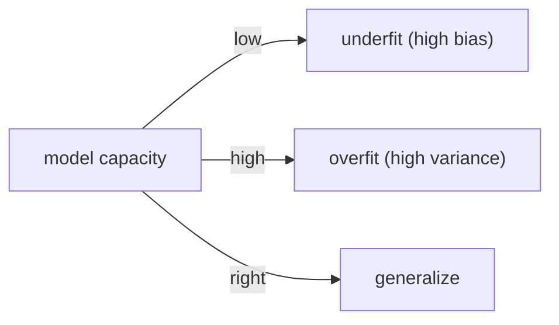

# Overfitting과 Regularization

훈련 점수는 99%인데 테스트 점수는 60%라면 모델이 똑똑한 것인지, 아니면 데이터를 외운 것인지부터 의심해야 합니다. 머신러닝에서 성능 개선의 절반은 더 강한 모델을 찾는 일이 아니라, 모델이 어디서 잡음을 외우고 있는지 진단하는 일에 가깝습니다. 과적합과 과소적합을 구분하지 못하면 점수가 좋아 보여도 실제 일반화는 오히려 나빠질 수 있습니다.

이 글은 Machine Learning 101 시리즈의 여덟 번째 글입니다. 여기서는 과적합과 과소적합의 신호, 편향-분산 트레이드오프, Ridge·Lasso·ElasticNet 같은 정규화 기법이 일반화를 어떻게 되찾아 주는지 살펴보겠습니다.

## 이 글에서 다룰 문제

- 과적합과 과소적합은 어떤 신호로 구분할까요?
- 편향-분산 트레이드오프는 무엇을 뜻할까요?
- Ridge, Lasso, ElasticNet은 어떻게 다를까요?
- 학습 곡선은 어떤 식으로 문제를 진단할까요?
- 정규화를 쓸 때 가장 흔한 실수는 무엇일까요?

> 과적합은 잡음을 외운 상태입니다. 정규화는 모델 자유도를 줄여서 일반화를 다시 되찾게 하는 장치입니다.

## 왜 중요한가

모델 개선의 절반은 정규화라고 해도 과장이 아닙니다. 모델 용량이 클수록 정규화가 모델을 살려 줍니다.

## 한눈에 보는 개념



## 핵심 용어

- 과적합: 훈련 성능은 좋지만 테스트 성능은 약한 상태입니다.
- **과소적합**: 훈련과 테스트 모두 약한 상태입니다.
- **편향(Bias)**: 모델 가정에 내장된 오차입니다.
- **분산(Variance)**: 데이터 변화에 민감한 정도입니다.
- **L1 / L2**: 계수 크기에 패널티를 주는 방식입니다.

## Before/After

**Before**: "모델을 더 크게 만들자"고 해서 더 심하게 과적합합니다.

**After**: 먼저 학습 곡선으로 진단하고, 그다음 정규화를 적용합니다.

## 실습: 5단계로 정규화 비교하기

### Step 1 — 데이터

```python
from sklearn.datasets import fetch_california_housing
from sklearn.model_selection import train_test_split
from sklearn.preprocessing import StandardScaler
X, y = fetch_california_housing(return_X_y=True)
Xtr, Xte, ytr, yte = train_test_split(X, y, test_size=0.2, random_state=42)
sc = StandardScaler().fit(Xtr); Xtr, Xte = sc.transform(Xtr), sc.transform(Xte)
```

### Step 2 — Linear

```python
from sklearn.linear_model import LinearRegression
lin = LinearRegression().fit(Xtr, ytr)
print("lin :", lin.score(Xte, yte))
```

### Step 3 — Ridge (L2)

```python
from sklearn.linear_model import Ridge
ridge = Ridge(alpha=1.0).fit(Xtr, ytr)
print("ridge:", ridge.score(Xte, yte))
```

### Step 4 — Lasso (L1)

```python
from sklearn.linear_model import Lasso
lasso = Lasso(alpha=0.01).fit(Xtr, ytr)
print("lasso:", lasso.score(Xte, yte), "nz:", (lasso.coef_ != 0).sum())
```

### Step 5 — Alpha sweep

```python
import numpy as np
for a in np.logspace(-3, 2, 6):
    s = Ridge(alpha=a).fit(Xtr, ytr).score(Xte, yte)
    print(f"alpha={a:.3g}  R^2={s:.3f}")
```

## 이 코드에서 먼저 봐야 할 점

- Lasso는 계수를 0으로 만들어 피처 선택 효과까지 냅니다.
- Ridge는 모든 계수를 부드럽게 줄입니다.
- `alpha`는 감으로 찍는 값이 아니라 교차검증으로 정해야 합니다.

## 자주 하는 실수 5가지

1. **스케일링 없이 L1이나 L2를 적용합니다.**
2. **`alpha`를 한 번만 시도하고 끝냅니다.**
3. **훈련 점수만 보고 과적합을 판단합니다.**
4. **상관 피처가 많을 때 Lasso의 불안정성을 무시합니다.**
5. **ElasticNet의 존재를 잊습니다.**

## 실무에서는 이렇게 나타납니다

광고 CTR, 검색 랭킹, 유전체 데이터처럼 고차원 문제에서는 Lasso와 ElasticNet이 피처 선택 도구로도 자주 쓰입니다.

## 시니어 엔지니어는 이렇게 생각합니다

- 학습 곡선을 먼저 봅니다.
- 더 많은 데이터는 가장 강한 정규화일 때가 많습니다.
- 드롭아웃과 데이터 증강도 넓게 보면 정규화입니다.
- `RidgeCV`로 `alpha`를 자동 선택하는 편이 실용적입니다.
- 과소적합이라면 모델 용량을 늘려야 합니다.

## 체크리스트

- [ ] 훈련 점수와 테스트 점수를 함께 추적합니다.
- [ ] 학습 곡선을 그립니다.
- [ ] `alpha`를 교차검증으로 정합니다.
- [ ] Lasso가 선택한 피처를 확인합니다.

## 연습 문제

1. `PolynomialFeatures(degree=10)`와 Ridge를 써서 과적합을 재현해 보세요.
2. `RidgeCV`와 수동으로 고른 `alpha`를 비교해 보세요.
3. Lasso가 0으로 줄인 피처 목록을 적어 보세요.

## 정리

정규화는 일반화를 회복하는 핵심 레버입니다. 모델을 더 크게 만드는 것보다 먼저, 모델이 어디서 잡음을 외우는지 읽고 자유도를 조절하는 편이 훨씬 실용적입니다.

이 글에서 기억할 핵심은 네 가지입니다. 첫째, 과적합은 훈련과 테스트 점수 차이에서 드러납니다. 둘째, 편향과 분산은 항상 함께 움직입니다. 셋째, Ridge는 부드럽게 줄이고 Lasso는 일부를 0으로 만듭니다. 넷째, `alpha`는 반드시 검증으로 골라야 합니다.

다음 글에서는 이런 모델을 올바른 지표로 비교하는 Model Evaluation을 다루겠습니다.

<!-- toc:begin -->
- [Machine Learning이란 무엇인가?](./01-what-is-machine-learning.md)
- [지도학습과 비지도학습](./02-supervised-and-unsupervised.md)
- [Train/Test Split](./03-train-test-split.md)
- [Linear Regression](./04-linear-regression.md)
- [Logistic Regression](./05-logistic-regression.md)
- [Decision Tree와 Random Forest](./06-decision-tree-and-random-forest.md)
- [Clustering](./07-clustering.md)
- **Overfitting과 Regularization (현재 글)**
- Model Evaluation (예정)
- ML 프로젝트 전체 흐름 (예정)
<!-- toc:end -->

## 참고 자료

- [scikit-learn — Linear models (Ridge, Lasso)](https://scikit-learn.org/stable/modules/linear_model.html)
- [scikit-learn — Validation curves](https://scikit-learn.org/stable/modules/learning_curve.html)
- [Bias-Variance — Stanford CS229 notes](https://cs229.stanford.edu/notes2022fall/)
- [StatQuest — Regularization](https://www.youtube.com/watch?v=Q81RR3yKn30)

Tags: MachineLearning, Overfitting, Regularization, Ridge, Lasso
