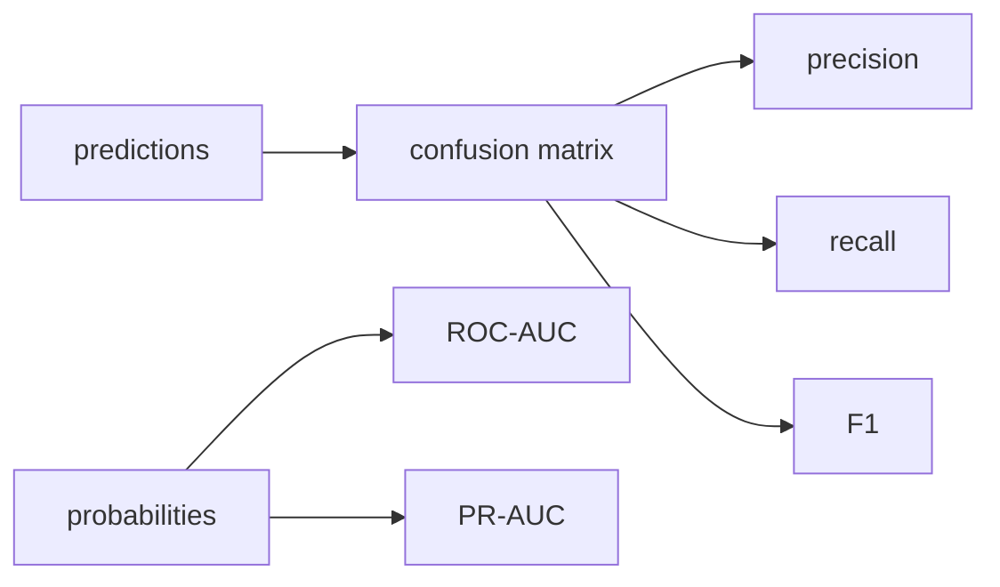

# Model Evaluation

누군가 "어떤 모델이 더 좋나요?"라고 묻는데 "어떤 지표 기준으로요?"라고 되묻지 않는다면 이미 곤란한 상황입니다. 머신러닝에서 평가는 숫자 하나를 출력하는 절차가 아니라, 무엇을 좋은 모델로 볼지 먼저 정의하는 과정입니다. 비즈니스 비용과 지표가 어긋나는 순간, 종이 위에서는 좋아 보이는 모델이 실제로는 나쁜 선택이 될 수 있습니다.

이 글은 Machine Learning 101 시리즈의 아홉 번째 글입니다. 여기서는 분류와 회귀 지표를 함께 정리하고, 혼동 행렬, ROC-AUC, PR-AUC, MAE, RMSE, R-squared를 언제 어떻게 읽어야 하는지 살펴보겠습니다.

## 이 글에서 다룰 문제

- 분류에서는 어떤 지표를 언제 써야 할까요?
- 회귀에서는 MAE, MSE, RMSE, R-squared를 어떻게 나눠 읽을까요?
- 혼동 행렬은 어떤 구조를 보여 줄까요?
- ROC와 PR 중 무엇을 먼저 봐야 할 때가 있을까요?
- 평가 단계에서 가장 흔한 실수는 무엇일까요?

> 모델 평가는 코드로 증명하는 절차입니다. **지표를 고르는 일이 모델을 고르는 일보다 먼저**라는 사실을 여기서 확인하게 됩니다.

## 왜 중요한가

지표가 틀리면 의사결정도 틀립니다. 비즈니스 비용과 지표가 어긋나는 순간, 모델은 서류상으로만 좋아 보이게 됩니다.

## 한눈에 보는 개념



## 핵심 용어

- **TP / FP / FN / TN**: 혼동 행렬의 네 칸입니다.
- **Accuracy**: 전체 예측 중 맞은 비율입니다.
- **Precision**: 양성이라고 예측한 것 중 실제 양성의 비율입니다.
- **Recall**: 실제 양성 중 모델이 잡아낸 비율입니다.
- **AUC**: 임계값 전반에서의 평균 성능입니다.

## Before/After

**Before**: 보고서에 정확도 숫자 하나만 적습니다.

**After**: 지표 표, 혼동 행렬, 그리고 PR 또는 ROC 곡선을 함께 봅니다.

## 실습: 5단계로 보는 평가

### Step 1 — 데이터

```python
from sklearn.datasets import load_breast_cancer
from sklearn.model_selection import train_test_split
X, y = load_breast_cancer(return_X_y=True)
Xtr, Xte, ytr, yte = train_test_split(X, y, test_size=0.2, stratify=y, random_state=42)
```

### Step 2 — 모델

```python
from sklearn.linear_model import LogisticRegression
m = LogisticRegression(max_iter=2000).fit(Xtr, ytr)
prob = m.predict_proba(Xte)[:, 1]
pred = (prob >= 0.5).astype(int)
```

### Step 3 — 혼동 행렬

```python
from sklearn.metrics import confusion_matrix
print(confusion_matrix(yte, pred))
```

### Step 4 — 분류 지표

```python
from sklearn.metrics import classification_report, roc_auc_score, average_precision_score
print(classification_report(yte, pred))
print("ROC-AUC:", roc_auc_score(yte, prob))
print("PR-AUC :", average_precision_score(yte, prob))
```

### Step 5 — 회귀 지표

```python
from sklearn.metrics import mean_absolute_error, mean_squared_error, r2_score
import numpy as np
yt, yp = np.array([3.0, 5.0, 2.5]), np.array([2.8, 5.4, 2.1])
print("MAE:", mean_absolute_error(yt, yp))
print("RMSE:", mean_squared_error(yt, yp) ** 0.5)
print("R^2:", r2_score(yt, yp))
```

## 이 코드에서 먼저 봐야 할 점

- AUC는 특정 임계값 하나에 묶이지 않습니다.
- PR-AUC는 불균형 데이터에서 더 유용한 경우가 많습니다.
- RMSE와 MAE는 이상치 민감도가 다릅니다.

## 자주 하는 실수 5가지

1. **불균형 데이터에서 Accuracy만 보고합니다.**
2. **클래스 불균형이 심한데 ROC-AUC만 믿습니다.**
3. **F1을 최적화하면서 임계값 조정을 무시합니다.**
4. **회귀에서 MAE 또는 RMSE 중 하나만 보고합니다.**
5. **같은 테스트 세트로 반복 평가하며 정보를 누수시킵니다.**

## 실무에서는 이렇게 나타납니다

A/B 테스트, 모델 게이트, MLOps 모니터링은 모두 지표 정의 위에서 돌아갑니다. 지표는 조직이 합의하는 언어입니다.

## 시니어 엔지니어는 이렇게 생각합니다

- 순서는 **비즈니스 비용 → 지표 → 임계값**입니다.
- 불균형에서는 PR 곡선이 진실에 더 가깝습니다.
- 양성을 놓치면 큰일 나는 문제에서는 재현율을 극대화합니다.
- 보정(calibration)도 평가의 일부입니다.
- 지표 하나로 끝내는 일은 드뭅니다.

## 체크리스트

- [ ] 항상 혼동 행렬을 출력합니다.
- [ ] ROC와 PR을 함께 봅니다.
- [ ] 회귀에서는 MAE와 RMSE를 함께 보고합니다.
- [ ] 테스트 세트는 마지막에 한 번만 봅니다.

## 연습 문제

1. 불균형 데이터에서 Accuracy와 F1을 비교해 보세요.
2. ROC 곡선과 PR 곡선을 나란히 그려 보세요.
3. MAE와 RMSE가 크게 다르게 나오는 데이터셋을 만들어 보세요.

## 정리

평가는 모델 선택의 언어입니다. 어떤 오류를 더 싫어하는지, 어떤 비용을 더 크게 보는지 먼저 정해야 숫자도 의미를 갖습니다.

이 글에서 기억할 핵심은 네 가지입니다. 첫째, 지표는 비즈니스 비용과 연결되어야 합니다. 둘째, 분류에서는 혼동 행렬과 임계값 해석이 중요합니다. 셋째, 불균형에서는 PR-AUC가 더 솔직한 경우가 많습니다. 넷째, 회귀에서는 서로 성격이 다른 지표를 함께 봐야 합니다.

다음 글에서는 시리즈를 마무리하며 ML 프로젝트 전체 워크플로를 끝까지 연결해 보겠습니다.

<!-- toc:begin -->
- [Machine Learning이란 무엇인가?](./01-what-is-machine-learning.md)
- [지도학습과 비지도학습](./02-supervised-and-unsupervised.md)
- [Train/Test Split](./03-train-test-split.md)
- [Linear Regression](./04-linear-regression.md)
- [Logistic Regression](./05-logistic-regression.md)
- [Decision Tree와 Random Forest](./06-decision-tree-and-random-forest.md)
- [Clustering](./07-clustering.md)
- [Overfitting과 Regularization](./08-overfitting-and-regularization.md)
- **Model Evaluation (현재 글)**
- ML 프로젝트 전체 흐름 (예정)
<!-- toc:end -->

## 참고 자료

- [scikit-learn — Model evaluation](https://scikit-learn.org/stable/modules/model_evaluation.html)
- [scikit-learn — ROC and PR curves](https://scikit-learn.org/stable/auto_examples/model_selection/plot_precision_recall.html)
- [Google — Classification metrics](https://developers.google.com/machine-learning/crash-course/classification/precision-and-recall)
- [Wikipedia — Confusion matrix](https://en.wikipedia.org/wiki/Confusion_matrix)

Tags: MachineLearning, Evaluation, Metrics, ROC, scikit-learn
