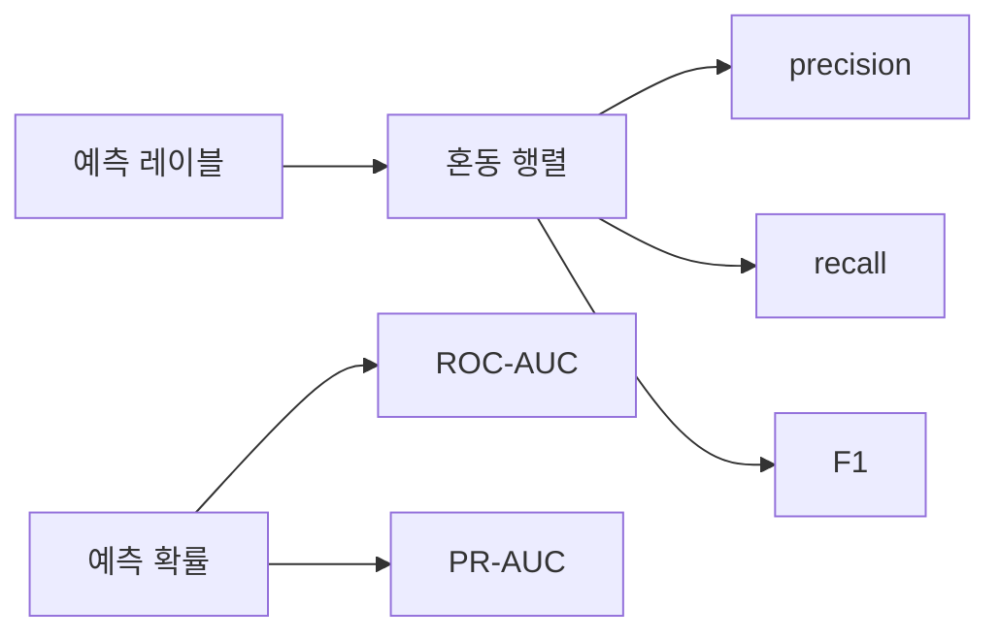

# Model Evaluation

## 이 글에서 다룰 문제

- 어떤 모델이 더 좋은지 묻기 전에 왜 지표부터 정해야 할까요?
- 정확도, 정밀도, 재현율, F1은 각각 무엇을 놓치고 무엇을 보여 줄까요?
- ROC-AUC와 PR-AUC는 불균형 데이터에서 어떻게 다르게 읽어야 할까요?
- 회귀에서는 MAE, RMSE, R^2를 언제 같이 봐야 할까요?
- 테스트셋을 반복해서 보면 왜 평가가 망가질까요?

머신러닝 모델을 만드는 일보다 더 어려운 일은 그 모델을 제대로 평가하는 일입니다. 모델이 하나 더 좋다는 말은 숫자 하나로 끝나지 않습니다. 어떤 지표를 기준으로 보았는지, 그 지표가 비즈니스 비용과 맞는지, 임계값을 어떻게 두었는지까지 함께 설명해야 비로소 비교가 됩니다.

이 글에서는 분류와 회귀 평가의 핵심 지표를 한 번에 정리하겠습니다. 혼동 행렬부터 ROC-AUC, PR-AUC, MAE, RMSE, R^2까지 연결하면서, 왜 "지표를 고르는 일"이 곧 모델 선택의 언어인지 설명하겠습니다.

> 모델 평가는 어떤 모델이 더 좋은지 증명하는 절차가 아니라, 무엇을 좋은 모델로 볼지 먼저 정의하는 절차입니다.

## 왜 중요한가

비즈니스 비용과 지표가 어긋나면 좋은 모델을 나쁜 모델로 버리거나, 반대로 나쁜 모델을 좋은 모델로 착각할 수 있습니다. 예를 들어 암 진단처럼 양성을 놓치면 큰 문제가 되는 상황에서는 재현율이 중요하고, 스팸 차단처럼 정상 메일을 잘못 막는 비용이 큰 상황에서는 정밀도가 중요할 수 있습니다.

평가 지표는 조직 안에서 모델을 논의하는 공용어이기도 합니다. 제품팀, 운영팀, 경영진이 같은 숫자를 보고도 다른 의미로 읽지 않으려면, 지표와 임계값의 의미를 명확히 공유해야 합니다.

## 한눈에 보는 개념



## 핵심 용어

- **TP / FP / FN / TN**: 혼동 행렬의 네 칸을 이루는 기본 단위입니다.
- **Accuracy**: 전체 예측 중 맞은 비율입니다.
- **Precision**: 양성이라고 예측한 것 중 실제 양성의 비율입니다.
- **Recall**: 실제 양성 중 모델이 잡아낸 비율입니다.
- **AUC**: 임계값 전반에 걸친 평균적인 분리 성능입니다.

## Before / After

**Before**: 보고서에 정확도 한 줄만 적습니다.

**After**: 지표 표, 혼동 행렬, PR 또는 ROC 곡선을 함께 봅니다.

## 5단계로 평가해 보기

### Step 1 — 데이터 준비

분류 평가용 데이터셋을 불러옵니다.

```python
from sklearn.datasets import load_breast_cancer
from sklearn.model_selection import train_test_split
X, y = load_breast_cancer(return_X_y=True)
Xtr, Xte, ytr, yte = train_test_split(X, y, test_size=0.2, stratify=y, random_state=42)
```

### Step 2 — 모델과 확률 출력

로지스틱 회귀를 학습하고, 확률과 기본 예측을 함께 준비합니다.

```python
from sklearn.linear_model import LogisticRegression
m = LogisticRegression(max_iter=2000).fit(Xtr, ytr)
prob = m.predict_proba(Xte)[:, 1]
pred = (prob >= 0.5).astype(int)
```

평가에서 중요한 점은 레이블만 보지 말고 확률도 함께 보관하는 것입니다. ROC-AUC와 PR-AUC는 확률 정보가 있어야 계산됩니다.

### Step 3 — 혼동 행렬

기본 오차 구조를 먼저 봅니다.

```python
from sklearn.metrics import confusion_matrix
print(confusion_matrix(yte, pred))
```

혼동 행렬은 어떤 실수를 더 많이 하는지 보여 줍니다. 단순 정확도보다 훨씬 구체적인 그림을 줍니다.

### Step 4 — 분류 지표

이제 정밀도, 재현율, F1과 AUC 계열을 확인합니다.

```python
from sklearn.metrics import classification_report, roc_auc_score, average_precision_score
print(classification_report(yte, pred))
print("ROC-AUC:", roc_auc_score(yte, prob))
print("PR-AUC :", average_precision_score(yte, prob))
```

ROC-AUC는 임계값 변화 전반에서 얼마나 잘 분리하는지 보여 주고, PR-AUC는 특히 불균형 데이터에서 양성 클래스 관점의 성능을 더 잘 드러냅니다.

### Step 5 — 회귀 지표

분류와 달리 회귀는 연속값 오차를 봅니다.

```python
from sklearn.metrics import mean_absolute_error, mean_squared_error, r2_score
import numpy as np
yt, yp = np.array([3.0, 5.0, 2.5]), np.array([2.8, 5.4, 2.1])
print("MAE:", mean_absolute_error(yt, yp))
print("RMSE:", mean_squared_error(yt, yp) ** 0.5)
print("R^2:", r2_score(yt, yp))
```

MAE는 평균 절대 오차라 직관적이고, RMSE는 큰 오차에 더 민감합니다. `R^2`는 설명력 관점의 요약치이지만, 그것만으로 오차 크기를 다 알 수는 없습니다.

## 이 코드에서 주목할 점

- AUC는 특정 임계값 하나에 묶이지 않습니다.
- PR-AUC는 클래스 불균형이 심할 때 더 현실적인 그림을 주는 경우가 많습니다.
- RMSE와 MAE는 이상치에 대한 민감도가 다르므로 함께 보는 편이 안전합니다.

## 실무에서는 이렇게 쓰입니다

모델 게이트, A/B 테스트, 운영 모니터링은 모두 지표 정의 위에서 돌아갑니다. 팀이 "성능이 좋아졌다"고 말할 때 그 뜻이 정확도 상승인지, 재현율 개선인지, false positive 감소인지 먼저 분명해야 합니다.

또한 평가는 한 번 끝나는 일이 아닙니다. 오프라인 검증, 배포 전 승인, 배포 후 모니터링까지 같은 지표 체계를 이어 가야 모델의 변화가 일관되게 읽힙니다. 그래서 평가 설계는 모델링의 부속 단계가 아니라 운영 설계의 일부입니다.

## 시니어 엔지니어는 이렇게 생각합니다

- 비즈니스 비용을 먼저 정하고, 그다음 지표와 임계값을 정합니다.
- 불균형 데이터에서는 PR 곡선을 특히 신뢰합니다.
- 양성을 놓치는 비용이 크면 재현율을 우선합니다.
- 확률을 쓰는 모델이라면 보정 여부도 평가 범위에 넣습니다.
- 지표 하나로 결론내리는 일은 드뭅니다.

## 자주 하는 실수 5가지

1. 불균형 데이터에서 Accuracy만 보고 결론을 냅니다.
2. 클래스 불균형이 큰데 ROC-AUC만 믿습니다.
3. F1만 최적화하고 임계값 조정을 무시합니다.
4. 회귀에서 MAE와 RMSE 중 하나만 보고 끝냅니다.
5. 같은 테스트셋을 반복해서 보며 의사결정을 내립니다.

## 체크리스트

- [ ] 혼동 행렬을 항상 함께 확인할 수 있습니다.
- [ ] ROC와 PR을 언제 같이 봐야 하는지 설명할 수 있습니다.
- [ ] 회귀에서는 MAE와 RMSE를 함께 볼 수 있습니다.
- [ ] 테스트셋은 마지막에 한 번만 만지는 것이 원칙이라는 점을 이해했습니다.

## 연습 문제

1. 불균형 데이터에서 Accuracy와 F1을 비교해 보세요.
2. ROC 곡선과 PR 곡선을 같은 모델로 나란히 그려 보세요.
3. MAE는 작지만 RMSE는 큰 예제를 직접 만들어 보세요.

## 정리 및 다음 글

모델 평가는 숫자 하나를 출력하는 일이 아닙니다. 어떤 오류를 더 싫어하는지, 확률을 어떻게 해석하는지, 회귀 오차를 어떤 기준으로 볼지 먼저 정해야 평가가 의미를 가집니다.

이 글에서 기억할 점은 세 가지입니다. 첫째, 지표는 비즈니스 비용과 연결되어야 합니다. 둘째, 분류에서는 혼동 행렬과 임계값 해석이 중요합니다. 셋째, 회귀에서는 서로 다른 성격의 지표를 함께 봐야 합니다. 다음 글에서는 이 시리즈를 마무리하며 ML 프로젝트 전체 흐름을 끝까지 연결해 보겠습니다.

<!-- toc:begin -->
- [Machine Learning이란 무엇인가?](./01-what-is-machine-learning.md)
- [지도학습과 비지도학습](./02-supervised-and-unsupervised.md)
- [Train/Test Split](./03-train-test-split.md)
- [Linear Regression](./04-linear-regression.md)
- [Logistic Regression](./05-logistic-regression.md)
- [Decision Tree와 Random Forest](./06-decision-tree-and-random-forest.md)
- [Clustering](./07-clustering.md)
- [Overfitting과 Regularization](./08-overfitting-and-regularization.md)
- **Model Evaluation (현재 글)**
- ML 프로젝트 전체 흐름 (예정)
<!-- toc:end -->

## 참고 자료

- [scikit-learn — Model evaluation](https://scikit-learn.org/stable/modules/model_evaluation.html)
- [scikit-learn — ROC and PR curves](https://scikit-learn.org/stable/auto_examples/model_selection/plot_precision_recall.html)
- [Google — Classification metrics](https://developers.google.com/machine-learning/crash-course/classification/precision-and-recall)
- [Wikipedia — Confusion matrix](https://en.wikipedia.org/wiki/Confusion_matrix)

Tags: MachineLearning, Evaluation, Metrics, ROC, scikit-learn
