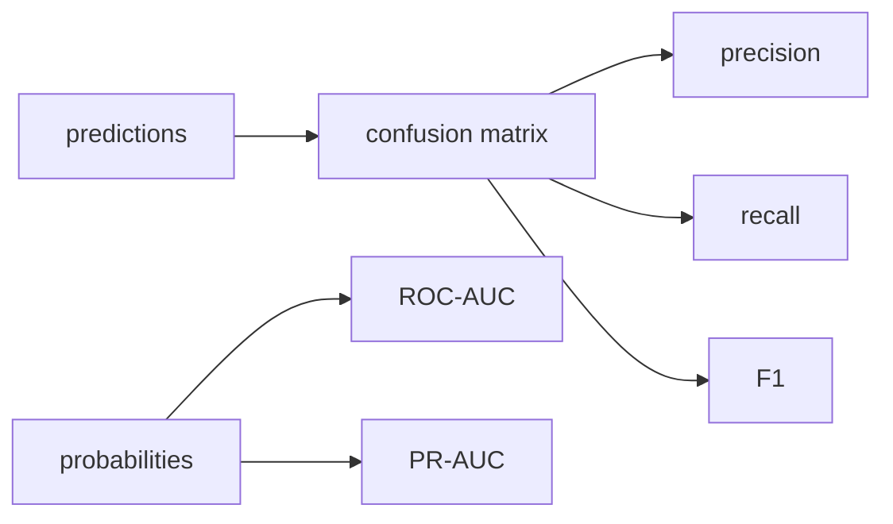

# Model Evaluation

> Machine Learning 101 시리즈 (9/10)


## 이 글에서 다룰 문제

*잘못된 지표* 는 *잘못된 결정*. *비즈니스 비용* 과 *지표* 가 *어긋나면* 모델은 *겉으로만* 좋아 보입니다.

## 전체 흐름


## Before/After

**Before**: *“정확도” 한 줄 보고서*.

**After**: *지표 표 + 혼동 행렬 + PR/ROC 곡선*.

## 5단계 평가

### 1단계 — 데이터

```python
from sklearn.datasets import load_breast_cancer
from sklearn.model_selection import train_test_split
X, y = load_breast_cancer(return_X_y=True)
Xtr, Xte, ytr, yte = train_test_split(X, y, test_size=0.2, stratify=y, random_state=42)
```

### 2단계 — 모델

```python
from sklearn.linear_model import LogisticRegression
m = LogisticRegression(max_iter=2000).fit(Xtr, ytr)
prob = m.predict_proba(Xte)[:, 1]
pred = (prob >= 0.5).astype(int)
```

### 3단계 — 혼동 행렬

```python
from sklearn.metrics import confusion_matrix
print(confusion_matrix(yte, pred))
```

### 4단계 — 분류 지표

```python
from sklearn.metrics import classification_report, roc_auc_score, average_precision_score
print(classification_report(yte, pred))
print("ROC-AUC:", roc_auc_score(yte, prob))
print("PR-AUC :", average_precision_score(yte, prob))
```

### 5단계 — 회귀 지표

```python
from sklearn.metrics import mean_absolute_error, mean_squared_error, r2_score
import numpy as np
yt, yp = np.array([3.0, 5.0, 2.5]), np.array([2.8, 5.4, 2.1])
print("MAE:", mean_absolute_error(yt, yp))
print("RMSE:", mean_squared_error(yt, yp) ** 0.5)
print("R^2:", r2_score(yt, yp))
```

## 이 코드에서 주목할 점

- *AUC* 는 *임계값* 에 *독립*.
- *PR-AUC* 는 *불균형* 에서 *더 정확*.
- *RMSE* 와 *MAE* 의 *민감도* 가 다름.

## 자주 하는 실수 5가지

1. ***불균형* 데이터에 *Accuracy* 만 보기.**
2. ***ROC-AUC* 를 *불균형* 에서 *과신*.**
3. ***임계값* 무시하고 *F1* 만 보기.**
4. ***회귀* 에서 *RMSE/MAE* 중 *하나만* 보기.**
5. ***test* 에 *반복 평가* (=test 누수).**

## 실무에서는 이렇게 쓰입니다

A/B 테스트, 모델 게이트, MLOps 모니터링 — *지표 정의* 가 *조직 합의* 의 *언어*.

## 체크리스트

- [ ] *혼동 행렬* 을 *항상* 출력.
- [ ] *ROC* 와 *PR* 을 *함께* 본다.
- [ ] *회귀* 는 *MAE + RMSE* 를 *함께*.
- [ ] *test* 평가는 *최후의 한 번*.

## 정리 및 다음 단계

평가가 *모델 선택* 의 *언어* 입니다. 다음 글에서는 *ML 프로젝트 전체 흐름* 으로 시리즈를 마무리합니다.

<!-- toc:begin -->
- [Machine Learning이란 무엇인가?](./01-what-is-machine-learning.md)
- [지도학습과 비지도학습](./02-supervised-and-unsupervised.md)
- [Train/Test Split](./03-train-test-split.md)
- [Linear Regression](./04-linear-regression.md)
- [Logistic Regression](./05-logistic-regression.md)
- [Decision Tree와 Random Forest](./06-decision-tree-and-random-forest.md)
- [Clustering](./07-clustering.md)
- [Overfitting과 Regularization](./08-overfitting-and-regularization.md)
- **Model Evaluation (현재 글)**
- ML 프로젝트 전체 흐름 (예정)
<!-- toc:end -->

## 참고 자료

- [scikit-learn — Model evaluation](https://scikit-learn.org/stable/modules/model_evaluation.html)
- [scikit-learn — ROC and PR curves](https://scikit-learn.org/stable/auto_examples/model_selection/plot_precision_recall.html)
- [Google — Classification metrics](https://developers.google.com/machine-learning/crash-course/classification/precision-and-recall)
- [Wikipedia — Confusion matrix](https://en.wikipedia.org/wiki/Confusion_matrix)

Tags: MachineLearning, Evaluation, Metrics, ROC, scikit-learn
