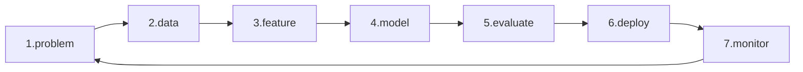

# ML 프로젝트 전체 흐름

> Machine Learning 101 시리즈 (10/10)

<!-- a-grade-intro:begin -->

**핵심 질문**: *모델 정확도* 가 *성공* 의 *전부* 라고 생각한다면 — *왜 90%* 의 ML 프로젝트가 *프로덕션* 에 *못 갈까요*?

> *ML 프로젝트의 성공은 *문제 정의* 에서 시작해 *모니터링* 으로 *끝나는* 한 사이클의 *완주* 입니다.*

<!-- a-grade-intro:end -->

## 이 글에서 배울 것

- *7단계 ML 워크플로우*
- *Pipeline* 으로 *전처리/모델* 묶기
- *재현성* 과 *모델 카드*
- *배포 후 모니터링* 의 의미
- 흔한 함정 5가지

## 왜 중요한가

*Notebook* 에서 *score 0.95* 가 나와도 *비즈니스* 에 닿지 못하면 *0점*. *전체 흐름* 을 *알아야* *영향력* 이 생깁니다.

## 개념 한눈에 보기



## 핵심 용어 정리

- **Pipeline**: *전처리 + 모델* 의 *단일 객체*.
- **재현성**: *시드/버전/데이터 스냅샷*.
- **Model Card**: *모델 메타* 의 *공식 문서*.
- **Drift**: *입력/타깃* 분포 변화.
- **Shadow deploy**: *예측만 기록*, 의사결정 미반영.

## Before/After

**Before**: *“모델 학습 → 점수 → 끝”*.

**After**: *문제 → 데이터 → 모델 → 평가 → 배포 → 모니터링* 의 *순환*.

## 실습: 5단계 미니 워크플로우

### 1단계 — 문제/데이터

```python
from sklearn.datasets import load_breast_cancer
from sklearn.model_selection import train_test_split
X, y = load_breast_cancer(return_X_y=True)
Xtr, Xte, ytr, yte = train_test_split(X, y, test_size=0.2, stratify=y, random_state=42)
```

### 2단계 — Pipeline

```python
from sklearn.pipeline import Pipeline
from sklearn.preprocessing import StandardScaler
from sklearn.linear_model import LogisticRegression
pipe = Pipeline([
    ("scaler", StandardScaler()),
    ("clf", LogisticRegression(max_iter=2000)),
])
```

### 3단계 — 학습/평가

```python
pipe.fit(Xtr, ytr)
print("test:", pipe.score(Xte, yte))
```

### 4단계 — 저장 (재현성)

```python
import joblib
joblib.dump(pipe, "model.joblib")
loaded = joblib.load("model.joblib")
print("loaded:", loaded.score(Xte, yte))
```

### 5단계 — 모니터링 시뮬레이션

```python
import numpy as np
fresh = Xte + np.random.normal(0, 0.1, Xte.shape)
print("drifted:", loaded.score(fresh, yte))
```

## 이 코드에서 주목할 점

- *Pipeline* 이 *전처리 누수* 를 *원천 차단*.
- *joblib* 으로 *재현 배포*.
- *입력 노이즈* 만으로 *점수 하락* — *드리프트* 의 직관.

## 자주 하는 실수 5가지

1. ***Notebook* 에 *전처리* 를 *분산*.**
2. ***시드/버전* 미기록 → *재현 불가*.**
3. ***모니터링* 없이 *배포 후 방치*.**
4. ***모델 카드* 없이 *팀 외부* 공유.**
5. ***평가 데이터* 가 *오래되어* 현실 반영 안 됨.**

## 실무에서는 이렇게 쓰입니다

추천, 사기 탐지, 검색 — *전 사이클* 을 *자동화* 한 팀이 *경쟁력*.

## 시니어 엔지니어는 이렇게 생각합니다

- *문제 정의* 가 *60%* 의 가치.
- *Pipeline* 이 *유지보수* 를 좌우.
- *모니터링* 이 *진짜 시작*.
- *Drift* 는 *항상 일어난다*.
- *모델 카드* 가 *조직 자산*.

## 체크리스트

- [ ] *Pipeline* 으로 *통합*.
- [ ] *joblib* 로 *저장/로드*.
- [ ] *시드/버전* 을 *기록*.
- [ ] *드리프트 모니터링* 계획.

## 연습 문제

1. *Pipeline* 에 *PCA* 를 추가하고 점수를 비교하세요.
2. *joblib* 로 저장한 모델을 *다른 스크립트* 에서 로드해 평가하세요.
3. *입력 노이즈* 를 키우며 *score 곡선* 을 그리세요.

## 정리 및 다음 단계

축하합니다 — *Machine Learning 101* 을 마쳤습니다. 다음 시리즈에서는 *Model Evaluation 101* 과 *MLOps 101* 으로 *심화* 합니다.

<!-- toc:begin -->
- [Machine Learning이란 무엇인가?](./01-what-is-machine-learning.md)
- [지도학습과 비지도학습](./02-supervised-and-unsupervised.md)
- [Train/Test Split](./03-train-test-split.md)
- [Linear Regression](./04-linear-regression.md)
- [Logistic Regression](./05-logistic-regression.md)
- [Decision Tree와 Random Forest](./06-decision-tree-and-random-forest.md)
- [Clustering](./07-clustering.md)
- [Overfitting과 Regularization](./08-overfitting-and-regularization.md)
- [Model Evaluation](./09-model-evaluation.md)
- **ML 프로젝트 전체 흐름 (현재 글)**
<!-- toc:end -->

## 참고 자료

- [scikit-learn — Pipelines](https://scikit-learn.org/stable/modules/compose.html)
- [Google — Rules of ML](https://developers.google.com/machine-learning/guides/rules-of-ml)
- [Model Cards — Mitchell et al. (2019)](https://arxiv.org/abs/1810.03993)
- [Hidden Technical Debt in ML — Sculley et al.](https://papers.nips.cc/paper/2015/hash/86df7dcfd896fcaf2674f757a2463eba-Abstract.html)

Tags: MachineLearning, MLWorkflow, Pipeline, MLOps, Beginner
