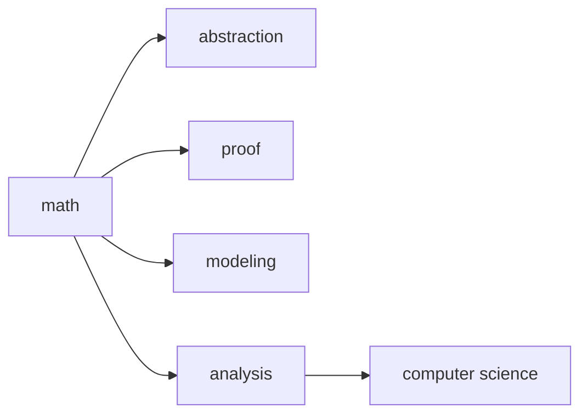

# Why Math for CS

> Math for CS 101 series (1/10)

<!-- a-grade-intro:begin -->

**Core question**: If you can already *code*, *why* do you need *math*?

> *Math* is the *common language* of *abstraction*, *proof*, *modeling*, and *analysis*.

<!-- a-grade-intro:end -->

## What You Will Learn

- The *role* of math
- *Abstraction* and *proof*
- *Modeling* and *analysis*
- The big picture across *nine areas*
- A *learning* order

## Why It Matters

Half of what makes a *problem* feel *hard* is missing *mathematical vocabulary*.

## Concept at a Glance



## Key Terms

- **abstraction**: *extracting* common patterns.
- **proof**: a *logical* guarantee of *truth*.
- **modeling**: turning *reality* into *equations*.
- **analysis**: *measuring* behavior.
- **invariant**: a property that *does not change*.

## Before/After

**Before**: if the *code runs*, you're done.

**After**: explain *why it runs* with *math*.

## Hands-on: Five Steps to Mathematical Thinking

### Step 1 — Extract the pattern

```python
def common(a, b):
    return [x for x in a if x in b]
```

### Step 2 — Check the invariant

```python
def invariant(items):
    assert sum(items) >= 0
    return True
```

### Step 3 — Model

```python
def model(rate, time):
    return rate * time
```

### Step 4 — Measure complexity

```python
def linear(n):
    return [i for i in range(n)]
```

### Step 5 — Sketch a proof

```python
def proof_sketch(claim):
    return f"assume {claim}; derive contradiction"
```

## What to Notice in This Code

- *Common* is a *set* operation.
- An *invariant* is one *assert*.
- *Complexity* is a function of *input size*.

## Five Common Mistakes

1. **Treating *math* as just *formulas*.**
2. **Trusting *intuition* without a *proof*.**
3. **Confusing the *model* with *reality*.**
4. **Substituting a *benchmark* for a *complexity* analysis.**
5. **Memorizing *symbols* without meaning.**

## How This Shows Up in Production

*Recommenders* lean on *linear algebra*; *distributed systems* on *logic* and *probability*; *AI* on *calculus* and *information theory*. Math is the *shared language*.

## How a Senior Engineer Thinks

- *Math* is *vocabulary*.
- *Verify* intuition with *math*.
- *Complexity* is a *prediction* tool.
- *Proof* is a *debugging* tool.
- The *nine areas* form a *ladder*.

## Checklist

- [ ] Comfortable with *proofs*.
- [ ] *Analyze* complexity.
- [ ] *Distinguish* model from reality.
- [ ] State *invariants*.

## Practice Problems

1. Define *abstraction* in one line.
2. Define *invariant* in one line.
3. Define *modeling* in one line.

## Wrap-up and Next Steps

Next, we cover *logic and proofs*.

<!-- toc:begin -->
- **Why Math for CS (current)**
- Logic and Proofs (upcoming)
- Sets and Functions (upcoming)
- Graphs (upcoming)
- Combinatorics (upcoming)
- Probability (upcoming)
- Linear Algebra (upcoming)
- Calculus (upcoming)
- Information Theory (upcoming)
- Algorithms and Math (upcoming)
<!-- toc:end -->

## References

- [Concrete Mathematics - Knuth, Graham, Patashnik](https://en.wikipedia.org/wiki/Concrete_Mathematics)
- [Mathematics for Computer Science - MIT OCW](https://ocw.mit.edu/courses/6-042j-mathematics-for-computer-science-fall-2010/)
- [Mathematical Foundations of CS - ACM](https://cacm.acm.org/magazines/2014/2/171688-mathematical-foundations-of-computer-science/)
- [The Importance of Math in Programming - Dev.to](https://dev.to/codenameone/the-importance-of-math-in-programming-21k0)

Tags: Math, CS, Foundations, Learning, Beginner
