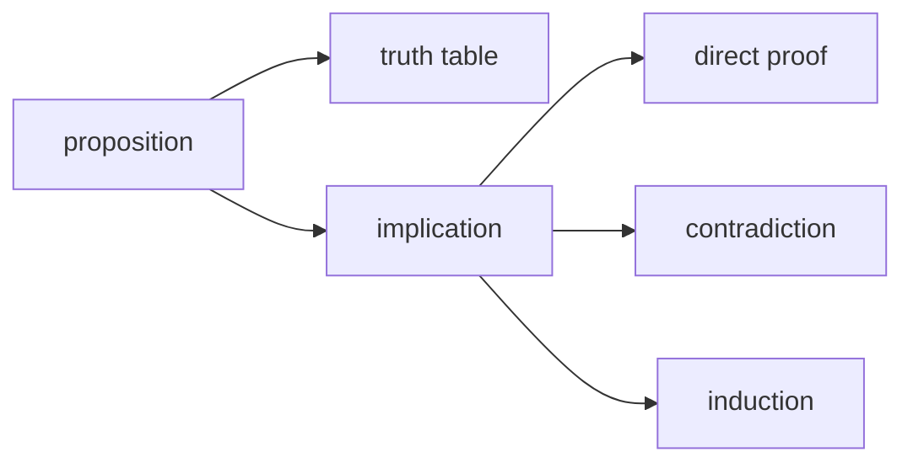

# Logic and Proofs

> Math for CS 101 series (2/10)

<!-- a-grade-intro:begin -->

**Core question**: How do you *prove* a *program* is *correct*?

> *Logic* gives us *propositions* and *implication*; *proof* uses *direct*, *contradiction*, and *induction*.

<!-- a-grade-intro:end -->

This is post 2 in the Math for CS 101 series.

## What You Will Learn

- *Propositions* and *truth tables*
- *Implication* and *equivalence*
- *Direct proof*
- *Proof by contradiction*
- *Mathematical induction*

## Why It Matters

A *test* checks a *few* cases. A *proof* covers *all* of them.

## Concept at a Glance



## Key Terms

- **proposition**: a *true/false* statement.
- **implication**: `p → q`.
- **direct proof**: from *premise* to *conclusion*.
- **contradiction**: assume the *opposite*, derive a *contradiction*.
- **induction**: *base case* plus *inductive step*.

## Before/After

**Before**: conclude *correct* from *three examples*.

**After**: prove for *all n* by *mathematical induction*.

## Hands-on: A Tiny Proof Kit

### Step 1 — Truth table

```python
def truth_imply():
    return [(p, q, (not p) or q) for p in (False, True) for q in (False, True)]
```

### Step 2 — Equivalence

```python
def equiv(p, q):
    return p == q
```

### Step 3 — Direct proof sketch

```python
def even_sum(a, b):
    assert a % 2 == 0 and b % 2 == 0
    return (a + b) % 2 == 0
```

### Step 4 — Contradiction sketch

```python
def assume_not(claim):
    return f"suppose not {claim}, derive contradiction"
```

### Step 5 — Induction

```python
def sum_to(n):
    return n * (n + 1) // 2
```

## What to Notice in This Code

- *Implication* is `not p or q`.
- The *sum* of *even* numbers is *even*.
- The *sum* formula is a *closed form*.

## Five Common Mistakes

1. **Replacing a *proof* with *examples*.**
2. **Confusing *implication* with its *converse*.**
3. **Skipping the *base case* in induction.**
4. **One *counterexample* is *disproof*.**
5. **Following *symbols* without grasping *meaning*.**

## How This Shows Up in Production

*Compiler* type checkers and *distributed* consensus algorithms are validated via *formal proofs*.

## How a Senior Engineer Thinks

- *Proof* is *documentation*.
- *Counterexamples* are *friends*.
- *Induction* is the cousin of a *loop*.
- *Equivalence* is a *refactoring* tool.
- *Implication* is a *guard*.

## Checklist

- [ ] Build a *truth table*.
- [ ] Distinguish *implication*, *converse*, *contrapositive*.
- [ ] Verify the *base case*.
- [ ] Hunt for *counterexamples*.

## Practice Problems

1. Define *implication* in one line.
2. Define *contradiction* in one line.
3. Define *induction* in one line.

## Wrap-up and Next Steps

Next, we cover *sets and functions*.

<!-- toc:begin -->
- [Why Math for CS](./01-why-math-for-cs.md)
- **Logic and Proofs (current)**
- Sets and Functions (upcoming)
- Graphs (upcoming)
- Combinatorics (upcoming)
- Probability (upcoming)
- Linear Algebra (upcoming)
- Calculus (upcoming)
- Information Theory (upcoming)
- Algorithms and Math (upcoming)
<!-- toc:end -->

## References

- [Discrete Mathematics and Its Applications - Rosen](https://en.wikipedia.org/wiki/Discrete_Mathematics_and_Its_Applications)
- [How to Prove It - Velleman](https://www.cambridge.org/core/books/how-to-prove-it/)
- [Mathematical Induction - Khan Academy](https://www.khanacademy.org/math/precalculus/x9e81a4f98389efdf:series/x9e81a4f98389efdf:induction/v/proof-by-induction)
- [Logic in Computer Science - Huth, Ryan](https://www.cambridge.org/core/books/logic-in-computer-science/)

Tags: Math, Logic, Proof, Boolean, Beginner
