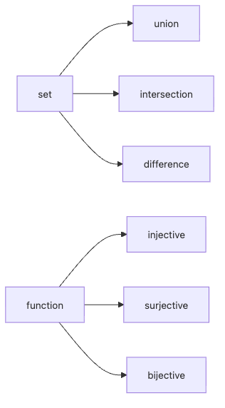

# Sets and Functions

When you learn data structures, you usually start with lists, dictionaries, mapping, and filtering. Step back a little, though, and two simpler ideas sit underneath all of them: sets tell you what belongs, and functions tell you how one value becomes another.

In real systems these two ideas rarely stay separate. Deduplication, permission checks, feature preprocessing, key mapping, and serialization pipelines all become easier to reason about once you can describe them as set boundaries plus transformation rules.

This is post 3 in the Math for CS 101 series.

Here we use sets and functions as the foundation for data modeling and transformation, not just as definitions to memorize.

## Questions this chapter answers

- Why are sets such a useful foundation for data structures and validation?
- How do union, intersection, and difference show up in ordinary code?
- What separates a function from a more general relation?
- Why do injective, surjective, and bijective mappings matter in practice?
- How does function composition resemble a production data pipeline?

> Sets make the boundary of allowed values explicit. Functions make the transformation from input to output explicit. Once those two axes are clear, both code and design decisions get easier to defend.

## Why It Matters

Python's `set`, `dict`, `map`, and `filter` already carry the mental model of sets and functions. Deduplication is a set operation. Data transformation is often a chain of functions. Permission checks usually become set membership or set intersection once you make the model explicit.

That clarity pays off when business rules get complicated. If you blur together the data boundary and the transformation rule, exceptions spread everywhere. When you separate them, you can explain what is allowed and how it is transformed as two different decisions.

## Concept at a Glance


*Sets define the boundary of values, while functions define the rule that moves values through the system.*

## Key Terms

- **set**: a collection of *distinct* elements.
- **union**: all elements.
- **intersection**: *shared* elements.
- **function**: one *output* per *input*.
- **bijection**: *injective* and *surjective*.

## Before/After

**Before**: handle everything with *lists*.

**After**: handle it with *sets* and *functions*, more clearly.

## Hands-on: Five Steps with Sets and Functions

### Step 1 — Sets

```python
A, B = {1, 2, 3}, {2, 3, 4}
```

### Step 2 — Union, intersection, difference

```python
def ops(A, B):
    return A | B, A & B, A - B
```

### Step 3 — A function

```python
def square(x):
    return x * x
```

### Step 4 — Injective check

```python
def is_injective(f, domain):
    return len({f(x) for x in domain}) == len(list(domain))
```

### Step 5 — Composition

```python
def compose(f, g):
    return lambda x: f(g(x))
```

## What to Notice in This Code

- The *operations* are *one operator* each.
- *Injective* is a *length* comparison.
- *Composition* is a *lambda*.

## Five Common Mistakes

1. **Confusing *list* and *set*.**
2. **Confusing *function* with *relation*.**
3. **Mixing up *injective* and *surjective*.**
4. **Misordering in *composition*.**
5. **Missing the *empty set* case.**

## How This Shows Up in Production

*Permission checks* are *set intersections*, *data mapping* is *function composition*, and *deduplication* is a *set conversion*.

## How a Senior Engineer Thinks

- *Sets* are *clear*.
- *Functions* are *deterministic*.
- *Bijections* are *invertible*.
- *Composition* is a *pipe*.
- The *empty set* is the *base case*.

## Checklist

- [ ] Translate *operations* to *code*.
- [ ] Specify *domain* and *codomain*.
- [ ] Decide *injective/surjective*.
- [ ] Check *composability*.

## Practice Problems

1. Define *injective* in one line.
2. Define *surjective* in one line.
3. Define *composition* in one line.

## Wrap-up and Next Steps

Sets clarify the shape of data, and functions clarify the shape of change. Together they provide a compact vocabulary for boundary checks, deterministic transformations, and reversible mappings.

Next, we broaden that structural view into graphs, where relationships between objects become the main story.

<!-- toc:begin -->
- [Why Math for CS](./01-why-math-for-cs.md)
- [Logic and Proofs](./02-logic-and-proofs.md)
- **Sets and Functions (current)**
- Graphs (upcoming)
- Combinatorics (upcoming)
- Probability (upcoming)
- Linear Algebra (upcoming)
- Calculus (upcoming)
- Information Theory (upcoming)
- Algorithms and Math (upcoming)
<!-- toc:end -->

## References

- [Sets - Wolfram MathWorld](https://mathworld.wolfram.com/Set.html)
- [Functions - Khan Academy](https://www.khanacademy.org/math/algebra/x2f8bb11595b61c86:functions)
- [Discrete Math - Rosen](https://en.wikipedia.org/wiki/Discrete_Mathematics_and_Its_Applications)
- [Python Set Operations](https://docs.python.org/3/tutorial/datastructures.html#sets)
- [SymPy GitHub repository](https://github.com/sympy/sympy)

Tags: Math, Sets, Functions, Foundations, Beginner
