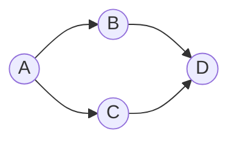

# Graphs

> Math for CS 101 series (4/10)

<!-- a-grade-intro:begin -->

**Core question**: How do you *represent* and *traverse* data with *relationships*?

> A *graph* is a collection of *vertices* and *edges* — the *common model* for every *network*.

<!-- a-grade-intro:end -->

## What You Will Learn

- *Vertices* and *edges*
- *Directed* vs *undirected*
- *Trees*
- *Adjacency matrix* vs *list*
- A starter *BFS*

## Why It Matters

*Social networks*, *maps*, *dependencies*, *recommendations* — all are *graphs*.

## Concept at a Glance



## Key Terms

- **vertex**: a *node*.
- **edge**: a *connection* between two *vertices*.
- **tree**: a *connected*, *acyclic* graph.
- **adjacency**: the *neighbor* relation.
- **BFS**: *breadth-first search*.

## Before/After

**Before**: store the graph as a *2-D array*.

**After**: use an *adjacency list* for a *sparse* representation.

## Hands-on: A Mini Graph Kit

### Step 1 — Adjacency list

```python
G = {"A": ["B", "C"], "B": ["D"], "C": ["D"], "D": []}
```

### Step 2 — Vertex and edge counts

```python
def stats(G):
    return len(G), sum(len(v) for v in G.values())
```

### Step 3 — Neighbors

```python
def neighbors(G, v):
    return G.get(v, [])
```

### Step 4 — BFS

```python
from collections import deque

def bfs(G, s):
    seen, q = {s}, deque([s])
    while q:
        v = q.popleft()
        for n in G[v]:
            if n not in seen:
                seen.add(n)
                q.append(n)
    return seen
```

### Step 5 — Tree check

```python
def is_tree(G):
    edges = sum(len(v) for v in G.values())
    return edges == len(G) - 1
```

## What to Notice in This Code

- An *adjacency list* is just a *dict*.
- *BFS* uses *one queue*.
- A *tree* has *edges = vertices - 1*.

## Five Common Mistakes

1. **Treating a *directed* graph as *undirected*.**
2. **Using an *adjacency matrix* on *sparse* data.**
3. **Forgetting *seen* in *BFS*.**
4. **Ignoring *connectivity* in tree checks.**
5. **Not handling *self loops*.**

## How This Shows Up in Production

*Friend recommendations*, *shortest path*, *dependency build order*, *rating propagation* — all *graph algorithms*.

## How a Senior Engineer Thinks

- The *graph* is the *model*.
- *Sparser* data prefers a *list*.
- *BFS* and *DFS* are *fundamentals*.
- A *tree* is a *subset* of graphs.
- *Direction* is *explicit*.

## Checklist

- [ ] Decide *directed/undirected*.
- [ ] Pick the *adjacency representation*.
- [ ] Implement *BFS*.
- [ ] Verify *tree conditions*.

## Practice Problems

1. Distinguish *vertex* and *edge* in one line.
2. Define *BFS* in one line.
3. Define *tree* in one line.

## Wrap-up and Next Steps

Next, we cover *combinatorics*.

<!-- toc:begin -->
- [Why Math for CS](./01-why-math-for-cs.md)
- [Logic and Proofs](./02-logic-and-proofs.md)
- [Sets and Functions](./03-sets-and-functions.md)
- **Graphs (current)**
- Combinatorics (upcoming)
- Probability (upcoming)
- Linear Algebra (upcoming)
- Calculus (upcoming)
- Information Theory (upcoming)
- Algorithms and Math (upcoming)
<!-- toc:end -->

## References

- [Graph Theory - Wolfram MathWorld](https://mathworld.wolfram.com/GraphTheory.html)
- [Graphs - Khan Academy](https://www.khanacademy.org/computing/computer-science/algorithms/graph-representation/a/representing-graphs)
- [Introduction to Algorithms - CLRS](https://mitpress.mit.edu/9780262046305/introduction-to-algorithms/)
- [NetworkX Documentation](https://networkx.org/)

Tags: Math, Graphs, DataStructure, Algorithms, Beginner
