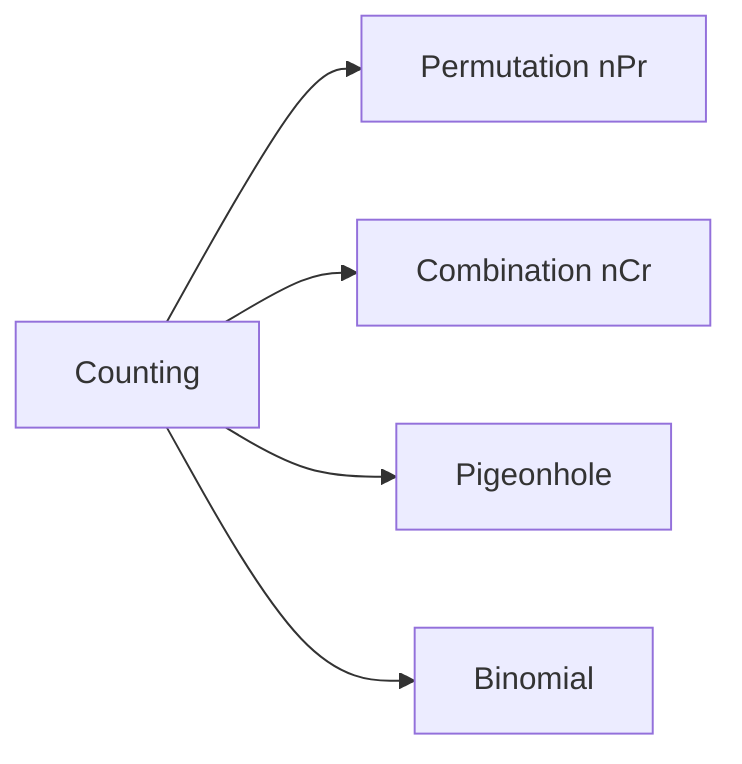

# Combinatorics

> Math for CS 101 series (5/10)

<!-- a-grade-intro:begin -->

**Core question**: How do we *count* possibilities *correctly* without listing them?

> *Combinatorics* is the *art of counting*, and it underpins *complexity analysis* and *probability*.

<!-- a-grade-intro:end -->

This is post 5 in the Math for CS 101 series.

## What You Will Learn

- *Product rule* and *sum rule*
- *Permutations* nPr
- *Combinations* nCr
- *Pigeonhole principle*
- *Binomial coefficients*

## Why It Matters

*Algorithm complexity*, *probability*, *hash collisions*, and *test case generation* all rest on counting.

## Concept at a Glance



## Key Terms

- **product rule**: multiply *sequential* choices.
- **sum rule**: add *exclusive* choices.
- **permutation**: *ordered* arrangement.
- **combination**: *unordered* selection.
- **pigeonhole**: *n+1* items in *n* boxes force a *collision*.

## Before/After

**Before**: enumerate every case by hand.

**After**: apply a *formula* in *constant time*.

## Hands-on: Mini Counting Kit

### Step 1 — Factorial

```python
def fact(n):
    r = 1
    for i in range(2, n + 1):
        r *= i
    return r
```

### Step 2 — Permutations

```python
def nPr(n, r):
    return fact(n) // fact(n - r)
```

### Step 3 — Combinations

```python
def nCr(n, r):
    return fact(n) // (fact(r) * fact(n - r))
```

### Step 4 — Pigeonhole Check

```python
def pigeon(items, holes):
    return items > holes
```

### Step 5 — Binomial Row

```python
def row(n):
    return [nCr(n, k) for k in range(n + 1)]
```

## What to Notice in This Code

- *Factorial* is the reusable building block.
- *nCr* is *symmetric*: (n,r) = (n,n-r).
- *Pigeonhole* is one inequality.

## Five Common Mistakes

1. **Confusing *permutations* and *combinations*.**
2. **Forgetting whether *repetition* is allowed.**
3. **Forgetting *0! = 1*.**
4. **Calling *factorial* directly on *huge n*.**
5. **Using *=* instead of *>* in pigeonhole.**

## How This Shows Up in Production

*A/B test bucketing*, *hash collision analysis*, *dataset sampling*, and *combinatorial explosion* checks all use these tools.

## How a Senior Engineer Thinks

- *Counting* is *modeling*.
- *Principles* over *formulas*.
- *Pigeonhole* proves *existence*.
- *Binomial* connects to *probability*.
- Watch for *combinatorial explosion*.

## Checklist

- [ ] Decide if *order matters*.
- [ ] Decide if *repetition* is allowed.
- [ ] Replace enumeration with a *formula*.
- [ ] Inspect *edge cases*.

## Practice Problems

1. State the difference between *nPr* and *nCr* in one line.
2. State *pigeonhole* in one line.
3. Why is *0! = 1*?

## Wrap-up and Next Steps

Next post: *Probability*.

<!-- toc:begin -->
- [Why Math for CS](./01-why-math-for-cs.md)
- [Logic and Proofs](./02-logic-and-proofs.md)
- [Sets and Functions](./03-sets-and-functions.md)
- [Graphs](./04-graphs.md)
- **Combinatorics (current)**
- Probability (upcoming)
- Linear Algebra (upcoming)
- Calculus (upcoming)
- Information Theory (upcoming)
- Algorithms and Math (upcoming)
<!-- toc:end -->

## References

- [Combinatorics - Wolfram MathWorld](https://mathworld.wolfram.com/Combinatorics.html)
- [Counting - Khan Academy](https://www.khanacademy.org/math/statistics-probability/counting-permutations-and-combinations)
- [Concrete Mathematics - Graham, Knuth, Patashnik](https://www-cs-faculty.stanford.edu/~knuth/gkp.html)
- [Python math.comb Documentation](https://docs.python.org/3/library/math.html#math.comb)

Tags: Math, Combinatorics, Counting, Probability, Beginner
