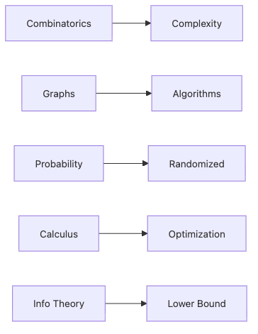

# Algorithms and Math

When people first learn algorithms, they usually focus on implementation. If the code works, it feels like progress. In production systems, though, the harder questions arrive right after that: how quickly does it grow, what model makes the problem tractable, when is randomness acceptable, and where are the theoretical limits no optimization can cross?

That is where the full series comes back together. Combinatorics explains explosive search spaces, graphs expose problem structure, probability enables randomized methods, calculus drives optimization, and information theory marks the floor you cannot beat.

This is the final post in the Math for CS 101 series.

Here we use algorithm design as the place where all of those mathematical tools finally meet.

## Questions this chapter answers

- How do the math topics from this series combine in algorithm design?
- Why does combinatorics matter so much for complexity analysis?
- How does graph modeling change the solution strategy itself?
- What do randomness, optimization, and information-theoretic limits each contribute?
- Why does a mathematical framing often change implementation outcomes?

> An algorithm is not just code. Before implementation, it is a model to choose, a cost to analyze, and a limit to acknowledge.

## Why It Matters

If you treat algorithms as code only, you often stop at whether they run. In real systems, you also need to know whether the model is right, whether the cost will scale, whether approximation is acceptable, and whether the theoretical lower bound already tells you to change strategy.

That is why mathematical framing matters so much. It is not decoration around implementation. It is often the thing that tells you whether an implementation direction is sensible in the first place.

## Concept at a Glance


*Algorithm design combines counting, structure, uncertainty, optimization, and lower bounds into one decision-making workflow before code is finalized.*

## Key Terms

- **complexity**: *cost* vs *input size*.
- **shortest path**: *minimum-distance* route.
- **randomized**: branches on a *coin flip*.
- **optimization**: search for *min/max*.
- **lower bound**: a *line of impossibility*.

## Before/After

**Before**: an algorithm is *just code*.

**After**: an algorithm is *analyzed* and bounded by *math*.

## Hands-on: Mini Capstone Kit

### Step 1 — Combinatorial Complexity

```python
def subsets(n):
    return 2 ** n
```

### Step 2 — BFS Shortest Path

```python
from collections import deque

def shortest(G, s, t):
    q, seen = deque([(s, 0)]), {s}
    while q:
        v, d = q.popleft()
        if v == t:
            return d
        for n in G[v]:
            if n not in seen:
                seen.add(n)
                q.append((n, d + 1))
    return -1
```

### Step 3 — Randomized Estimate

```python
import random

def estimate_pi(n=10000):
    inside = sum(1 for _ in range(n) if random.random() ** 2 + random.random() ** 2 < 1)
    return 4 * inside / n
```

### Step 4 — Gradient Descent Min

```python
def minimize(f, x, lr=0.1, steps=100, h=1e-5):
    for _ in range(steps):
        g = (f(x + h) - f(x - h)) / (2 * h)
        x = x - lr * g
    return x
```

### Step 5 — Entropy Lower Bound

```python
import math

def lower_bound_bits(probs):
    return sum(-p * math.log2(p) for p in probs if p > 0)
```

## What to Notice in This Code

- *Combinatorics* explains *exponential blowup*.
- *Graphs* are *models*.
- *Randomness* enables *approximation*.
- *Calculus* powers *optimization*.
- *Entropy* sets the *compression floor*.

## Five Common Mistakes

1. **Skipping *complexity* analysis.**
2. **Failing to *model* the problem as a graph.**
3. **Treating *randomized* output as *deterministic*.**
4. **Ignoring *learning rate* tuning.**
5. **Ignoring *theoretical limits*.**

## How This Shows Up in Production

*Search indexing (graphs + info theory)*, *recommenders (linalg + probability)*, *training (calculus + probability)*, and *design reviews (complexity)* all combine these tools.

## How a Senior Engineer Thinks

- *Math* is a *lens*.
- *Complexity* is a *budget*.
- *Probability* is *reality*.
- *Information theory* sets *limits*.
- *Modeling* comes *before code*.

## Checklist

- [ ] State the *complexity*.
- [ ] State the *model*.
- [ ] Isolate *randomness*.
- [ ] Verify *convergence*.
- [ ] Acknowledge *theoretical limits*.

## Practice Problems

1. State the link between *complexity* and *combinatorics* in one line.
2. State an advantage of *randomized* algorithms in one line.
3. State a *limit* that *information theory* imposes in one line.

## Wrap-up and Next Steps

This chapter closes the series by putting the full toolbox back into one frame. Math is not a barrier that makes code harder. It is the map that tells you which models are useful, which paths scale, and which limits you must respect.

If this series did its job, the next time you approach an algorithmic problem you will ask about structure, cost, randomness, and limits before you rush into implementation.

<!-- toc:begin -->
- [Why Math for CS](./01-why-math-for-cs.md)
- [Logic and Proofs](./02-logic-and-proofs.md)
- [Sets and Functions](./03-sets-and-functions.md)
- [Graphs](./04-graphs.md)
- [Combinatorics](./05-combinatorics.md)
- [Probability](./06-probability.md)
- [Linear Algebra](./07-linear-algebra.md)
- [Calculus](./08-calculus.md)
- [Information Theory](./09-information-theory.md)
- **Algorithms and Math (current)**
<!-- toc:end -->

## References

- [Introduction to Algorithms - CLRS](https://mitpress.mit.edu/9780262046305/introduction-to-algorithms/)
- [Algorithm Design - Kleinberg and Tardos](https://www.pearson.com/en-us/subject-catalog/p/algorithm-design/P200000003259)
- [Randomized Algorithms - Motwani and Raghavan](https://www.cambridge.org/9780521474658)
- [Convex Optimization - Boyd and Vandenberghe](https://web.stanford.edu/~boyd/cvxbook/)
- [TheAlgorithms/Python GitHub repository](https://github.com/TheAlgorithms/Python)

Tags: Math, Algorithms, Complexity, Capstone, Beginner
