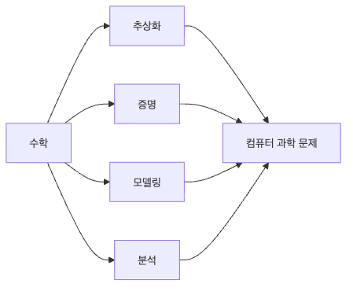

# CS에 수학이 필요한 이유

처음 프로그래밍을 배울 때는 이런 생각을 자주 합니다. 코드를 실행해서 원하는 결과가 나오면 된 것 아닌가, 굳이 수학까지 다시 붙잡아야 하나 하는 생각입니다. 실제로 작은 스크립트나 간단한 웹 기능을 만들 때는 이 감각만으로도 꽤 멀리 갈 수 있습니다.

그런데 시스템이 커지고 요구 사항이 복잡해지면 질문이 달라집니다. 왜 이 구현이 항상 맞는지, 입력이 커지면 어디서 느려지는지, 직관적으로 맞아 보이는 설계가 어떤 반례에서 깨지는지 설명해야 하기 때문입니다.

이 글은 Math for CS 101 시리즈의 1번째 글입니다.

여기서는 왜 컴퓨터 과학이 수학을 공식을 외우는 과목이 아니라 사고 도구로 받아들여야 하는지 큰 그림부터 잡아 보겠습니다.

---

## 이 글에서 다룰 문제

- 코드를 이미 작성할 수 있는데도 왜 수학이 더 필요할까요?
- 추상화, 증명, 모델링, 분석은 실제 개발에서 어떤 역할을 할까요?
- 수학을 알면 문제를 보는 방식이 어떻게 달라질까요?
- 이 시리즈의 아홉 개 수학 영역은 서로 어떻게 연결될까요?
- 처음 공부할 때 어떤 순서로 접근하면 부담이 덜할까요?

> 수학은 공식을 외우는 과목이 아니라 추상화, 증명, 모델링, 분석을 한 언어로 묶어 주는 작업대입니다. 코드를 더 많이 쓰게 해 주기보다, 코드가 왜 맞고 어디서 깨지는지 더 빨리 보게 해 줍니다.

---

## 왜 중요한가

개발 현장에서 자주 벌어지는 오해가 하나 있습니다. 코드가 한 번 돌아가면 설계도 맞는 것처럼 느껴진다는 점입니다. 하지만 실행 성공은 대개 일부 입력, 일부 시점, 일부 환경에 대한 확인일 뿐입니다. 보편적인 올바름, 성능의 상한, 데이터 모델의 경계는 따로 설명해야 합니다.

이때 수학이 들어옵니다. 집합은 무엇이 허용되고 무엇이 빠지는지 경계를 분명하게 만들고, 논리는 조건과 결론의 연결을 정리합니다. 조합은 경우의 수 폭발을 눈으로 보이게 만들고, 확률은 불확실성을 감 대신 수치로 다루게 합니다. 선형대수와 미분은 추천 시스템과 머신러닝이 왜 그런 식으로 움직이는지 설명하는 언어가 됩니다.

수학은 코드를 대체하지 않습니다. 대신 코드 뒤에 있는 구조를 정리합니다. 그래서 구현을 더 빨리 끝내는 도구라기보다, 잘못된 가정을 더 빨리 드러내는 도구에 가깝습니다.

---

## 머릿속에 먼저 둘 관점

이 시리즈를 따라갈 때 가장 먼저 잡아 둘 문장은 이것입니다. **수학은 정답을 외우는 과목이 아니라 문제를 압축해서 보는 방법**이라는 점입니다. 저는 이 감각이 잡히면 이후의 모든 주제가 훨씬 쉬워진다고 봅니다.

예를 들어 추상화는 여러 사례에서 공통 패턴만 남기는 일이고, 증명은 그 패턴이 언제나 성립하는지 보장하는 일입니다. 모델링은 현실을 계산 가능한 구조로 바꾸는 과정이고, 분석은 그 구조가 입력 크기와 조건에 따라 어떻게 움직이는지 측정하는 일입니다. 결국 수학은 코드 바깥의 별도 세계가 아니라, 코드를 더 정확히 말하게 만드는 상위 언어입니다.

특히 입문 단계에서는 수학을 많이 아는 사람보다, 어떤 주장을 수학적으로 다시 말할 수 있는 사람이 더 강합니다. 구현이 맞다고 느끼는 직관을 불변식으로 적고, 느릴 것 같다는 감을 복잡도로 적고, 애매한 관계를 함수나 그래프로 다시 그려 낼 수 있기 때문입니다.

## 한 장으로 보는 Math for CS의 역할


*Math for CS는 추상화, 증명, 모델링, 분석을 한 언어로 묶어 코드 바깥의 구조를 보이게 합니다.*

---

## 다섯 단계로 보는 수학적 사고

### 첫 번째 단계 — 패턴을 뽑아냅니다

```python
def common(a, b):
    return [x for x in a if x in b]
```

두 컬렉션에서 공통 원소를 찾는 이 코드는 단순해 보이지만, 실제로는 교집합이라는 생각을 코드로 옮긴 것입니다. 수학적 추상화는 늘 이런 식으로 시작합니다. 표면상 다른 문제에서도 같은 구조를 발견하면, 설명과 재사용이 함께 쉬워집니다.

### 두 번째 단계 — 불변식을 적습니다

```python
def invariant(items):
    assert sum(items) >= 0
    return True
```

불변식은 진행 중에도 계속 유지되어야 하는 조건입니다. 루프를 읽을 때, 상태 전이를 점검할 때, 동시성 코드를 검토할 때 이 한 문장이 있느냐 없느냐가 디버깅 난도를 크게 바꿉니다. 수학은 이 불변식을 감으로 넘기지 않고 문장으로 적게 만듭니다.

### 세 번째 단계 — 현실을 모델로 바꿉니다

```python
def model(rate, time):
    return rate * time
```

현실 문제를 변수와 관계로 바꾸는 순간 계산이 시작됩니다. 속도와 시간을 곱해 거리를 구하는 식은 단순하지만, 모델링의 핵심을 잘 보여 줍니다. 현실 전체를 복사하는 것이 아니라, 지금 필요한 관계만 남기는 것입니다.

### 네 번째 단계 — 비용을 함수로 봅니다

```python
def linear(n):
    return [i for i in range(n)]
```

입력 크기 n이 커질 때 비용이 어떻게 늘어나는지 보는 순간, 구현은 단순한 코드 조각이 아니라 분석 대상이 됩니다. 지금은 빠른 코드가 나중에도 빠를지, 작은 데이터에서만 괜찮은지 구분하게 되는 지점입니다.

### 다섯 번째 단계 — 왜 맞는지 설명합니다

```python
def proof_sketch(claim):
    return f"assume {claim}; derive contradiction"
```

증명은 거창한 수학자 전용 기술이 아닙니다. 주장과 가정을 분리하고, 반례가 가능한지 보고, 모순이 생기는지 따지는 습관입니다. API 제약 조건을 설명할 때도, 정렬 로직을 검토할 때도, 분산 시스템의 안전성을 따질 때도 같은 사고가 그대로 쓰입니다.

---

## 이 코드에서 먼저 볼 점

- 공통 원소 찾기는 리스트 처리처럼 보여도 집합 사고로 다시 읽을 수 있습니다.
- 불변식은 거대한 정리보다 `assert` 한 줄에서 먼저 시작할 수 있습니다.
- 모델링은 현실을 단순화하는 대신 계산 가능성을 얻는 과정입니다.
- 복잡도는 결과가 아니라 입력 크기와 비용의 관계를 보는 시선입니다.
- 증명은 구현 이후에 붙는 장식이 아니라 설계 단계에서 가정을 정리하는 도구입니다.

---

## 어디서 자주 헷갈릴까요?

가장 흔한 실수는 수학을 공식 암기로만 보는 것입니다. 그러면 함수 이름과 기호는 남는데, 왜 그 도구가 필요한지는 남지 않습니다. 반대로 수학을 사고 도구로 보면, 공식을 외우기 전에 먼저 구조를 묻게 됩니다.

또 하나는 테스트와 증명을 같은 것으로 보는 실수입니다. 테스트는 필수지만 일부 사례를 확인하는 일입니다. 증명은 가능한 모든 경우를 겨냥합니다. 둘은 경쟁 관계가 아니라 역할이 다릅니다.

모델과 현실을 혼동하는 일도 자주 나옵니다. 모델은 현실을 단순화한 것이지 현실 자체가 아닙니다. 그래서 모델이 깔끔할수록 오히려 무엇을 버렸는지 더 의식해야 합니다.

복잡도 분석을 벤치마크로 대체하는 습관도 위험합니다. 지금 노트북에서 한 번 빨랐다는 사실과, 입력이 커졌을 때도 구조적으로 감당 가능하다는 사실은 전혀 다릅니다.

---

## 실무에서는 이렇게 생각한다

추천 시스템은 선형대수로 점수 공간을 다루고, 분산 시스템은 논리와 확률 위에서 안전성을 설명합니다. 검색과 압축은 정보이론과 연결되고, 알고리즘 설계는 조합과 복잡도 분석을 피해 갈 수 없습니다. 분야는 달라도 공통 질문은 비슷합니다. 구조가 무엇인지, 왜 맞는지, 어디서 느려지는지, 어떤 한계가 있는지 묻는 일입니다.

저는 시니어 엔지니어의 수학 감각이 계산 실력보다 설명 실력에서 더 잘 드러난다고 생각합니다. 좋은 엔지니어는 직관을 버리지 않지만, 직관으로 끝내지도 않습니다. 불변식으로 적고, 반례를 찾고, 비용을 함수로 보고, 모델과 현실의 차이를 분리해 말합니다.

---

## 체크리스트

- [ ] 코드의 핵심 불변식을 한 문장으로 적을 수 있습니다.
- [ ] 모델과 현실의 차이를 구분해 설명할 수 있습니다.
- [ ] 입력 크기에 따른 비용 변화를 말할 수 있습니다.
- [ ] 테스트와 증명의 역할 차이를 설명할 수 있습니다.
- [ ] 다음 글에서 다룰 논리와 증명이 왜 필요한지 이해했습니다.

## 연습 문제

1. 추상화를 한 줄로 정의해 보세요.
2. 불변식이 왜 디버깅에 도움이 되는지 설명해 보세요.
3. 모델링과 분석의 차이를 한 문장으로 정리해 보세요.

## 정리

이 글은 왜 CS가 수학을 필요로 하는지 큰 그림을 잡는 출발점입니다. 수학은 코드를 대신하지 않지만, 코드가 왜 맞는지 설명하고 어디서 깨질지 예상하게 해 줍니다. 이후 글들은 이 큰 그림을 논리, 집합, 그래프, 조합, 확률, 선형대수, 미분, 정보이론으로 나눠 더 구체적으로 다룹니다.

<!-- toc:begin -->
- **CS에 수학이 필요한 이유 (현재 글)**
- 논리와 증명 (예정)
- 집합과 함수 (예정)
- 그래프 (예정)
- 조합 (예정)
- 확률 (예정)
- 선형대수 (예정)
- 미분 (예정)
- 정보이론 (예정)
- 알고리즘과 수학 (예정)
<!-- toc:end -->

## 참고 자료

- [Concrete Mathematics - Knuth, Graham, Patashnik](https://en.wikipedia.org/wiki/Concrete_Mathematics)
- [Mathematics for Computer Science - MIT OCW](https://ocw.mit.edu/courses/6-042j-mathematics-for-computer-science-fall-2010/)
- [Mathematical Foundations of CS - ACM](https://cacm.acm.org/magazines/2014/2/171688-mathematical-foundations-of-computer-science/)
- [The Importance of Math in Programming - Dev.to](https://dev.to/codenameone/the-importance-of-math-in-programming-21k0)
- [TheAlgorithms/Python GitHub repository](https://github.com/TheAlgorithms/Python)

Tags: Math, CS, Foundations, Learning, Beginner
