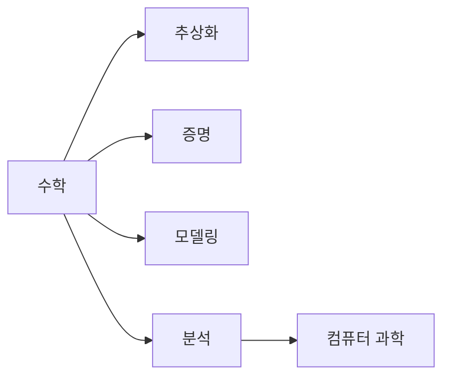

# CS에 수학이 필요한 이유

## 이 글에서 다룰 문제

- 코드를 이미 작성할 수 있는데도 왜 수학이 더 필요할까요?
- 추상화, 증명, 모델링, 분석은 실제 개발에서 어떤 역할을 할까요?
- 수학을 알면 문제를 보는 방식이 어떻게 달라질까요?
- 이 시리즈의 아홉 개 수학 영역은 서로 어떻게 연결될까요?
- 처음 공부할 때 어떤 순서로 접근하면 부담이 덜할까요?

> 수학은 공식을 외우는 과목이 아니라 추상화, 증명, 모델링, 분석을 같은 언어로 다루게 해 주는 도구입니다.

> Math for CS 101 시리즈 (1/10)

## 왜 중요한가

개발을 하다 보면 코드가 돌아가는 것과 코드를 설명할 수 있는 것은 전혀 다른 문제라는 사실을 자주 마주합니다. 테스트 몇 개가 통과했다고 해서 알고리즘이 항상 맞는 것은 아니고, 입력이 커졌을 때도 충분히 빠른지 따져 보려면 직관만으로는 부족합니다.

이때 필요한 것이 수학 어휘입니다. 집합을 알면 데이터의 경계를 더 또렷하게 볼 수 있고, 논리를 알면 조건문과 불변식을 더 분명하게 설명할 수 있습니다. 확률을 알면 불확실성을 감으로 넘기지 않고 수치로 다룰 수 있고, 선형대수와 미분을 알면 추천 시스템이나 머신러닝 모델이 왜 그런 방식으로 움직이는지 이해할 수 있습니다.

수학은 코드를 대신하지 않습니다. 대신 코드를 더 잘 설계하고, 더 정확히 설명하고, 더 일찍 틀린 가정을 발견하게 도와줍니다.

## 한눈에 보는 흐름



이 그림은 수학이 CS에 들어오는 대표 경로를 보여 줍니다. 추상화는 공통 구조를 뽑아내는 힘이고, 증명은 왜 맞는지 보장하는 방식이며, 모델링은 현실 문제를 계산 가능한 형태로 바꾸는 과정입니다. 분석은 성능과 비용을 예측하는 일입니다.

## 핵심 용어

- 추상화: 여러 사례에서 공통 패턴만 남기는 일입니다.
- 증명: 어떤 명제가 항상 참임을 논리적으로 보이는 과정입니다.
- 모델링: 현실 문제를 수식이나 구조로 바꾸는 작업입니다.
- 분석: 입력 크기나 조건에 따라 동작이 어떻게 달라지는지 측정하는 일입니다.
- 불변식: 과정이 진행되어도 유지되는 성질입니다.

## Before / After

Before: 코드가 실행되면 충분하다고 생각합니다.

After: 왜 실행되고 왜 맞는지까지 설명하려고 합니다.

## 수학적으로 생각하는 다섯 단계

### 1단계 — 패턴 추출

```python
def common(a, b):
    return [x for x in a if x in b]
```

두 컬렉션에서 공통 원소를 찾는 코드는 단순해 보이지만, 실제로는 교집합이라는 개념을 코드로 표현한 것입니다. 수학을 알고 보면 이 동작을 매번 새로 설명하지 않아도 됩니다.

### 2단계 — 불변식 확인

```python
def invariant(items):
    assert sum(items) >= 0
    return True
```

불변식은 디버깅에도 유용합니다. 어떤 루프나 상태 전이가 진행되는 동안 반드시 유지되어야 하는 속성을 한 문장으로 적을 수 있으면, 오류를 찾는 범위가 훨씬 좁아집니다.

### 3단계 — 모델링

```python
def model(rate, time):
    return rate * time
```

현실의 관계를 변수로 바꾸는 순간 계산이 가능해집니다. 속도와 시간을 곱해 거리를 구하는 식은 단순하지만, 모델링이 무엇인지 보여 주는 대표 사례입니다.

### 4단계 — 복잡도 측정

```python
def linear(n):
    return [i for i in range(n)]
```

입력이 커질수록 비용이 얼마나 늘어나는지 보는 시선은 실무에서 매우 중요합니다. 같은 결과를 만드는 코드라도 어떤 구현은 선형으로 늘고, 어떤 구현은 제곱으로 늘어납니다.

### 5단계 — 증명 스케치

```python
def proof_sketch(claim):
    return f"assume {claim}; derive contradiction"
```

증명은 거창한 수학자 전용 도구가 아닙니다. 주장의 반대를 가정해 모순을 끌어내는 식의 사고는 API 설계, 동시성 제어, 알고리즘 검토에서도 그대로 쓰입니다.

## 이 코드에서 봐야 할 포인트

- 공통 원소 찾기는 집합 연산으로 다시 볼 수 있습니다.
- 불변식은 assert 한 줄처럼 작게 시작할 수 있습니다.
- 복잡도는 입력 크기를 변수로 둘 때 더 또렷하게 보입니다.
- 모델링은 현실을 단순화하는 대신 계산 가능성을 얻는 과정입니다.

## 자주 하는 실수 다섯 가지

1. 수학을 공식 암기로만 보는 실수
2. 직관이 맞아 보인다는 이유로 검증을 생략하는 실수
3. 모델과 현실이 완전히 같다고 생각하는 실수
4. 벤치마크 몇 번으로 복잡도 분석을 대신하는 실수
5. 기호 뜻을 모르고 표기만 외우는 실수

## 실무에서는 이렇게 드러납니다

추천 시스템은 선형대수로 점수 공간을 다루고, 분산 시스템은 논리와 확률 위에서 안정성을 설명합니다. 검색과 압축은 정보이론과 연결되고, 알고리즘 설계는 조합과 복잡도 분석을 피할 수 없습니다. 분야는 달라도 수학이 공통 언어가 됩니다.

## 시니어 엔지니어는 이렇게 생각합니다

- 수학은 별도 과목이 아니라 설명 능력입니다.
- 직관은 출발점이고, 검증은 수학이 맡습니다.
- 복잡도는 성능 측정 결과보다 먼저 보는 예측 도구입니다.
- 증명은 문서화이자 디버깅 도구입니다.
- 여러 수학 영역은 따로 놀지 않고 사다리처럼 이어집니다.

## 체크리스트

- [ ] 코드의 핵심 불변식을 한 문장으로 적을 수 있습니다.
- [ ] 모델과 현실의 차이를 구분해 설명할 수 있습니다.
- [ ] 입력 크기에 따른 비용 변화를 말할 수 있습니다.
- [ ] 다음 글에서 다룰 논리와 증명이 왜 필요한지 이해했습니다.

## 연습 문제

1. 추상화를 한 줄로 정의해 보세요.
2. 불변식이 왜 디버깅에 도움이 되는지 설명해 보세요.
3. 모델링과 분석의 차이를 한 문장으로 정리해 보세요.

## 정리 및 다음 단계

이 글은 왜 CS가 수학을 필요로 하는지 큰 그림을 잡는 출발점입니다. 수학은 코드를 대체하지 않지만, 코드가 왜 맞는지 설명하고 어디서 깨질지 예상하게 해 줍니다. 다음 글에서는 이 기초 위에 논리와 증명을 올려 보겠습니다.

<!-- toc:begin -->
- **CS에 수학이 필요한 이유 (현재 글)**
- 논리와 증명 (예정)
- 집합과 함수 (예정)
- 그래프 (예정)
- 조합 (예정)
- 확률 (예정)
- 선형대수 (예정)
- 미분 (예정)
- 정보이론 (예정)
- 알고리즘과 수학 (예정)
<!-- toc:end -->

## 참고 자료

- [Concrete Mathematics - Knuth, Graham, Patashnik](https://en.wikipedia.org/wiki/Concrete_Mathematics)
- [Mathematics for Computer Science - MIT OCW](https://ocw.mit.edu/courses/6-042j-mathematics-for-computer-science-fall-2010/)
- [Why CS Needs Math - ACM Communications](https://cacm.acm.org/magazines/2014/2/171688-mathematical-foundations-of-computer-science/)
- [The Importance of Math in Programming - Dev.to](https://dev.to/codenameone/the-importance-of-math-in-programming-21k0)

Tags: Math, CS, Foundations, Learning, Beginner
