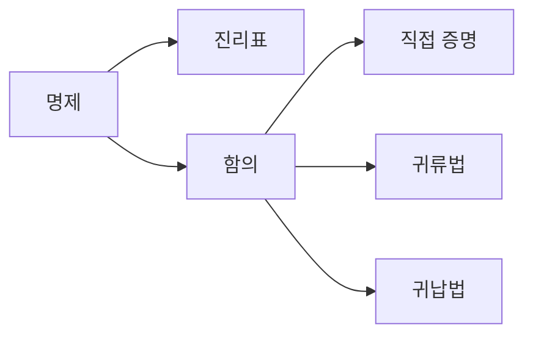

# 논리와 증명

## 이 글에서 다룰 문제

- 테스트와 증명은 무엇이 다를까요?
- 명제, 함의, 동치는 코드와 어떤 식으로 연결될까요?
- 직접 증명과 귀류법은 언제 쓰면 좋을까요?
- 수학적 귀납법은 반복문 검증과 어떻게 닮아 있을까요?
- 반례 하나가 왜 전체 주장을 무너뜨릴 수 있을까요?

> 논리는 참과 거짓을 다루는 문법이고, 증명은 그 문법으로 프로그램과 알고리즘의 올바름을 설명하는 방법입니다.

> Math for CS 101 시리즈 (2/10)

## 왜 중요한가

테스트는 중요한 도구이지만 본질적으로 일부 입력만 확인합니다. 반면 증명은 모든 경우를 대상으로 합니다. 예제가 세 개 맞았다고 해서 모든 n에 대해 맞는 것은 아닙니다. 그래서 논리와 증명은 코드를 더 많이 짜기 전에, 주장이 정확히 무엇인지부터 분명하게 만들어 줍니다.

개발에서 이 감각은 생각보다 자주 필요합니다. 타입 시스템은 어떤 값이 들어올 수 있는지 논리적으로 제한하고, 분산 합의 알고리즘은 특정 조건에서 상태가 깨지지 않음을 증명하려고 합니다. 조건문이 많아질수록 명제와 함의를 분명히 다루는 능력이 중요해집니다.

## 한눈에 보는 흐름



명제는 참이나 거짓을 가질 수 있는 문장입니다. 함의는 어떤 조건이 참일 때 다른 결론이 따라오는지를 다루고, 증명 기법은 그 연결을 어떻게 보여 줄지 정하는 방법입니다.

## 핵심 용어

- 명제: 참 또는 거짓으로 판단할 수 있는 문장입니다.
- 함의: `p → q`처럼 조건과 결론의 관계를 나타냅니다.
- 직접 증명: 가정에서 출발해 결론으로 곧장 가는 방식입니다.
- 귀류법: 반대를 가정한 뒤 모순을 이끌어 냅니다.
- 수학적 귀납법: 기저 단계와 귀납 단계를 통해 전체를 보입니다.

## Before / After

Before: 예제 몇 개가 맞으니 전체도 맞다고 생각합니다.

After: 어떤 명제를 증명하려는지부터 분명히 적고, 적절한 증명 방식을 고릅니다.

## 작은 증명 키트

### 1단계 — 진리표

```python
def truth_imply():
    return [(p, q, (not p) or q) for p in (False, True) for q in (False, True)]
```

함의를 코드로 보면 `not p or q`로 나타낼 수 있습니다. 이 표현을 이해하면 조건문이 언제 참으로 평가되는지 훨씬 명확해집니다.

### 2단계 — 동치 확인

```python
def equiv(p, q):
    return p == q
```

동치는 두 표현이 항상 같은 진리값을 갖는다는 뜻입니다. 리팩터링을 할 때 두 조건식이 정말 같은지 따지는 데도 같은 감각이 필요합니다.

### 3단계 — 직접 증명 스케치

```python
def even_sum(a, b):
    assert a % 2 == 0 and b % 2 == 0
    return (a + b) % 2 == 0
```

짝수 두 개의 합이 짝수라는 사실은 직접 증명의 좋은 예입니다. 가정이 분명할수록 결론까지의 경로도 짧아집니다.

### 4단계 — 귀류법 스케치

```python
def assume_not(claim):
    return f"suppose not {claim}, derive contradiction"
```

직접 밀고 가기 어려운 주장은 반대를 가정해 보는 편이 더 쉽습니다. 동시성 문제나 상태 불변식을 검토할 때도 같은 방식이 유용합니다.

### 5단계 — 귀납법

```python
def sum_to(n):
    return n * (n + 1) // 2
```

귀납법은 반복 구조와 특히 잘 맞습니다. n일 때 성립하고 n+1일 때도 이어진다는 점을 보이면 전체 자연수 구간으로 확장할 수 있습니다.

## 이 코드에서 봐야 할 포인트

- 함의는 낯선 기호가 아니라 불리언 표현으로 옮길 수 있습니다.
- 직접 증명은 가정이 명확할수록 읽기 쉽습니다.
- 귀납법은 반복문의 사고방식과 닮아 있습니다.
- 반례 하나는 보편 명제를 깨뜨리기에 충분합니다.

## 자주 하는 실수 다섯 가지

1. 예시 몇 개를 증명으로 착각하는 실수
2. 함의와 역을 같은 것으로 보는 실수
3. 귀납법에서 기저 단계를 빼먹는 실수
4. 반례 하나의 힘을 과소평가하는 실수
5. 기호만 따라가고 명제 뜻을 놓치는 실수

## 실무에서는 이렇게 드러납니다

컴파일러의 타입 검사기는 허용 가능한 상태를 논리적으로 제한합니다. 분산 시스템의 합의 알고리즘은 특정 장애 조건에서도 안전성이 유지되는지 증명합니다. 인증과 권한 처리에서도 조건 조합이 복잡해질수록 논리적 사고가 직접 도움이 됩니다.

## 시니어 엔지니어는 이렇게 생각합니다

- 증명은 수학 숙제가 아니라 설계 문서입니다.
- 반례를 찾는 일은 공격이 아니라 품질 향상입니다.
- 귀납법은 루프 검증의 가까운 친척입니다.
- 동치는 리팩터링 안전성을 따지는 기준입니다.
- 함의는 가드 조건을 읽는 기본 문법입니다.

## 체크리스트

- [ ] 명제와 예시를 구분할 수 있습니다.
- [ ] 함의, 역, 대우를 서로 다르게 설명할 수 있습니다.
- [ ] 귀납법의 기저 단계와 귀납 단계를 말할 수 있습니다.
- [ ] 반례를 찾는 습관이 왜 중요한지 이해했습니다.

## 연습 문제

1. 함의를 한 줄로 정의해 보세요.
2. 귀류법이 무엇인지 한 문장으로 써 보세요.
3. 귀납법이 반복문 검증과 닮은 이유를 설명해 보세요.

## 정리 및 다음 단계

논리와 증명은 코드가 맞는지 설명하는 언어입니다. 테스트가 몇 가지 사례를 확인하는 동안, 증명은 전체 경우를 겨냥합니다. 다음 글에서는 이 논리를 더 구체적인 구조로 옮겨 집합과 함수를 살펴보겠습니다.

<!-- toc:begin -->
- [CS에 수학이 필요한 이유](./01-why-math-for-cs.md)
- **논리와 증명 (현재 글)**
- 집합과 함수 (예정)
- 그래프 (예정)
- 조합 (예정)
- 확률 (예정)
- 선형대수 (예정)
- 미분 (예정)
- 정보이론 (예정)
- 알고리즘과 수학 (예정)
<!-- toc:end -->

## 참고 자료

- [Discrete Mathematics and Its Applications - Rosen](https://en.wikipedia.org/wiki/Discrete_Mathematics_and_Its_Applications)
- [How to Prove It - Velleman](https://www.cambridge.org/core/books/how-to-prove-it/)
- [Mathematical Induction - Khan Academy](https://www.khanacademy.org/math/precalculus/x9e81a4f98389efdf:series/x9e81a4f98389efdf:induction/v/proof-by-induction)
- [Logic in Computer Science - Huth, Ryan](https://www.cambridge.org/core/books/logic-in-computer-science/)

Tags: Math, Logic, Proof, Boolean, Beginner
