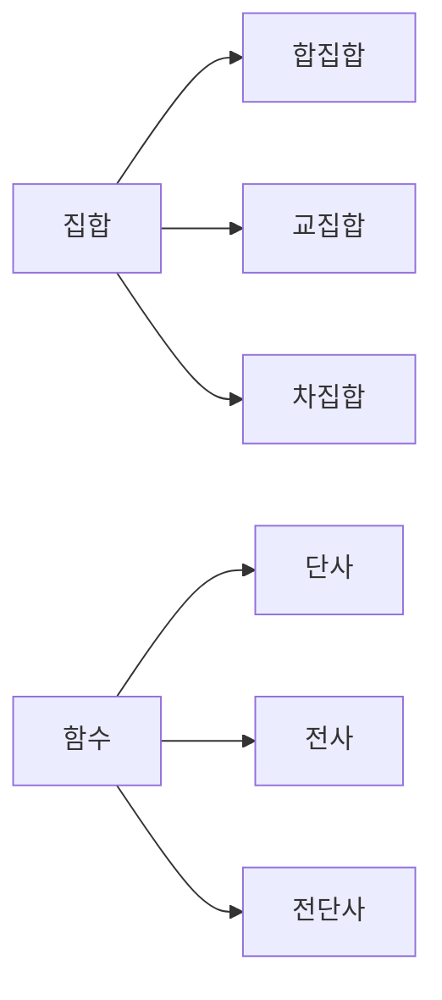

# 집합과 함수

## 이 글에서 다룰 문제

- 집합은 왜 자료구조와 데이터 모델의 기초라고 할까요?
- 합집합, 교집합, 차집합은 코드에서 어떻게 보일까요?
- 함수와 관계는 무엇이 다를까요?
- 단사, 전사, 전단사는 왜 중요한 구분일까요?
- 함수 합성은 실무 코드의 어떤 패턴과 닮아 있을까요?

> 집합은 원소의 경계를 분명하게 만들고, 함수는 입력과 출력의 규칙을 분명하게 만듭니다. 둘을 함께 이해하면 데이터 구조가 훨씬 또렷해집니다.

> Math for CS 101 시리즈 (3/10)

## 왜 중요한가

Python의 set, dict, map, filter를 떠올려 보면 이미 집합과 함수의 아이디어가 코드 곳곳에 들어와 있다는 사실을 알 수 있습니다. 중복 제거는 집합의 성질을 쓰는 일이고, 데이터 변환 파이프라인은 함수 합성과 거의 같은 생각으로 읽을 수 있습니다.

집합은 무엇이 포함되고 무엇이 제외되는지 경계를 그어 줍니다. 함수는 어떤 입력에 어떤 출력이 대응되는지 규칙을 정합니다. 이 둘이 분명해지면 코드도 분명해집니다. 반대로 이 구분이 흐리면 자료구조와 비즈니스 규칙이 뒤섞이기 쉽습니다.

## 한눈에 보는 흐름



집합 쪽은 원소의 포함 관계를 다루고, 함수 쪽은 매핑의 성질을 다룹니다. 둘은 분리된 주제처럼 보여도 데이터 모델링에서는 늘 함께 등장합니다.

## 핵심 용어

- 집합: 중복 없는 원소들의 모음입니다.
- 합집합: 두 집합에 속한 모든 원소를 모은 결과입니다.
- 교집합: 두 집합이 공통으로 가진 원소입니다.
- 함수: 각 입력에 정확히 하나의 출력을 대응시키는 규칙입니다.
- 전단사: 단사이면서 전사인 함수입니다.

## Before / After

Before: 모든 데이터를 리스트로만 다루려고 합니다.

After: 중복 제거, 포함 여부, 매핑 규칙을 집합과 함수로 분리해 생각합니다.

## 집합과 함수 다섯 단계

### 1단계 — 집합 만들기

```python
A, B = {1, 2, 3}, {2, 3, 4}
```

집합의 핵심은 순서보다 포함 여부입니다. 같은 원소가 두 번 들어가도 한 번만 남는다는 점이 리스트와 가장 먼저 갈리는 부분입니다.

### 2단계 — 합집합, 교집합, 차집합

```python
def ops(A, B):
    return A | B, A & B, A - B
```

연산자 하나로 집합 연산을 표현할 수 있다는 사실은, 코드가 이미 수학적 구조를 받아들이고 있다는 좋은 예입니다.

### 3단계 — 함수

```python
def square(x):
    return x * x
```

함수는 입력마다 결과가 하나여야 합니다. 같은 입력에 따라 결과가 달라진다면 함수라기보다 상태 의존 규칙에 가깝습니다.

### 4단계 — 단사 확인

```python
def is_injective(f, domain):
    return len({f(x) for x in domain}) == len(list(domain))
```

서로 다른 입력이 서로 다른 출력으로 가는지 보는 관점입니다. 식별자 매핑이나 키 생성 규칙을 생각할 때도 유용합니다.

### 5단계 — 합성

```python
def compose(f, g):
    return lambda x: f(g(x))
```

작은 함수를 안전하게 이어 붙이는 감각은 실무에서도 중요합니다. 변환 파이프라인, 직렬화 단계, 권한 검사 단계가 모두 합성으로 읽힐 수 있습니다.

## 이 코드에서 봐야 할 포인트

- 집합 연산은 파이썬에서 매우 직접적으로 표현됩니다.
- 단사는 출력 개수와 입력 개수의 관계로 확인할 수 있습니다.
- 합성은 파이프라인 설계와 닮아 있습니다.
- 공집합은 자주 잊히지만 중요한 경계 사례입니다.

## 자주 하는 실수 다섯 가지

1. 리스트와 집합을 같은 것으로 취급하는 실수
2. 함수와 일반 관계를 구분하지 않는 실수
3. 단사와 전사를 뒤섞는 실수
4. 함수 합성 순서를 거꾸로 이해하는 실수
5. 공집합과 빈 입력의 처리를 빼먹는 실수

## 실무에서는 이렇게 드러납니다

권한 집합의 교집합으로 접근 가능 여부를 계산할 수 있고, 중복 제거는 집합 변환으로 깔끔하게 해결됩니다. 데이터 전처리 단계는 함수 합성으로 정리할 수 있어 테스트와 재사용이 쉬워집니다.

## 시니어 엔지니어는 이렇게 생각합니다

- 집합은 경계를 또렷하게 만드는 도구입니다.
- 함수는 결정적 규칙이라는 점이 중요합니다.
- 전단사는 되돌릴 수 있는 매핑을 떠올리게 합니다.
- 합성 가능성은 설계 품질을 보여 줍니다.
- 공집합과 빈 입력은 기본 사례입니다.

## 체크리스트

- [ ] 집합 연산을 코드로 옮길 수 있습니다.
- [ ] 함수의 정의역과 공역을 말할 수 있습니다.
- [ ] 단사와 전사의 차이를 설명할 수 있습니다.
- [ ] 함수 합성의 순서를 올바르게 읽을 수 있습니다.

## 연습 문제

1. 단사를 한 줄로 정의해 보세요.
2. 전사를 한 줄로 정의해 보세요.
3. 함수 합성이 왜 파이프라인과 닮았는지 설명해 보세요.

## 정리 및 다음 단계

집합은 데이터의 범위를 분명하게 만들고, 함수는 데이터가 어떻게 변하는지 규칙을 분명하게 만듭니다. 이 두 개념을 익히면 코드의 모양뿐 아니라 의도까지 더 깔끔하게 설명할 수 있습니다. 다음 글에서는 관계를 더 넓은 구조로 확장해 그래프를 보겠습니다.

<!-- toc:begin -->
- [CS에 수학이 필요한 이유](./01-why-math-for-cs.md)
- [논리와 증명](./02-logic-and-proofs.md)
- **집합과 함수 (현재 글)**
- 그래프 (예정)
- 조합 (예정)
- 확률 (예정)
- 선형대수 (예정)
- 미분 (예정)
- 정보이론 (예정)
- 알고리즘과 수학 (예정)
<!-- toc:end -->

## 참고 자료

- [Sets - Wolfram MathWorld](https://mathworld.wolfram.com/Set.html)
- [Functions - Khan Academy](https://www.khanacademy.org/math/algebra/x2f8bb11595b61c86:functions)
- [Discrete Math - Rosen](https://en.wikipedia.org/wiki/Discrete_Mathematics_and_Its_Applications)
- [Python Set Operations](https://docs.python.org/3/tutorial/datastructures.html#sets)

Tags: Math, Sets, Functions, Foundations, Beginner
