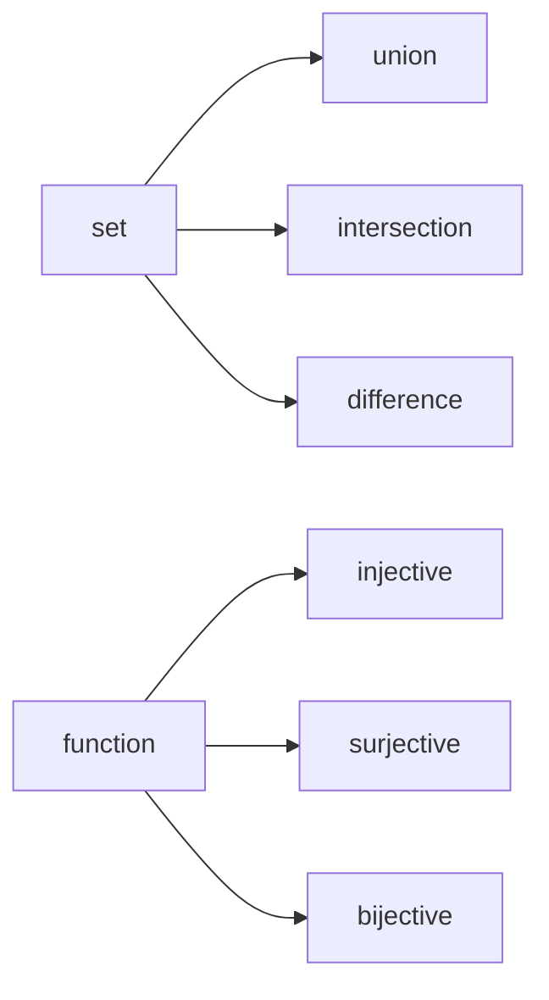

# 집합과 함수

> Math for CS 101 시리즈 (3/10)


## 이 글에서 다룰 문제

*Python set*, *dict*, *map*, *filter* 까지 모두 *집합과 함수* 의 *재해석* 입니다.

## 개념 한눈에 보기



## Before/After

**Before**: *list* 로 모든 처리.

**After**: *set* 과 *함수* 로 *명확* 한 처리.

## 실습: 집합과 함수 5단계

### 1단계 — 집합

```python
A, B = {1, 2, 3}, {2, 3, 4}
```

### 2단계 — 합/교/차

```python
def ops(A, B):
    return A | B, A & B, A - B
```

### 3단계 — 함수

```python
def square(x):
    return x * x
```

### 4단계 — 단사/전사 검사

```python
def is_injective(f, domain):
    return len({f(x) for x in domain}) == len(list(domain))
```

### 5단계 — 합성

```python
def compose(f, g):
    return lambda x: f(g(x))
```

## 이 코드에서 주목할 점

- *합/교/차* 는 *연산자* 한 줄.
- *단사* 는 *길이* 비교.
- *합성* 은 *람다*.

## 자주 하는 실수 5가지

1. ***list* 와 *set* 혼동.**
2. ***함수* 와 *관계* 혼동.**
3. ***단사* 와 *전사* 혼용.**
4. ***합성* 의 *순서* 오해.**
5. ***공집합* 처리 누락.**

## 실무에서는 이렇게 쓰입니다

*권한 검사* 는 *집합 교차*, *데이터 매핑* 은 *함수 합성*, *중복 제거* 는 *집합 변환* 입니다.

## 체크리스트

- [ ] *연산* 을 *코드* 로 변환.
- [ ] *함수* 의 *정의역/공역* 명시.
- [ ] *단사/전사* 판단.
- [ ] *합성* 가능 여부.

## 정리 및 다음 단계

다음 글은 *그래프* 입니다.

<!-- toc:begin -->
- [CS에 수학이 필요한 이유](./01-why-math-for-cs.md)
- [논리와 증명](./02-logic-and-proofs.md)
- **집합과 함수 (현재 글)**
- 그래프 (예정)
- 조합 (예정)
- 확률 (예정)
- 선형대수 (예정)
- 미분 (예정)
- 정보이론 (예정)
- 알고리즘과 수학 (예정)
<!-- toc:end -->

## 참고 자료

- [Sets - Wolfram MathWorld](https://mathworld.wolfram.com/Set.html)
- [Functions - Khan Academy](https://www.khanacademy.org/math/algebra/x2f8bb11595b61c86:functions)
- [Discrete Math - Rosen](https://en.wikipedia.org/wiki/Discrete_Mathematics_and_Its_Applications)
- [Python Set Operations](https://docs.python.org/3/tutorial/datastructures.html#sets)

Tags: Math, Sets, Functions, Foundations, Beginner
