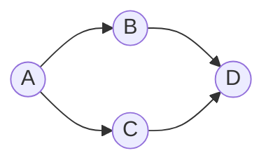

# 그래프

> Math for CS 101 시리즈 (4/10)

<!-- a-grade-intro:begin -->

**핵심 질문**: *관계* 가 있는 데이터를 *어떻게* 표현하고 *어떻게* 탐색할까요?

> *그래프* 는 *정점* 과 *간선* 의 *모음* 이고, 모든 *네트워크* 의 *공통 모델* 입니다.

<!-- a-grade-intro:end -->

## 이 글에서 배울 것

- *정점* 과 *간선*
- *방향/무방향*
- *트리*
- *인접 행렬* vs *리스트*
- *BFS* 입문

## 왜 중요한가

*소셜 네트워크*, *지도*, *의존성*, *추천* 까지 모두 *그래프* 입니다.

## 개념 한눈에 보기



## 핵심 용어 정리

- **vertex**: *노드*.
- **edge**: 두 *정점* 의 *연결*.
- **tree**: *순환 없는* 연결 그래프.
- **adjacency**: *이웃* 관계.
- **BFS**: *너비 우선 탐색*.

## Before/After

**Before**: *2 차원 배열* 로 표현.

**After**: *인접 리스트* 로 *희소* 표현.

## 실습: 미니 그래프 키트

### 1단계 — 인접 리스트

```python
G = {"A": ["B", "C"], "B": ["D"], "C": ["D"], "D": []}
```

### 2단계 — 정점/간선 수

```python
def stats(G):
    return len(G), sum(len(v) for v in G.values())
```

### 3단계 — 이웃

```python
def neighbors(G, v):
    return G.get(v, [])
```

### 4단계 — BFS

```python
from collections import deque

def bfs(G, s):
    seen, q = {s}, deque([s])
    while q:
        v = q.popleft()
        for n in G[v]:
            if n not in seen:
                seen.add(n)
                q.append(n)
    return seen
```

### 5단계 — 트리 검사

```python
def is_tree(G):
    edges = sum(len(v) for v in G.values())
    return edges == len(G) - 1
```

## 이 코드에서 주목할 점

- *인접 리스트* 는 *dict*.
- *BFS* 는 *큐* 한 개.
- *트리* 는 *간선 = 정점 - 1*.

## 자주 하는 실수 5가지

1. ***방향* 그래프를 *무방향* 으로 처리.**
2. ***인접 행렬* 을 *희소* 데이터에 적용.**
3. ***BFS* 에 *seen* 누락.**
4. ***트리* 검사 시 *연결성* 무시.**
5. ***self loop* 미처리.**

## 실무에서는 이렇게 쓰입니다

*친구 추천*, *최단 경로*, *의존성 빌드 순서*, *레이팅 전파* 모두 *그래프 알고리즘* 입니다.

## 시니어 엔지니어는 이렇게 생각합니다

- *그래프* 가 *모델*.
- *희소* 일수록 *리스트*.
- *BFS* 와 *DFS* 는 *기본기*.
- *트리* 는 *그래프* 의 부분집합.
- *방향* 은 *명시*.

## 체크리스트

- [ ] *방향/무방향* 결정.
- [ ] *인접 표현* 선택.
- [ ] *BFS* 구현.
- [ ] *트리* 조건 확인.

## 연습 문제

1. *vertex* 와 *edge* 의 차이 한 줄로.
2. *BFS* 의 의미 한 줄로.
3. *tree* 의 정의 한 줄로.

## 정리 및 다음 단계

다음 글은 *조합* 입니다.

<!-- toc:begin -->
- [CS에 수학이 필요한 이유](./01-why-math-for-cs.md)
- [논리와 증명](./02-logic-and-proofs.md)
- [집합과 함수](./03-sets-and-functions.md)
- **그래프 (현재 글)**
- 조합 (예정)
- 확률 (예정)
- 선형대수 (예정)
- 미분 (예정)
- 정보이론 (예정)
- 알고리즘과 수학 (예정)
<!-- toc:end -->

## 참고 자료

- [Graph Theory - Wolfram MathWorld](https://mathworld.wolfram.com/GraphTheory.html)
- [Graphs - Khan Academy](https://www.khanacademy.org/computing/computer-science/algorithms/graph-representation/a/representing-graphs)
- [BFS and DFS - CLRS](https://mitpress.mit.edu/9780262046305/introduction-to-algorithms/)
- [NetworkX Documentation](https://networkx.org/)

Tags: Math, Graphs, DataStructure, Algorithms, Beginner
