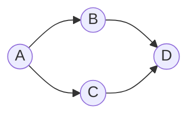

# 그래프

## 이 글에서 다룰 문제

- 관계가 있는 데이터를 왜 그래프로 표현할까요?
- 정점과 간선은 실무 모델에서 각각 무엇에 해당할까요?
- 방향 그래프와 무방향 그래프는 어떻게 다를까요?
- 인접 행렬과 인접 리스트는 언제 각각 유리할까요?
- BFS는 왜 그래프 탐색의 기본기로 불릴까요?

> 그래프는 객체보다 관계가 더 중요한 문제를 다루는 기본 모델입니다. 네트워크, 의존성, 추천, 경로 탐색은 거의 모두 여기에서 시작합니다.

> Math for CS 101 시리즈 (4/10)

## 왜 중요한가

소셜 네트워크의 친구 관계, 지도 서비스의 도로 연결, 빌드 시스템의 의존성, 추천 시스템의 연결 구조는 겉보기에는 서로 달라 보입니다. 하지만 조금만 추상화하면 모두 정점과 간선으로 표현할 수 있습니다.

그래프를 배우면 데이터가 단순한 목록이 아니라 연결 구조라는 사실을 더 분명하게 보게 됩니다. 이 관점이 잡히면 어떤 문제를 BFS로 풀지, 어떤 문제를 최단 경로 문제로 바꿔야 할지 감이 생깁니다.

## 한눈에 보는 흐름



작은 예시지만 방향이 있는 연결 구조를 잘 보여 줍니다. A에서 B와 C로 갈 수 있고, B와 C는 모두 D로 이어집니다. 이런 그림 하나가 의존성, 경로, 추천 흐름을 동시에 설명할 수 있습니다.

## 핵심 용어

- 정점: 노드 하나를 뜻합니다.
- 간선: 두 정점 사이의 연결입니다.
- 방향 그래프: 간선의 방향이 의미를 가지는 그래프입니다.
- 인접 관계: 어떤 정점이 누구와 직접 연결되는지 나타내는 관계입니다.
- BFS: 가까운 정점부터 넓게 탐색하는 방법입니다.

## Before / After

Before: 그래프를 단순히 2차원 표처럼 저장합니다.

After: 데이터가 희소한지 조밀한지 보고 표현을 고릅니다.

## 미니 그래프 키트

### 1단계 — 인접 리스트

```python
G = {"A": ["B", "C"], "B": ["D"], "C": ["D"], "D": []}
```

인접 리스트는 희소 그래프에서 가장 자주 쓰는 표현입니다. 각 정점이 누구와 연결되는지만 저장하므로 메모리를 아낄 수 있습니다.

### 2단계 — 정점 수와 간선 수

```python
def stats(G):
    return len(G), sum(len(v) for v in G.values())
```

그래프를 다룰 때는 구조를 먼저 세어 보는 습관이 좋습니다. 정점과 간선의 개수는 복잡도 감각과 바로 이어집니다.

### 3단계 — 이웃 찾기

```python
def neighbors(G, v):
    return G.get(v, [])
```

인접 관계를 빠르게 조회하는 기능은 그래프 알고리즘의 기본입니다. 추천 후보, 다음 작업, 다음 도시를 찾는 일도 결국 같은 형태입니다.

### 4단계 — BFS

```python
from collections import deque

def bfs(G, s):
    seen, q = {s}, deque([s])
    while q:
        v = q.popleft()
        for n in G[v]:
            if n not in seen:
                seen.add(n)
                q.append(n)
    return seen
```

BFS는 시작점에서 가까운 정점부터 차례대로 방문합니다. 최단 간선 수 경로를 찾는 문제와도 자연스럽게 이어집니다.

### 5단계 — 트리 확인

```python
def is_tree(G):
    edges = sum(len(v) for v in G.values())
    return edges == len(G) - 1
```

이 코드는 아주 간단한 조건만 확인합니다. 실제 트리 판정에는 연결성까지 함께 봐야 한다는 점이 중요합니다.

## 이 코드에서 봐야 할 포인트

- 인접 리스트는 파이썬 dict 하나로 충분히 표현됩니다.
- BFS는 큐 하나와 방문 집합 하나가 핵심입니다.
- 트리 조건은 간선 수만으로 끝나지 않고 연결성도 필요합니다.
- 방향 여부를 놓치면 모델 자체가 바뀔 수 있습니다.

## 자주 하는 실수 다섯 가지

1. 방향 그래프를 무방향처럼 다루는 실수
2. 희소 그래프에 인접 행렬을 고집하는 실수
3. BFS에서 seen 관리를 빼먹는 실수
4. 트리 판정에서 연결성을 확인하지 않는 실수
5. self loop 같은 예외 구조를 무시하는 실수

## 실무에서는 이렇게 드러납니다

친구 추천은 연결 관계를 따라 후보를 넓히는 문제이고, 빌드 순서는 의존성 그래프를 정리하는 문제입니다. 길찾기는 최단 경로 문제로 이어지고, 서비스 장애 전파도 그래프 관점으로 보면 훨씬 이해하기 쉬워집니다.

## 시니어 엔지니어는 이렇게 생각합니다

- 그래프는 알고리즘보다 먼저 오는 모델입니다.
- 희소한 데이터에는 인접 리스트가 자연스럽습니다.
- BFS와 DFS는 거의 모든 탐색의 출발점입니다.
- 트리는 그래프의 특별한 경우입니다.
- 방향은 항상 명시적으로 다뤄야 합니다.

## 체크리스트

- [ ] 문제를 그래프로 모델링할 수 있습니다.
- [ ] 방향 그래프와 무방향 그래프를 구분할 수 있습니다.
- [ ] 인접 리스트와 인접 행렬의 차이를 설명할 수 있습니다.
- [ ] BFS의 방문 순서를 말할 수 있습니다.

## 연습 문제

1. 정점과 간선의 차이를 한 줄로 써 보세요.
2. BFS를 한 문장으로 설명해 보세요.
3. 트리가 일반 그래프와 다른 점을 정리해 보세요.

## 정리 및 다음 단계

그래프는 관계 중심 문제를 다루는 가장 기본적인 수학 모델입니다. 정점과 간선, 표현 방식, BFS 같은 기초만 익혀도 많은 실무 문제를 더 정확한 구조로 바라볼 수 있습니다. 다음 글에서는 경우의 수를 세는 조합론으로 넘어가 보겠습니다.

<!-- toc:begin -->
- [CS에 수학이 필요한 이유](./01-why-math-for-cs.md)
- [논리와 증명](./02-logic-and-proofs.md)
- [집합과 함수](./03-sets-and-functions.md)
- **그래프 (현재 글)**
- 조합 (예정)
- 확률 (예정)
- 선형대수 (예정)
- 미분 (예정)
- 정보이론 (예정)
- 알고리즘과 수학 (예정)
<!-- toc:end -->

## 참고 자료

- [Graph Theory - Wolfram MathWorld](https://mathworld.wolfram.com/GraphTheory.html)
- [Graphs - Khan Academy](https://www.khanacademy.org/computing/computer-science/algorithms/graph-representation/a/representing-graphs)
- [BFS and DFS - CLRS](https://mitpress.mit.edu/9780262046305/introduction-to-algorithms/)
- [NetworkX Documentation](https://networkx.org/)

Tags: Math, Graphs, DataStructure, Algorithms, Beginner
