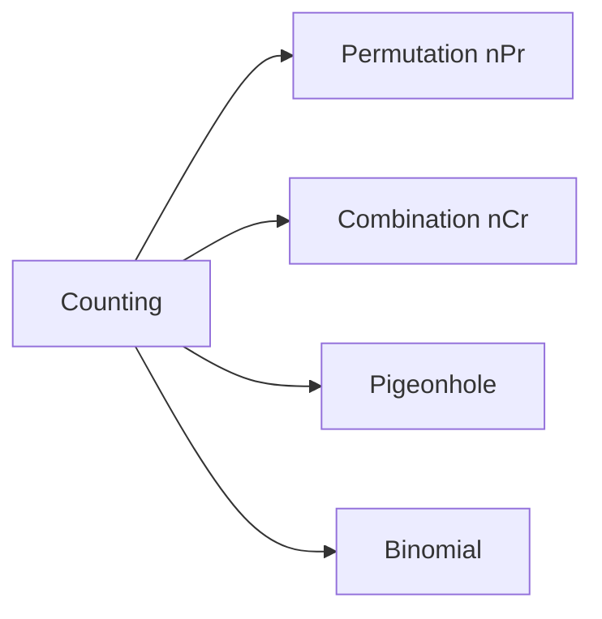

# 조합

> Math for CS 101 시리즈 (5/10)

<!-- a-grade-intro:begin -->

**핵심 질문**: *경우의 수* 는 *어떻게* 세는 것이 *정확* 할까요?

> *조합* 은 *세는 기술* 이고, *복잡도 분석* 과 *확률* 의 *기초* 입니다.

<!-- a-grade-intro:end -->

## 이 글에서 배울 것

- *곱의 법칙* / *합의 법칙*
- *순열* nPr
- *조합* nCr
- *비둘기집 원리*
- *이항계수*

## 왜 중요한가

*알고리즘 복잡도*, *확률*, *해시 충돌*, *테스트 케이스* 까지 모두 *세기* 가 기본입니다.

## 개념 한눈에 보기



## 핵심 용어 정리

- **product rule**: *순차 선택* 의 *곱*.
- **sum rule**: *배타 선택* 의 *합*.
- **permutation**: *순서 있는* 배열.
- **combination**: *순서 없는* 선택.
- **pigeonhole**: *n+1* 개를 *n* 칸에 넣으면 *중복*.

## Before/After

**Before**: *모든 경우* 를 *나열* 해서 셈.

**After**: *공식* 으로 *상수 시간* 에 셈.

## 실습: 미니 카운팅 키트

### 1단계 — 팩토리얼

```python
def fact(n):
    r = 1
    for i in range(2, n + 1):
        r *= i
    return r
```

### 2단계 — 순열

```python
def nPr(n, r):
    return fact(n) // fact(n - r)
```

### 3단계 — 조합

```python
def nCr(n, r):
    return fact(n) // (fact(r) * fact(n - r))
```

### 4단계 — 비둘기집

```python
def pigeon(items, holes):
    return items > holes
```

### 5단계 — 이항계수 표

```python
def row(n):
    return [nCr(n, k) for k in range(n + 1)]
```

## 이 코드에서 주목할 점

- *팩토리얼* 은 *재사용* 단위.
- *nCr* 은 *대칭* (n,r) = (n,n-r).
- *비둘기집* 은 *부등식* 한 줄.

## 자주 하는 실수 5가지

1. ***순열* 과 *조합* 혼동.**
2. ***중복 허용* 여부 누락.**
3. ***0!* = 1 잊음.**
4. ***큰 n* 에 *팩토리얼* 직접 사용.**
5. ***비둘기집* 의 *조건* 을 *=* 로 처리.**

## 실무에서는 이렇게 쓰입니다

*A/B 테스트 분배*, *해시 함수 충돌 분석*, *데이터셋 샘플링*, *조합 폭발 검증* 에 사용합니다.

## 시니어 엔지니어는 이렇게 생각합니다

- *세기* 는 *모델링*.
- *공식* 보다 *원리*.
- *비둘기집* 은 *존재성* 도구.
- *이항계수* 는 *확률* 과 연결.
- *조합 폭발* 을 *경계*.

## 체크리스트

- [ ] *순서* 의 *유무* 확인.
- [ ] *중복* 의 *허용* 확인.
- [ ] *공식* 으로 *대체*.
- [ ] *경계* 사례 점검.

## 연습 문제

1. *nPr* 과 *nCr* 의 차이 한 줄로.
2. *비둘기집* 을 한 줄로.
3. *0!* 의 값과 이유.

## 정리 및 다음 단계

다음 글은 *확률* 입니다.

<!-- toc:begin -->
- [CS에 수학이 필요한 이유](./01-why-math-for-cs.md)
- [논리와 증명](./02-logic-and-proofs.md)
- [집합과 함수](./03-sets-and-functions.md)
- [그래프](./04-graphs.md)
- **조합 (현재 글)**
- 확률 (예정)
- 선형대수 (예정)
- 미분 (예정)
- 정보이론 (예정)
- 알고리즘과 수학 (예정)
<!-- toc:end -->

## 참고 자료

- [Combinatorics - Wolfram MathWorld](https://mathworld.wolfram.com/Combinatorics.html)
- [Counting - Khan Academy](https://www.khanacademy.org/math/statistics-probability/counting-permutations-and-combinations)
- [Concrete Mathematics - Graham, Knuth, Patashnik](https://www-cs-faculty.stanford.edu/~knuth/gkp.html)
- [Python math.comb Documentation](https://docs.python.org/3/library/math.html#math.comb)

Tags: Math, Combinatorics, Counting, Probability, Beginner
