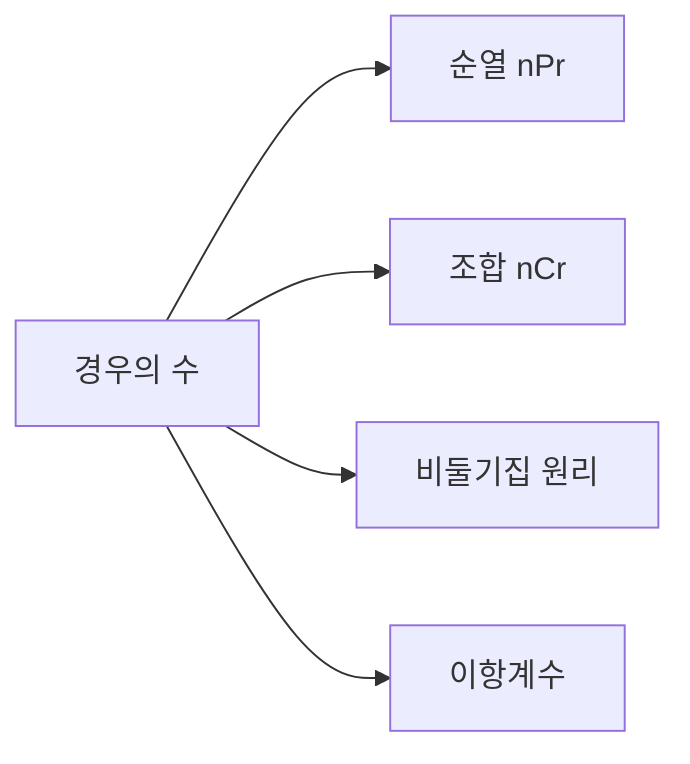

# 조합

## 이 글에서 다룰 문제

- 모든 경우를 직접 나열하지 않고도 왜 정확히 셀 수 있을까요?
- 곱의 법칙과 합의 법칙은 언제 각각 쓰일까요?
- 순열과 조합은 무엇이 다를까요?
- 비둘기집 원리는 왜 존재 증명에 자주 쓰일까요?
- 이항계수는 확률과 어떤 식으로 연결될까요?

> 조합론은 경우의 수를 세는 기술입니다. 복잡도 분석과 확률 계산은 대개 정확한 셈에서 시작합니다.

> Math for CS 101 시리즈 (5/10)

## 왜 중요한가

알고리즘이 왜 느려지는지 설명하려면 가능한 경우의 수가 얼마나 빨리 늘어나는지 알아야 합니다. 해시 충돌 가능성을 가늠할 때도, 테스트 케이스 수를 정할 때도, 샘플링 전략을 세울 때도 결국 셈이 필요합니다.

조합론의 장점은 모든 경우를 손으로 나열하지 않아도 된다는 점입니다. 순서가 중요한지, 중복을 허용하는지, 선택이 서로 배타적인지 같은 구조만 파악하면 공식을 통해 훨씬 빠르게 판단할 수 있습니다.

## 한눈에 보는 흐름



경우의 수를 세는 기본 원리에서 출발해 순열과 조합이 나오고, 더 나아가 비둘기집 원리나 이항계수처럼 강력한 도구로 확장됩니다.

## 핵심 용어

- 곱의 법칙: 연속된 선택의 수는 곱해서 셉니다.
- 합의 법칙: 서로 배타적인 선택의 수는 더해서 셉니다.
- 순열: 순서가 중요한 배치입니다.
- 조합: 순서가 중요하지 않은 선택입니다.
- 비둘기집 원리: 상자 n개에 물건 n+1개를 넣으면 반드시 한 상자에는 둘 이상 들어갑니다.

## Before / After

Before: 가능한 경우를 하나씩 적어 보며 셉니다.

After: 구조를 파악해 공식으로 한 번에 계산합니다.

## 미니 카운팅 키트

### 1단계 — 팩토리얼

```python
def fact(n):
    r = 1
    for i in range(2, n + 1):
        r *= i
    return r
```

팩토리얼은 조합론에서 가장 자주 재사용되는 부품입니다. 순열과 조합 공식을 이해하려면 먼저 익숙해져야 합니다.

### 2단계 — 순열

```python
def nPr(n, r):
    return fact(n) // fact(n - r)
```

순열은 순서가 바뀌면 다른 경우로 셉니다. 비밀번호 자리 배치나 작업 순서 계산이 이런 형태에 가깝습니다.

### 3단계 — 조합

```python
def nCr(n, r):
    return fact(n) // (fact(r) * fact(n - r))
```

조합은 고르는 것 자체만 중요합니다. 팀 구성, 샘플 선택, 피처 집합 선택처럼 순서가 필요 없는 문제에서 자주 나옵니다.

### 4단계 — 비둘기집 확인

```python
def pigeon(items, holes):
    return items > holes
```

놀랄 만큼 단순한 부등식이지만, 충돌이 반드시 생긴다는 사실을 증명할 수 있습니다. 해시 버킷 수보다 키가 많다면 충돌을 피할 수 없다는 식입니다.

### 5단계 — 이항계수 행

```python
def row(n):
    return [nCr(n, k) for k in range(n + 1)]
```

이항계수는 파스칼 삼각형, 확률 분포, 다항식 전개와 모두 연결됩니다. 조합론이 확률로 넘어가는 다리 역할을 합니다.

## 이 코드에서 봐야 할 포인트

- 팩토리얼은 여러 공식의 공통 재료입니다.
- nCr은 대칭성을 가집니다.
- 비둘기집 원리는 긴 계산보다 구조 파악이 더 중요합니다.
- 큰 n에서는 직접 계산 방식의 비용도 함께 봐야 합니다.

## 자주 하는 실수 다섯 가지

1. 순열과 조합을 바꿔 쓰는 실수
2. 중복 허용 여부를 확인하지 않는 실수
3. `0! = 1`을 놓치는 실수
4. 아주 큰 n에 팩토리얼을 그대로 적용하는 실수
5. 비둘기집 원리에서 `>` 대신 `=`로 생각하는 실수

## 실무에서는 이렇게 드러납니다

A/B 테스트 버킷 수를 설계할 때, 해시 충돌 가능성을 대략 볼 때, 샘플 수를 정할 때, 경우의 수 폭발이 예상되는 탐색 문제를 점검할 때 조합론은 실용적인 판단 기준을 줍니다.

## 시니어 엔지니어는 이렇게 생각합니다

- 셈은 모델링의 일부입니다.
- 공식을 외우기보다 구조를 먼저 봅니다.
- 비둘기집 원리는 존재를 보이는 좋은 도구입니다.
- 이항계수는 확률과 자연스럽게 이어집니다.
- 경우의 수 폭발은 설계 단계에서 빨리 감지해야 합니다.

## 체크리스트

- [ ] 순서가 중요한지 먼저 판단할 수 있습니다.
- [ ] 중복 허용 여부를 따질 수 있습니다.
- [ ] 순열과 조합 공식을 구분해 쓸 수 있습니다.
- [ ] 경우의 수가 폭발하는 지점을 감지할 수 있습니다.

## 연습 문제

1. nPr과 nCr의 차이를 한 줄로 정리해 보세요.
2. 비둘기집 원리를 한 문장으로 써 보세요.
3. 왜 `0! = 1`인지 설명해 보세요.

## 정리 및 다음 단계

조합론은 경우의 수를 셈으로 끝내지 않고 구조로 읽게 해 줍니다. 순열과 조합, 비둘기집 원리, 이항계수를 익히면 복잡도와 확률을 훨씬 편하게 받아들일 수 있습니다. 다음 글에서는 이 흐름을 이어 확률을 살펴보겠습니다.

<!-- toc:begin -->
- [CS에 수학이 필요한 이유](./01-why-math-for-cs.md)
- [논리와 증명](./02-logic-and-proofs.md)
- [집합과 함수](./03-sets-and-functions.md)
- [그래프](./04-graphs.md)
- **조합 (현재 글)**
- 확률 (예정)
- 선형대수 (예정)
- 미분 (예정)
- 정보이론 (예정)
- 알고리즘과 수학 (예정)
<!-- toc:end -->

## 참고 자료

- [Combinatorics - Wolfram MathWorld](https://mathworld.wolfram.com/Combinatorics.html)
- [Counting - Khan Academy](https://www.khanacademy.org/math/statistics-probability/counting-permutations-and-combinations)
- [Concrete Mathematics - Graham, Knuth, Patashnik](https://www-cs-faculty.stanford.edu/~knuth/gkp.html)
- [Python math.comb Documentation](https://docs.python.org/3/library/math.html#math.comb)

Tags: Math, Combinatorics, Counting, Probability, Beginner
