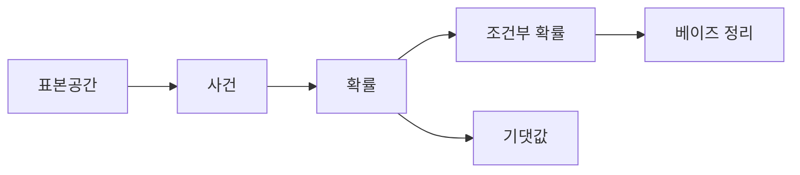

# 확률

## 이 글에서 다룰 문제

- 불확실성을 감으로 넘기지 않고 어떻게 수치로 다룰까요?
- 표본공간과 사건은 무엇이 다를까요?
- 조건부 확률은 왜 문맥을 붙인 확률이라고 할 수 있을까요?
- 베이즈 정리는 어떤 식으로 믿음을 갱신할까요?
- 기댓값과 분산은 의사결정에서 어떤 역할을 할까요?

> 확률은 불확실성을 설명하는 언어입니다. 추측을 숫자로 바꾸면 비교와 의사결정이 훨씬 명확해집니다.

> Math for CS 101 시리즈 (6/10)

## 왜 중요한가

A/B 테스트 결과를 읽을 때도, 분류기의 오탐률을 볼 때도, 장애 가능성을 계산할 때도 우리는 이미 확률 문제를 다루고 있습니다. 다만 확률을 모르면 숫자를 보면서도 해석은 직관에 기대게 됩니다.

확률은 불확실성을 제거하지는 못합니다. 대신 불확실성을 구조화합니다. 어떤 경우가 가능한지, 어떤 사건이 관심 대상인지, 이미 알고 있는 조건은 무엇인지 구분하게 해 줍니다.

## 한눈에 보는 흐름



가능한 결과 전체를 표본공간으로 두고, 그중 관심 있는 부분집합을 사건으로 봅니다. 그 위에서 조건부 확률과 베이즈 정리, 기댓값이 이어집니다.

## 핵심 용어

- 표본공간: 가능한 모든 결과의 집합입니다.
- 사건: 표본공간의 부분집합입니다.
- 조건부 확률: 어떤 조건이 주어졌을 때의 확률입니다.
- 베이즈 정리: 새로운 정보를 받아 사전 믿음을 사후 믿음으로 갱신하는 공식입니다.
- 기댓값: 결과를 확률로 가중한 평균입니다.

## Before / After

Before: 대충 그럴 것 같다는 감각에 기대어 판단합니다.

After: 표본공간과 조건을 분리한 뒤 식으로 계산합니다.

## 미니 확률 키트

### 1단계 — 확률

```python
def prob(favorable, total):
    return favorable / total
```

가장 기본 형태입니다. 관심 있는 경우 수를 전체 경우 수로 나누는 사고는 이후 모든 확률 계산의 출발점이 됩니다.

### 2단계 — 조건부 확률

```python
def cond(p_a_and_b, p_b):
    return p_a_and_b / p_b
```

조건부 확률은 이미 B가 일어났다는 정보를 반영합니다. 전체 공간이 바뀐다는 점이 핵심입니다.

### 3단계 — 베이즈

```python
def bayes(p_b_given_a, p_a, p_b):
    return p_b_given_a * p_a / p_b
```

새 증거가 들어왔을 때 추정치를 어떻게 갱신할지 보여 줍니다. 스팸 필터, 진단, 랭킹 계산에 널리 쓰입니다.

### 4단계 — 기댓값

```python
def expect(values, probs):
    return sum(v * p for v, p in zip(values, probs))
```

기댓값은 평균적인 결과를 알려 줍니다. 장기적으로 어떤 선택이 유리한지 비교할 때 특히 중요합니다.

### 5단계 — 분산

```python
def variance(values, probs):
    mu = expect(values, probs)
    return sum(p * (v - mu) ** 2 for v, p in zip(values, probs))
```

평균만 보면 놓치는 위험을 분산이 보여 줍니다. 같은 기댓값이라도 흔들림이 큰 선택과 작은 선택은 의미가 다릅니다.

## 이 코드에서 봐야 할 포인트

- 확률값들의 합은 전체 분포 안에서 1이 됩니다.
- 조건부 확률은 분모가 바뀌는 순간 의미가 달라집니다.
- 기댓값은 가중 평균이고, 분산은 흔들림의 크기입니다.
- 독립 가정은 편리하지만 항상 성립하지는 않습니다.

## 자주 하는 실수 다섯 가지

1. 독립이라고 쉽게 가정하는 실수
2. 베이즈 정리에서 사전 확률을 0으로 두는 실수
3. 기댓값과 최빈값을 같은 것으로 보는 실수
4. 조건부 확률에서 분모가 0인 경우를 빼먹는 실수
5. 분산과 표준편차를 혼동하는 실수

## 실무에서는 이렇게 드러납니다

스팸 필터는 베이즈 관점으로 점수를 갱신하고, 추천 시스템은 클릭 확률을 추정합니다. SRE 영역에서는 장애 발생 확률과 SLA 위반 가능성을 봅니다. 실험 설계에서는 결과의 평균뿐 아니라 분산도 함께 봐야 합니다.

## 시니어 엔지니어는 이렇게 생각합니다

- 모든 추정치는 하나의 값보다 분포에 가깝습니다.
- 베이즈는 믿음을 갱신하는 절차입니다.
- 기댓값은 선택 기준을 만드는 데 중요합니다.
- 분산은 위험을 말해 줍니다.
- 독립성은 사실이 아니라 가정일 때가 많습니다.

## 체크리스트

- [ ] 표본공간과 사건을 구분할 수 있습니다.
- [ ] 어떤 조건이 붙은 확률인지 말할 수 있습니다.
- [ ] 베이즈 정리의 입력값이 무엇인지 설명할 수 있습니다.
- [ ] 평균과 분산을 함께 봐야 하는 이유를 이해했습니다.

## 연습 문제

1. 조건부 확률을 한 줄로 정의해 보세요.
2. 베이즈 정리를 한 문장으로 설명해 보세요.
3. 기댓값과 분산의 차이를 정리해 보세요.

## 정리 및 다음 단계

확률은 불확실성을 포기하지 않고 다루는 방법입니다. 표본공간, 사건, 조건부 확률, 베이즈 정리, 기댓값과 분산을 익히면 감으로만 판단하던 영역을 훨씬 차분하게 다룰 수 있습니다. 다음 글에서는 데이터를 다루는 또 다른 핵심 언어인 선형대수를 보겠습니다.

<!-- toc:begin -->
- [CS에 수학이 필요한 이유](./01-why-math-for-cs.md)
- [논리와 증명](./02-logic-and-proofs.md)
- [집합과 함수](./03-sets-and-functions.md)
- [그래프](./04-graphs.md)
- [조합](./05-combinatorics.md)
- **확률 (현재 글)**
- 선형대수 (예정)
- 미분 (예정)
- 정보이론 (예정)
- 알고리즘과 수학 (예정)
<!-- toc:end -->

## 참고 자료

- [Probability - Khan Academy](https://www.khanacademy.org/math/statistics-probability/probability-library)
- [Bayes Theorem - Stanford Encyclopedia](https://plato.stanford.edu/entries/bayes-theorem/)
- [Introduction to Probability - Blitzstein](https://projects.iq.harvard.edu/stat110)
- [Python statistics Module](https://docs.python.org/3/library/statistics.html)

Tags: Math, Probability, Statistics, Bayes, Beginner
