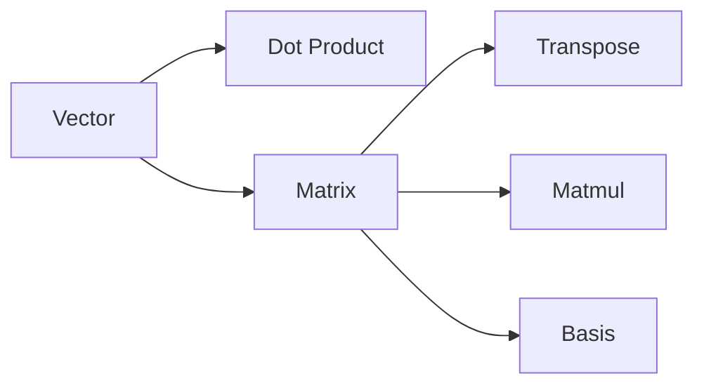

# 선형대수

> Math for CS 101 시리즈 (7/10)


## 이 글에서 다룰 문제

*임베딩*, *PCA*, *추천*, *3D 변환* 모두 *선형대수* 위에서 동작합니다.

## 개념 한눈에 보기



## Before/After

**Before**: *for 루프* 로 원소 단위 계산.

**After**: *벡터화* 한 줄.

## 실습: 미니 선형대수 키트

### 1단계 — 벡터 덧셈

```python
def vadd(a, b):
    return [x + y for x, y in zip(a, b)]
```

### 2단계 — 내적

```python
def dot(a, b):
    return sum(x * y for x, y in zip(a, b))
```

### 3단계 — 행렬-벡터 곱

```python
def matvec(M, v):
    return [dot(row, v) for row in M]
```

### 4단계 — 전치

```python
def transpose(M):
    return [list(col) for col in zip(*M)]
```

### 5단계 — 행렬-행렬 곱

```python
def matmul(A, B):
    Bt = transpose(B)
    return [[dot(row, col) for col in Bt] for row in A]
```

## 이 코드에서 주목할 점

- *내적* 은 *연산의 핵심*.
- *전치* 는 *zip 한 줄*.
- *행렬곱* 은 *내적의 격자*.

## 자주 하는 실수 5가지

1. ***행/열* 차원 불일치.**
2. ***행렬곱* 의 *교환법칙* 가정.**
3. ***내적* 과 *외적* 혼동.**
4. ***numpy* 미사용으로 *성능* 저하.**
5. ***전치* 가 *원본* 을 변경한다고 오해.**

## 실무에서는 이렇게 쓰입니다

*임베딩 검색*, *추천 점수*, *카메라 변환*, *신경망 forward pass* 모두 *행렬 연산* 입니다.

## 체크리스트

- [ ] *차원* 표시.
- [ ] *벡터화* 사용.
- [ ] *전치* 의도 명시.
- [ ] *수치 안정성* 검토.

## 정리 및 다음 단계

다음 글은 *미분* 입니다.

<!-- toc:begin -->
- [CS에 수학이 필요한 이유](./01-why-math-for-cs.md)
- [논리와 증명](./02-logic-and-proofs.md)
- [집합과 함수](./03-sets-and-functions.md)
- [그래프](./04-graphs.md)
- [조합](./05-combinatorics.md)
- [확률](./06-probability.md)
- **선형대수 (현재 글)**
- 미분 (예정)
- 정보이론 (예정)
- 알고리즘과 수학 (예정)
<!-- toc:end -->

## 참고 자료

- [Linear Algebra - 3Blue1Brown](https://www.3blue1brown.com/topics/linear-algebra)
- [Linear Algebra - Khan Academy](https://www.khanacademy.org/math/linear-algebra)
- [Introduction to Linear Algebra - Strang](https://math.mit.edu/~gs/linearalgebra/)
- [NumPy Linear Algebra Documentation](https://numpy.org/doc/stable/reference/routines.linalg.html)

Tags: Math, LinearAlgebra, Vectors, Matrices, Beginner
