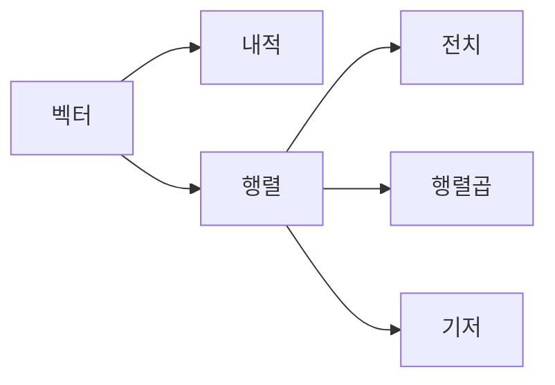

# 선형대수

## 이 글에서 다룰 문제

- 벡터와 행렬은 데이터를 어떻게 표현할까요?
- 내적은 왜 유사도 계산의 핵심 연산일까요?
- 행렬곱은 단순 반복 계산과 무엇이 다를까요?
- 전치는 어떤 상황에서 필요한가요?
- 기저를 이해하면 데이터 해석이 왜 쉬워질까요?

> 선형대수는 데이터와 변환을 같은 문법으로 다루게 해 줍니다. 임베딩, 추천, 그래픽스, 시뮬레이션은 모두 이 문법 위에서 움직입니다.

> Math for CS 101 시리즈 (7/10)

## 왜 중요한가

추천 시스템의 임베딩, PCA 같은 차원 축소, 카메라 변환, 신경망의 순전파는 모두 벡터와 행렬 연산으로 읽을 수 있습니다. 이름만 들으면 어렵지만, 결국 숫자 묶음을 다루는 더 좋은 방법이라고 생각하면 접근이 쉬워집니다.

선형대수의 힘은 반복문 여러 개를 하나의 연산 의미로 묶어 준다는 데 있습니다. 각 숫자를 따로 보지 않고 공간 안의 방향과 변환으로 볼 수 있게 되면, 코드와 모델을 동시에 이해하기 쉬워집니다.

## 한눈에 보는 흐름



벡터는 데이터의 방향과 크기를 담고, 행렬은 여러 벡터를 모아 변환을 표현합니다. 내적과 행렬곱은 실제 계산의 중심이고, 기저는 공간을 읽는 기준축입니다.

## 핵심 용어

- 벡터: 방향과 크기를 가진 값의 묶음입니다.
- 행렬: 여러 벡터를 모아 놓은 구조입니다.
- 내적: 두 벡터의 정렬 정도를 보여 주는 연산입니다.
- 전치: 행과 열을 바꾸는 연산입니다.
- 기저: 공간을 설명하는 기준축입니다.

## Before / After

Before: 원소별 반복문으로만 계산을 이해합니다.

After: 벡터와 행렬이 데이터를 어떻게 변환하는지 구조로 봅니다.

## 미니 선형대수 키트

### 1단계 — 벡터 덧셈

```python
def vadd(a, b):
    return [x + y for x, y in zip(a, b)]
```

가장 단순한 연산이지만, 같은 차원의 데이터를 같은 위치끼리 더한다는 감각을 익히기에 좋습니다.

### 2단계 — 내적

```python
def dot(a, b):
    return sum(x * y for x, y in zip(a, b))
```

내적은 추천 점수, 유사도, 투영 계산에 자주 등장합니다. 두 벡터가 얼마나 비슷한 방향을 향하는지 보는 데도 쓰입니다.

### 3단계 — 행렬-벡터 곱

```python
def matvec(M, v):
    return [dot(row, v) for row in M]
```

행렬을 변환기로 보면 이해가 쉬워집니다. 벡터 하나를 입력하면 변환된 벡터가 나옵니다.

### 4단계 — 전치

```python
def transpose(M):
    return [list(col) for col in zip(*M)]
```

행 중심으로 보던 데이터를 열 중심으로 다시 읽고 싶을 때 전치가 필요합니다. 선형대수뿐 아니라 데이터 전처리에서도 자주 나옵니다.

### 5단계 — 행렬-행렬 곱

```python
def matmul(A, B):
    Bt = transpose(B)
    return [[dot(row, col) for col in Bt] for row in A]
```

행렬곱은 변환을 연결하는 방법입니다. 하나의 변환 뒤에 다른 변환을 이어 붙이는 구조로 이해하면 훨씬 자연스럽습니다.

## 이 코드에서 봐야 할 포인트

- 내적은 여러 연산의 공통 핵심입니다.
- 전치는 데이터 관점을 바꾸는 도구입니다.
- 행렬곱은 내적들의 격자로 읽을 수 있습니다.
- 차원 일치는 선형대수에서 가장 기본적인 안전장치입니다.

## 자주 하는 실수 다섯 가지

1. 행과 열 차원을 맞추지 않는 실수
2. 행렬곱이 교환법칙을 따른다고 생각하는 실수
3. 내적과 외적을 혼동하는 실수
4. 벡터화 기회를 놓쳐 성능을 잃는 실수
5. 전치가 원본 데이터를 바꾼다고 오해하는 실수

## 실무에서는 이렇게 드러납니다

임베딩 검색은 벡터 유사도로 동작하고, 추천 시스템은 행렬 분해나 점수 계산에 선형대수를 씁니다. 3D 그래픽스에서는 좌표 변환이 핵심이며, 신경망 계산도 결국 큰 행렬 연산으로 볼 수 있습니다.

## 시니어 엔지니어는 이렇게 생각합니다

- 벡터는 데이터 표현입니다.
- 행렬은 변환 그 자체입니다.
- 벡터화는 성능과 가독성을 함께 올립니다.
- 기저를 이해하면 표현을 해석하기 쉬워집니다.
- 수치 안정성도 함께 봐야 합니다.

## 체크리스트

- [ ] 벡터와 행렬의 차이를 설명할 수 있습니다.
- [ ] 내적이 무엇을 계산하는지 말할 수 있습니다.
- [ ] 행렬곱이 가능한 차원 조건을 확인할 수 있습니다.
- [ ] 전치가 필요한 상황을 예로 들 수 있습니다.

## 연습 문제

1. 내적을 한 줄로 정의해 보세요.
2. 전치를 한 문장으로 설명해 보세요.
3. 행렬곱이 가능하려면 어떤 조건이 필요한지 써 보세요.

## 정리 및 다음 단계

선형대수는 숫자 배열을 더 높은 수준의 구조로 보게 해 줍니다. 벡터와 행렬, 내적, 전치, 행렬곱을 이해하면 데이터 처리와 모델 계산을 훨씬 압축된 언어로 설명할 수 있습니다. 다음 글에서는 변화와 최적화를 다루는 미분으로 넘어가겠습니다.

<!-- toc:begin -->
- [CS에 수학이 필요한 이유](./01-why-math-for-cs.md)
- [논리와 증명](./02-logic-and-proofs.md)
- [집합과 함수](./03-sets-and-functions.md)
- [그래프](./04-graphs.md)
- [조합](./05-combinatorics.md)
- [확률](./06-probability.md)
- **선형대수 (현재 글)**
- 미분 (예정)
- 정보이론 (예정)
- 알고리즘과 수학 (예정)
<!-- toc:end -->

## 참고 자료

- [Linear Algebra - 3Blue1Brown](https://www.3blue1brown.com/topics/linear-algebra)
- [Linear Algebra - Khan Academy](https://www.khanacademy.org/math/linear-algebra)
- [Introduction to Linear Algebra - Strang](https://math.mit.edu/~gs/linearalgebra/)
- [NumPy Linear Algebra Documentation](https://numpy.org/doc/stable/reference/routines.linalg.html)

Tags: Math, LinearAlgebra, Vectors, Matrices, Beginner
