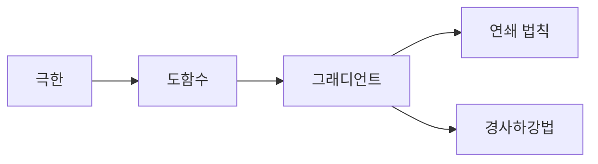

# 미분

## 이 글에서 다룰 문제

- 변화량을 왜 한 점의 기울기로 요약할 수 있을까요?
- 극한과 도함수는 어떤 관계를 가질까요?
- 기울기와 그래디언트는 무엇이 다를까요?
- 연쇄 법칙은 왜 신경망 학습의 핵심일까요?
- 경사하강법은 어떻게 더 작은 값 쪽으로 이동할까요?

> 미분은 변화의 언어입니다. 함수가 어느 방향으로 얼마나 변하는지 알면 최적화와 학습을 수식으로 다룰 수 있습니다.

> Math for CS 101 시리즈 (8/10)

## 왜 중요한가

머신러닝 모델을 학습할 때 손실 함수를 줄이는 과정, 수치 최적화에서 더 좋은 해를 찾는 과정, 물리 시뮬레이션에서 시간에 따른 변화를 계산하는 과정은 모두 미분과 연결됩니다. 결국 지금 위치에서 어느 방향으로 움직여야 하는지를 알아야 하기 때문입니다.

미분은 복잡한 곡선을 전부 이해하게 만들기보다, 지금 이 지점의 변화 경향을 알려 줍니다. 그래서 한 번에 전체를 읽기 어려운 문제도 지역적인 정보부터 쌓아 풀어 갈 수 있습니다.

## 한눈에 보는 흐름



극한이 도함수의 토대를 만들고, 여러 변수로 확장되면 그래디언트가 됩니다. 연쇄 법칙은 연결된 함수들의 미분을 가능하게 하고, 경사하강법은 그 정보를 최적화에 씁니다.

## 핵심 용어

- 극한: 어떤 값에 가까워질 때 함수가 접근하는 값입니다.
- 도함수: 한 점에서의 순간 변화율입니다.
- 그래디언트: 여러 변수에 대한 변화율을 모은 벡터입니다.
- 연쇄 법칙: 합성 함수의 미분 규칙입니다.
- 경사하강법: 그래디언트의 반대 방향으로 이동해 값을 줄이는 방법입니다.

## Before / After

Before: 많은 점을 찍어 봐야 변화 방향을 알 수 있다고 생각합니다.

After: 현재 지점의 기울기만으로도 다음 이동 방향을 정할 수 있다는 점을 이해합니다.

## 미니 미분 키트

### 1단계 — 수치 미분

```python
def deriv(f, x, h=1e-5):
    return (f(x + h) - f(x - h)) / (2 * h)
```

수치 미분은 정확한 해석적 미분이 어려울 때 변화율을 근사하는 방법입니다. h를 너무 크게 잡아도, 너무 작게 잡아도 문제가 생깁니다.

### 2단계 — 그래디언트

```python
def grad(f, x, h=1e-5):
    return [(f([xi + (h if i == j else 0) for i, xi in enumerate(x)])
             - f([xi - (h if i == j else 0) for i, xi in enumerate(x)])) / (2 * h)
            for j in range(len(x))]
```

변수가 하나가 아니면 각 축 방향의 변화율을 모아 봐야 합니다. 그 결과가 그래디언트입니다.

### 3단계 — 연쇄 법칙

```python
def chain(df_dy, dy_dx):
    return df_dy * dy_dx
```

여러 함수가 연결된 시스템에서는 중간 단계를 거쳐 변화가 전달됩니다. 연쇄 법칙은 그 연결 고리를 계산하는 기본 원리입니다.

### 4단계 — 경사하강 한 스텝

```python
def step(x, g, lr=0.1):
    return [xi - lr * gi for xi, gi in zip(x, g)]
```

현재 위치에서 그래디언트의 반대 방향으로 조금 이동하면 값을 줄일 수 있습니다. 이때 이동량을 정하는 값이 학습률입니다.

### 5단계 — 미니 학습 루프

```python
def descend(f, x, lr=0.1, steps=100):
    for _ in range(steps):
        x = step(x, grad(f, x), lr)
    return x
```

최적화는 한 번의 이동으로 끝나지 않습니다. 작은 이동을 여러 번 반복하면서 점차 더 좋은 해로 다가갑니다.

## 이 코드에서 봐야 할 포인트

- 수치 미분은 근사값이라는 점을 잊지 말아야 합니다.
- 그래디언트는 방향 정보를 담은 벡터입니다.
- 학습률은 속도를 정하지만, 너무 크면 발산할 수 있습니다.
- 국소 최솟값과 전역 최솟값은 다를 수 있습니다.

## 자주 하는 실수 다섯 가지

1. 학습률을 너무 크게 두는 실수
2. 수치 미분의 h를 극단적으로 잡는 실수
3. 연쇄 법칙의 순서를 혼동하는 실수
4. 국소 최소를 전역 최소로 착각하는 실수
5. 스케일이 다른 변수를 그대로 비교하는 실수

## 실무에서는 이렇게 드러납니다

신경망 학습은 연쇄 법칙과 그래디언트를 기반으로 동작합니다. 광고 입찰 최적화나 추천 모델 튜닝처럼 값을 조금씩 개선하는 문제도 같은 관점으로 읽을 수 있습니다. 수렴 여부를 지켜보는 습관 역시 미분 감각과 연결됩니다.

## 시니어 엔지니어는 이렇게 생각합니다

- 그래디언트는 방향 정보입니다.
- 학습률은 이동 속도입니다.
- 연쇄 법칙은 역전파의 핵심입니다.
- 수치 안정성은 이론만큼 중요합니다.
- 지역 최적해에 갇힐 가능성도 늘 염두에 둡니다.

## 체크리스트

- [ ] 도함수와 그래디언트의 차이를 설명할 수 있습니다.
- [ ] 학습률이 너무 크면 어떤 문제가 생기는지 말할 수 있습니다.
- [ ] 연쇄 법칙이 필요한 이유를 이해했습니다.
- [ ] 경사하강법이 왜 반대 방향으로 가는지 설명할 수 있습니다.

## 연습 문제

1. 도함수를 한 줄로 정의해 보세요.
2. 연쇄 법칙을 한 문장으로 설명해 보세요.
3. 경사하강법이 무엇을 하는지 한 줄로 써 보세요.

## 정리 및 다음 단계

미분은 변화와 최적화를 읽는 기본 도구입니다. 극한, 도함수, 그래디언트, 연쇄 법칙, 경사하강법을 함께 보면 머신러닝과 수치 최적화의 핵심 흐름이 한 줄로 이어집니다. 다음 글에서는 확률과 나란히 중요한 정보이론으로 넘어갑니다.

<!-- toc:begin -->
- [CS에 수학이 필요한 이유](./01-why-math-for-cs.md)
- [논리와 증명](./02-logic-and-proofs.md)
- [집합과 함수](./03-sets-and-functions.md)
- [그래프](./04-graphs.md)
- [조합](./05-combinatorics.md)
- [확률](./06-probability.md)
- [선형대수](./07-linear-algebra.md)
- **미분 (현재 글)**
- 정보이론 (예정)
- 알고리즘과 수학 (예정)
<!-- toc:end -->

## 참고 자료

- [Calculus - Khan Academy](https://www.khanacademy.org/math/calculus-1)
- [Essence of Calculus - 3Blue1Brown](https://www.3blue1brown.com/topics/calculus)
- [Gradient Descent - Deep Learning Book](https://www.deeplearningbook.org/contents/numerical.html)
- [SymPy Calculus Documentation](https://docs.sympy.org/latest/modules/calculus/index.html)

Tags: Math, Calculus, Derivative, GradientDescent, Beginner
