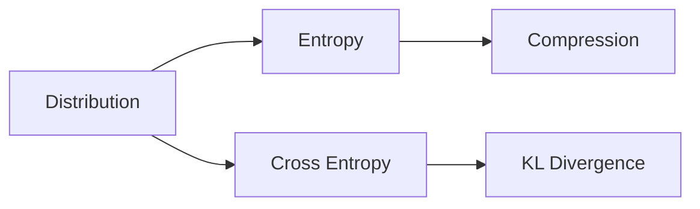

# 정보이론

> Math for CS 101 시리즈 (9/10)


## 이 글에서 다룰 문제

분류기 손실 함수, zip 압축, 통신 코드, 언어 모델은 모두 정보이론 위에서 정의됩니다.

## 전체 흐름


## Before/After

**Before**: 모든 메시지를 같은 길이로 다룹니다.

**After**: 자주 쓰는 것은 짧게, 드문 것은 길게 배정합니다.

## 미니 정보이론 키트

### 1단계 — 정보량

```python
import math

def info(p):
    return -math.log2(p)
```

### 2단계 — 엔트로피

```python
def entropy(probs):
    return sum(-p * math.log2(p) for p in probs if p > 0)
```

### 3단계 — 교차 엔트로피

```python
def cross_entropy(p, q):
    return sum(-pi * math.log2(qi) for pi, qi in zip(p, q) if qi > 0)
```

### 4단계 — KL 발산

```python
def kl(p, q):
    return cross_entropy(p, q) - entropy(p)
```

### 5단계 — 평균 부호 길이

```python
def avg_len(probs, lengths):
    return sum(p * L for p, L in zip(probs, lengths))
```

## 이 코드에서 주목할 점

- log2의 단위는 비트입니다.
- KL 발산은 비대칭입니다.
- 교차 엔트로피는 손실 함수로 자주 사용합니다.

## 자주 하는 실수 5가지

1. **log(0) 처리를 누락합니다.**
2. **KL 발산을 대칭이라고 가정합니다.**
3. **엔트로피와 교차 엔트로피를 혼동합니다.**
4. **확률 합이 1이 아닌 입력을 넣습니다.**
5. **단위(비트 vs 나트)를 혼동합니다.**

## 실무에서는 이렇게 쓰입니다

분류기 손실, 언어 모델 perplexity, zip/gzip, ML 정규화는 모두 정보이론 위에서 동작합니다.

## 체크리스트

- [ ] 확률 합을 검증합니다.
- [ ] log(0)을 보호합니다.
- [ ] 단위를 명시합니다.
- [ ] KL의 방향을 명시합니다.

## 정리 및 다음 단계

다음 글은 알고리즘과 수학 종합 편입니다.

<!-- toc:begin -->
- [CS에 수학이 필요한 이유](./01-why-math-for-cs.md)
- [논리와 증명](./02-logic-and-proofs.md)
- [집합과 함수](./03-sets-and-functions.md)
- [그래프](./04-graphs.md)
- [조합](./05-combinatorics.md)
- [확률](./06-probability.md)
- [선형대수](./07-linear-algebra.md)
- [미분](./08-calculus.md)
- **정보이론 (현재 글)**
- 알고리즘과 수학 (예정)
<!-- toc:end -->

## 참고 자료

- [Information Theory - Stanford Encyclopedia](https://plato.stanford.edu/entries/information-theory/)
- [A Mathematical Theory of Communication - Shannon](https://people.math.harvard.edu/~ctm/home/text/others/shannon/entropy/entropy.pdf)
- [Elements of Information Theory - Cover and Thomas](https://www.wiley.com/en-us/Elements+of+Information+Theory%2C+2nd+Edition-p-9780471241959)
- [SciPy Stats Entropy Documentation](https://docs.scipy.org/doc/scipy/reference/generated/scipy.stats.entropy.html)

Tags: Math, InformationTheory, Entropy, Compression, Beginner
