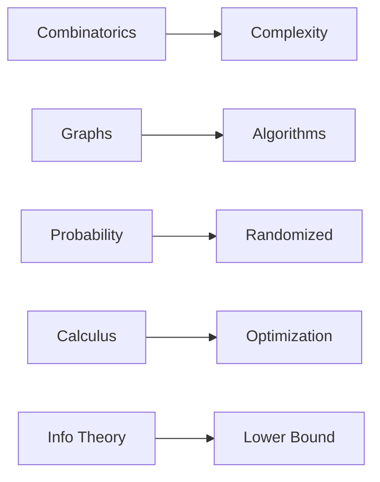

# 알고리즘과 수학

> Math for CS 101 시리즈 (10/10)

<!-- a-grade-intro:begin -->

**핵심 질문**: 지금까지 배운 *수학* 은 *알고리즘 설계* 에서 *어떻게* 결합될까요?

> *수학* 은 *알고리즘* 의 *분석*, *설계*, *한계* 모두를 결정합니다.

<!-- a-grade-intro:end -->

## 이 글에서 배울 것

- *복잡도* 와 *조합론*
- *그래프 알고리즘*
- *무작위* 알고리즘
- *경사하강* 의 분석
- *정보이론* 의 한계

## 왜 중요한가

*시리즈를 종합* 해서, 같은 문제도 *수학* 으로 *바라보는 시각* 이 *결과* 를 결정함을 보입니다.

## 개념 한눈에 보기



## 핵심 용어 정리

- **complexity**: *입력 크기* 대 *비용*.
- **shortest path**: *최소 거리* 경로.
- **randomized**: *동전* 으로 *분기*.
- **optimization**: *최소/최대* 탐색.
- **lower bound**: *불가능* 의 경계.

## Before/After

**Before**: *알고리즘* 을 *코드* 로만 본다.

**After**: *수학* 으로 *분석* 하고 *한계* 를 안다.

## 실습: 미니 종합 키트

### 1단계 — 조합 복잡도

```python
def subsets(n):
    return 2 ** n
```

### 2단계 — BFS 최단 경로

```python
from collections import deque

def shortest(G, s, t):
    q, seen = deque([(s, 0)]), {s}
    while q:
        v, d = q.popleft()
        if v == t:
            return d
        for n in G[v]:
            if n not in seen:
                seen.add(n)
                q.append((n, d + 1))
    return -1
```

### 3단계 — 무작위 추정

```python
import random

def estimate_pi(n=10000):
    inside = sum(1 for _ in range(n) if random.random() ** 2 + random.random() ** 2 < 1)
    return 4 * inside / n
```

### 4단계 — 경사하강 최소화

```python
def minimize(f, x, lr=0.1, steps=100, h=1e-5):
    for _ in range(steps):
        g = (f(x + h) - f(x - h)) / (2 * h)
        x = x - lr * g
    return x
```

### 5단계 — 엔트로피 하한

```python
import math

def lower_bound_bits(probs):
    return sum(-p * math.log2(p) for p in probs if p > 0)
```

## 이 코드에서 주목할 점

- *조합* 이 *지수 폭발* 을 설명.
- *그래프* 가 *모델*.
- *무작위* 가 *근사* 의 도구.
- *미분* 이 *최적화* 의 동력.
- *엔트로피* 가 *압축 한계*.

## 자주 하는 실수 5가지

1. ***복잡도* 분석 없이 *상수* 가정.**
2. ***그래프 모델링* 누락.**
3. ***무작위* 결과를 *결정적* 으로 사용.**
4. ***학습률* 튜닝 무시.**
5. ***이론적 한계* 무시.**

## 실무에서는 이렇게 쓰입니다

*검색 인덱스 (그래프 + 정보이론)*, *추천 (선형대수 + 확률)*, *학습 (미분 + 확률)*, *설계 검토 (복잡도)* 까지 모두 *수학 결합* 입니다.

## 시니어 엔지니어는 이렇게 생각합니다

- *수학* 은 *시각*.
- *복잡도* 는 *예산*.
- *확률* 은 *현실*.
- *정보이론* 은 *한계*.
- *모델링* 이 *코드 보다 먼저*.

## 체크리스트

- [ ] *복잡도* 표기.
- [ ] *모델* 명시.
- [ ] *무작위성* 분리.
- [ ] *수렴* 검증.
- [ ] *이론적 한계* 인지.

## 연습 문제

1. *복잡도* 와 *조합론* 의 관계 한 줄.
2. *무작위* 알고리즘의 장점 한 줄.
3. *정보이론* 이 주는 *한계* 한 줄.

## 정리 및 다음 단계

이 글로 *Math for CS 101* 시리즈를 마무리합니다. *수학* 은 *코드* 위에서 *방향* 과 *한계* 를 알려주는 *지도* 입니다.

<!-- toc:begin -->
- [CS에 수학이 필요한 이유](./01-why-math-for-cs.md)
- [논리와 증명](./02-logic-and-proofs.md)
- [집합과 함수](./03-sets-and-functions.md)
- [그래프](./04-graphs.md)
- [조합](./05-combinatorics.md)
- [확률](./06-probability.md)
- [선형대수](./07-linear-algebra.md)
- [미분](./08-calculus.md)
- [정보이론](./09-information-theory.md)
- **알고리즘과 수학 (현재 글)**
<!-- toc:end -->

## 참고 자료

- [Introduction to Algorithms - CLRS](https://mitpress.mit.edu/9780262046305/introduction-to-algorithms/)
- [Algorithm Design - Kleinberg and Tardos](https://www.pearson.com/en-us/subject-catalog/p/algorithm-design/P200000003259)
- [Randomized Algorithms - Motwani and Raghavan](https://www.cambridge.org/9780521474658)
- [Convex Optimization - Boyd and Vandenberghe](https://web.stanford.edu/~boyd/cvxbook/)

Tags: Math, Algorithms, Complexity, Capstone, Beginner
