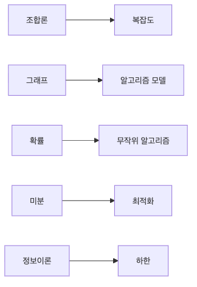

# 알고리즘과 수학

알고리즘을 처음 배울 때는 대개 구현에 집중합니다. 동작하면 일단 성공처럼 느껴집니다. 하지만 실제 시스템에서는 그다음 질문이 훨씬 중요합니다. 얼마나 빠른지, 어떤 모델로 바꿔야 풀리는지, 무작위성을 써도 되는지, 더 줄일 수 없는 이론적 한계는 무엇인지 같이 봐야 하기 때문입니다.

이 지점에서 수학이 시리즈 전체를 다시 하나로 묶습니다. 조합론은 경우의 수 폭발을 설명하고, 그래프는 문제 구조를 드러내고, 확률은 무작위 알고리즘을 가능하게 하고, 미분은 최적화를 움직이며, 정보이론은 넘을 수 없는 바닥선을 알려 줍니다.

이 글은 Math for CS 101 시리즈의 10번째 글입니다.

여기서는 앞에서 본 수학 도구들이 알고리즘 설계와 분석에서 어떻게 만나고 서로를 보완하는지 묶어 보겠습니다.

---

## 이 글에서 다룰 문제

- 이 시리즈에서 본 수학이 알고리즘 설계에 어떻게 합쳐질까요?
- 조합론은 왜 복잡도 분석과 연결될까요?
- 그래프 모델은 문제 해결 방식 자체를 어떻게 바꿀까요?
- 무작위성, 최적화, 정보이론은 각각 어떤 제약과 가능성을 줄까요?
- 수학적으로 보는 시선이 구현 결과를 왜 바꿀까요?

> 알고리즘은 코드이기도 하지만, 그 전에 모델과 분석의 대상입니다. 수학은 알고리즘의 비용, 가능성, 한계를 드러내는 지도이며, 이 지도가 있어야 구현도 방향을 잃지 않습니다.

---

## 왜 중요한가

알고리즘을 단순한 구현으로만 보면 동작 여부만 확인하고 끝나기 쉽습니다. 하지만 실제로는 얼마나 빠른지, 어떤 구조로 모델링해야 하는지, 무작위성을 넣어도 되는지, 더 줄일 수 없는 이론적 한계는 무엇인지까지 함께 봐야 합니다.

이 글은 시리즈의 마무리로, 앞에서 다룬 수학 개념들이 알고리즘 설계와 분석에서 어떻게 만나고 서로를 보완하는지 묶어 봅니다. 문제를 수학적으로 본다는 말이 추상적인 구호가 아니라 실제 설계 방법이라는 점을 보여 주는 단계입니다.

---

## 머릿속에 먼저 둘 관점

이 시리즈를 하나로 묶는 가장 중요한 문장은 이것입니다. **알고리즘은 구현 이전에 먼저 모델링되고, 그다음에 분석된다**는 점입니다. 어떤 문제를 그래프로 바꾸면 최단 경로 문제로 정리할 수 있고, 경우의 수를 세어 보면 완전 탐색이 불가능하다는 사실을 빨리 알 수 있습니다.

또 확률을 넣으면 근사와 샘플링이 가능해지고, 미분을 넣으면 최적화 절차를 만들 수 있습니다. 정보이론은 아무리 잘 설계해도 넘을 수 없는 하한을 보여 줍니다. 결국 좋은 알고리즘 설계는 구현 요령보다, 어떤 수학 도구로 문제를 다시 쓸지 정하는 일에 더 가깝습니다.

저는 이 관점을 알고리즘 설계의 멘탈 모델이라고 생각합니다. 코드가 아니라 구조를 먼저 보는 눈입니다.

## 한 장으로 보는 알고리즘과 수학의 연결


*알고리즘 설계는 구현 전에 어떤 수학 도구로 문제를 다시 쓸지 정하는 일에서 이미 절반이 결정됩니다.*

---

## 다섯 단계로 보는 수학과 알고리즘의 연결

### 첫 번째 단계 — 경우의 수 폭발을 봅니다

```python
def subsets(n):
    return 2 ** n
```

부분집합 수가 `2 ** n`으로 늘어난다는 사실만 알아도, 어떤 문제는 입력이 조금만 커져도 탐색이 금방 감당하기 어려워진다는 점을 알 수 있습니다. 조합론은 구현을 시작하기 전에 이미 위험 신호를 보여 줍니다.

### 두 번째 단계 — 문제를 그래프로 바꿉니다

```python
from collections import deque

def shortest(G, s, t):
    q, seen = deque([(s, 0)]), {s}
    while q:
        v, d = q.popleft()
        if v == t:
            return d
        for n in G[v]:
            if n not in seen:
                seen.add(n)
                q.append((n, d + 1))
    return -1
```

그래프로 모델링하는 순간 최단 경로라는 잘 알려진 문제로 바뀝니다. 모델 선택이 해결 전략을 결정한다는 뜻입니다. 알고리즘은 종종 구현보다 표현에서 먼저 달라집니다.

### 세 번째 단계 — 무작위성으로 근사합니다

```python
import random

def estimate_pi(n=10000):
    inside = sum(1 for _ in range(n) if random.random() ** 2 + random.random() ** 2 < 1)
    return 4 * inside / n
```

무작위성은 근사와 추정을 가능하게 합니다. 항상 같은 답을 주지는 않지만, 계산량과 정확도 사이에서 실용적인 균형을 만들 수 있습니다. 확률은 여기서 계산 오차를 해석하는 언어가 됩니다.

### 네 번째 단계 — 최적화로 더 나은 해를 찾습니다

```python
def minimize(f, x, lr=0.1, steps=100, h=1e-5):
    for _ in range(steps):
        g = (f(x + h) - f(x - h)) / (2 * h)
        x = x - lr * g
    return x
```

최적화는 알고리즘 설계와 별개가 아닙니다. 비용 함수가 정의되면 더 나은 해를 찾는 과정 자체가 알고리즘이 됩니다. 미분은 그 과정에 방향 정보를 공급합니다.

### 다섯 번째 단계 — 한계를 인정합니다

```python
import math

def lower_bound_bits(probs):
    return sum(-p * math.log2(p) for p in probs if p > 0)
```

정보이론은 압축이나 추정에서 이론적 바닥선을 알려 줍니다. 아무리 구현을 잘해도 이 한계 아래로는 내려갈 수 없습니다. 알고리즘 설계는 가능성뿐 아니라 불가능성도 함께 다루는 일입니다.

---

## 이 코드에서 먼저 볼 점

- 조합론은 지수 폭발이 어디서 오는지 설명합니다.
- 그래프는 문제를 푸는 언어를 바꿉니다.
- 무작위성은 근사와 샘플링을 가능하게 합니다.
- 미분은 최적화 절차를 움직이는 힘입니다.
- 정보이론은 가능한 것과 불가능한 것을 가릅니다.

---

## 어디서 자주 헷갈릴까요?

복잡도 분석 없이 구현부터 밀어붙이는 실수가 가장 흔합니다. 작게는 잘 돌아가 보여도, 경우의 수가 이미 폭발하는 구조라면 나중에 손쓸 수 없게 됩니다.

그래프 모델링이 필요한 문제를 목록 처리로만 보는 것도 자주 나옵니다. 관계 중심 문제를 순차 데이터처럼 다루면 문제 자체가 흐려지고, 잘 알려진 해법도 놓치기 쉽습니다.

무작위 알고리즘의 결과를 결정론적 값처럼 해석하거나, 학습률과 수렴 조건을 무시하는 일도 흔합니다. 또 정보이론이 말하는 하한을 잊고 무한정 더 줄일 수 있다고 믿는 것도 위험합니다. 수학은 바로 이런 기대의 경계를 그어 줍니다.

---

## 실무에서는 이렇게 생각한다

검색 인덱스는 그래프와 정보이론의 영향을 받습니다. 추천 시스템은 선형대수와 확률을 동시에 사용합니다. 학습 시스템은 미분과 확률을 함께 쓰고, 설계 리뷰에서는 거의 항상 복잡도 분석이 따라붙습니다. 개별 분야는 달라도 결국 수학 도구들이 함께 움직입니다.

좋은 엔지니어는 구현 아이디어가 떠오르면 곧바로 묻습니다. 이 문제의 모델은 무엇인지, 비용은 어떻게 커지는지, 근사나 무작위화가 가능한지, 이론적 한계는 어디인지 묻는 습관입니다. 이 질문이 있으면 구현은 더 분명해지고, 설계는 더 설득력 있어집니다.

---

## 체크리스트

- [ ] 알고리즘의 복잡도를 말할 수 있습니다.
- [ ] 문제를 적절한 수학 모델로 바꿀 수 있습니다.
- [ ] 무작위성이 들어가는 부분을 분리해 설명할 수 있습니다.
- [ ] 수렴과 이론적 한계를 함께 볼 수 있습니다.
- [ ] 구현 전에 구조적 위험 신호를 먼저 점검할 수 있습니다.

## 연습 문제

1. 복잡도와 조합론의 연결을 한 줄로 정리해 보세요.
2. 무작위 알고리즘의 장점 하나를 써 보세요.
3. 정보이론이 주는 한계 하나를 설명해 보세요.

## 정리

이 글로 Math for CS 101 시리즈를 마칩니다. 수학은 코드를 어렵게 만드는 장벽이 아니라, 코드를 더 잘 설계하고 더 빨리 한계를 파악하게 해 주는 지도입니다. 문제를 수학적으로 볼 수 있게 되면 구현은 더 분명해지고, 분석은 더 설득력 있어집니다.

<!-- toc:begin -->
- [CS에 수학이 필요한 이유](./01-why-math-for-cs.md)
- [논리와 증명](./02-logic-and-proofs.md)
- [집합과 함수](./03-sets-and-functions.md)
- [그래프](./04-graphs.md)
- [조합](./05-combinatorics.md)
- [확률](./06-probability.md)
- [선형대수](./07-linear-algebra.md)
- [미분](./08-calculus.md)
- [정보이론](./09-information-theory.md)
- **알고리즘과 수학 (현재 글)**
<!-- toc:end -->

## 참고 자료

- [Introduction to Algorithms - CLRS](https://mitpress.mit.edu/9780262046305/introduction-to-algorithms/)
- [Algorithm Design - Kleinberg and Tardos](https://www.pearson.com/en-us/subject-catalog/p/algorithm-design/P200000003259)
- [Randomized Algorithms - Motwani and Raghavan](https://www.cambridge.org/9780521474658)
- [Convex Optimization - Boyd and Vandenberghe](https://web.stanford.edu/~boyd/cvxbook/)
- [TheAlgorithms/Python GitHub repository](https://github.com/TheAlgorithms/Python)

Tags: Math, Algorithms, Complexity, Capstone, Beginner
