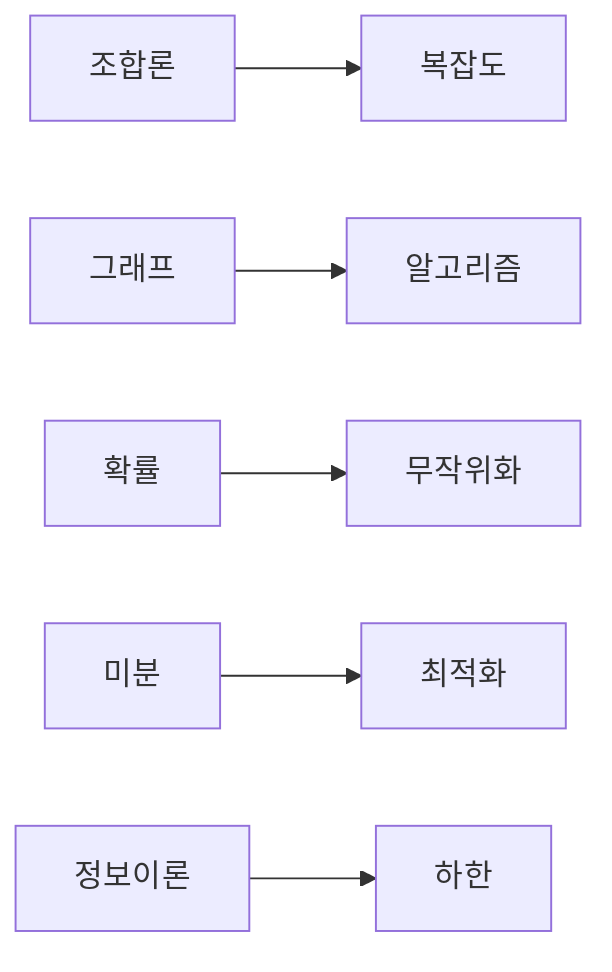

# 알고리즘과 수학

## 이 글에서 다룰 문제

- 이 시리즈에서 본 수학이 알고리즘 설계에 어떻게 합쳐질까요?
- 조합론은 왜 복잡도 분석과 연결될까요?
- 그래프 모델은 문제 해결 방식 자체를 어떻게 바꿀까요?
- 무작위성, 최적화, 정보이론은 각각 어떤 제약과 가능성을 줄까요?
- 수학적으로 보는 시선이 구현 결과를 왜 바꿀까요?

> 알고리즘은 코드이기도 하지만, 그 전에 모델과 분석의 대상입니다. 수학은 알고리즘의 비용, 가능성, 한계를 드러내는 지도입니다.

> Math for CS 101 시리즈 (10/10)

## 왜 중요한가

알고리즘을 단순한 구현으로만 보면 동작 여부만 확인하고 끝나기 쉽습니다. 하지만 실제로는 얼마나 빠른지, 어떤 구조로 모델링해야 하는지, 무작위성을 넣어도 되는지, 더 줄일 수 없는 이론적 한계는 무엇인지까지 함께 봐야 합니다.

이 글은 시리즈의 마무리로, 앞에서 다룬 수학 개념들이 알고리즘 설계와 분석에서 어떻게 만나고 서로를 보완하는지 묶어 봅니다. 문제를 수학적으로 본다는 말이 추상적인 구호가 아니라 실제 설계 방법이라는 점을 보여 주는 단계입니다.

## 한눈에 보는 흐름



조합론은 경우의 수 폭발을 설명하고, 그래프는 문제의 구조를 드러냅니다. 확률은 무작위 알고리즘의 기반이 되고, 미분은 최적화에 힘을 줍니다. 정보이론은 아무리 잘해도 넘을 수 없는 하한을 알려 줍니다.

## 핵심 용어

- 복잡도: 입력 크기에 따라 드는 비용입니다.
- 최단 경로: 가장 짧은 비용으로 도달하는 경로입니다.
- 무작위 알고리즘: 동전 던지기 같은 무작위 선택을 내부에 포함하는 알고리즘입니다.
- 최적화: 최소값이나 최대값을 찾는 과정입니다.
- 하한: 어떤 문제를 푸는 데 피할 수 없는 최소 비용입니다.

## Before / After

Before: 알고리즘은 일단 돌아가면 충분하다고 봅니다.

After: 어떤 모델로 보고, 어떤 비용이 들고, 어떤 한계가 있는지까지 함께 분석합니다.

## 미니 종합 키트

### 1단계 — 조합 복잡도

```python
def subsets(n):
    return 2 ** n
```

부분집합 수가 `2 ** n`으로 늘어난다는 사실만 알아도, 어떤 문제는 입력이 조금만 커져도 탐색이 금방 감당하기 어려워진다는 점을 알 수 있습니다.

### 2단계 — BFS 최단 경로

```python
from collections import deque

def shortest(G, s, t):
    q, seen = deque([(s, 0)]), {s}
    while q:
        v, d = q.popleft()
        if v == t:
            return d
        for n in G[v]:
            if n not in seen:
                seen.add(n)
                q.append((n, d + 1))
    return -1
```

그래프로 모델링하는 순간 최단 경로라는 잘 알려진 문제로 바뀝니다. 모델 선택이 해결 전략을 결정한다는 뜻입니다.

### 3단계 — 무작위 추정

```python
import random

def estimate_pi(n=10000):
    inside = sum(1 for _ in range(n) if random.random() ** 2 + random.random() ** 2 < 1)
    return 4 * inside / n
```

무작위성은 근사와 추정을 가능하게 합니다. 항상 같은 답을 주지는 않지만, 계산량과 정확도 사이에서 실용적인 균형을 만들 수 있습니다.

### 4단계 — 경사하강 최소화

```python
def minimize(f, x, lr=0.1, steps=100, h=1e-5):
    for _ in range(steps):
        g = (f(x + h) - f(x - h)) / (2 * h)
        x = x - lr * g
    return x
```

최적화는 알고리즘 설계와 별개가 아닙니다. 비용 함수가 정의되면 더 나은 해를 찾는 과정 자체가 알고리즘이 됩니다.

### 5단계 — 엔트로피 하한

```python
import math

def lower_bound_bits(probs):
    return sum(-p * math.log2(p) for p in probs if p > 0)
```

정보이론은 압축이나 추정에서 이론적 바닥선을 알려 줍니다. 아무리 구현을 잘해도 이 한계 아래로는 내려갈 수 없습니다.

## 이 코드에서 봐야 할 포인트

- 조합론은 지수 폭발이 어디서 오는지 설명합니다.
- 그래프는 문제를 푸는 언어를 바꿉니다.
- 무작위성은 근사와 샘플링을 가능하게 합니다.
- 미분은 최적화 절차를 움직이는 힘입니다.
- 정보이론은 가능한 것과 불가능한 것을 가릅니다.

## 자주 하는 실수 다섯 가지

1. 복잡도 분석 없이 구현부터 밀어붙이는 실수
2. 그래프 모델링이 필요한 문제를 목록 처리로만 보는 실수
3. 무작위 알고리즘의 결과를 결정론적 값처럼 해석하는 실수
4. 학습률이나 수렴 조건을 무시하는 실수
5. 이론적 하한을 잊고 무한정 최적화할 수 있다고 믿는 실수

## 실무에서는 이렇게 드러납니다

검색 인덱스는 그래프와 정보이론의 영향을 받습니다. 추천 시스템은 선형대수와 확률을 동시에 사용합니다. 학습 시스템은 미분과 확률을 함께 쓰고, 설계 리뷰에서는 거의 항상 복잡도 분석이 따라붙습니다. 개별 분야는 달라도 결국 수학 도구들이 함께 움직입니다.

## 시니어 엔지니어는 이렇게 생각합니다

- 수학은 구현 이전에 문제를 보는 렌즈입니다.
- 복잡도는 예산처럼 다뤄야 합니다.
- 확률은 현실의 잡음을 설명합니다.
- 정보이론은 한계를 알려 줍니다.
- 모델링이 코드보다 먼저입니다.

## 체크리스트

- [ ] 알고리즘의 복잡도를 말할 수 있습니다.
- [ ] 문제를 적절한 수학 모델로 바꿀 수 있습니다.
- [ ] 무작위성이 들어가는 부분을 분리해 설명할 수 있습니다.
- [ ] 수렴과 이론적 한계를 함께 볼 수 있습니다.

## 연습 문제

1. 복잡도와 조합론의 연결을 한 줄로 정리해 보세요.
2. 무작위 알고리즘의 장점 하나를 써 보세요.
3. 정보이론이 주는 한계 하나를 설명해 보세요.

## 정리 및 다음 단계

이 글로 Math for CS 101 시리즈를 마칩니다. 수학은 코드를 어렵게 만드는 장벽이 아니라, 코드를 더 잘 설계하고 더 빨리 한계를 파악하게 해 주는 지도입니다. 문제를 수학적으로 볼 수 있게 되면 구현은 더 분명해지고, 분석은 더 설득력 있어집니다.

<!-- toc:begin -->
- [CS에 수학이 필요한 이유](./01-why-math-for-cs.md)
- [논리와 증명](./02-logic-and-proofs.md)
- [집합과 함수](./03-sets-and-functions.md)
- [그래프](./04-graphs.md)
- [조합](./05-combinatorics.md)
- [확률](./06-probability.md)
- [선형대수](./07-linear-algebra.md)
- [미분](./08-calculus.md)
- [정보이론](./09-information-theory.md)
- **알고리즘과 수학 (현재 글)**
<!-- toc:end -->

## 참고 자료

- [Introduction to Algorithms - CLRS](https://mitpress.mit.edu/9780262046305/introduction-to-algorithms/)
- [Algorithm Design - Kleinberg and Tardos](https://www.pearson.com/en-us/subject-catalog/p/algorithm-design/P200000003259)
- [Randomized Algorithms - Motwani and Raghavan](https://www.cambridge.org/9780521474658)
- [Convex Optimization - Boyd and Vandenberghe](https://web.stanford.edu/~boyd/cvxbook/)

Tags: Math, Algorithms, Complexity, Capstone, Beginner
