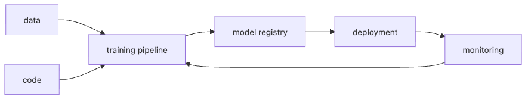

# What Is MLOps?

Training one good model and running that model in production for months are very different jobs. A model can look great inside a notebook, then become hard to reproduce after deployment, drift when the input shape changes, or lose performance with no trace of when the decline started.

Many teams make the same assumption at this point: if model quality improves, operations will take care of themselves. In practice, the opposite is usually true. In production, the model, data, code, deployment path, monitoring, and retraining loop all have to move together.

This is the first post in the MLOps 101 series.

Here, we will treat MLOps not as a list of tool names, but as the operational loop that lets a model stay alive in production.

## What This Post Answers

- What makes MLOps different from simply attaching DevOps habits to ML?
- Why do even accurate models break down quickly in real production systems?
- What does it actually mean to manage data, code, and models together?
- Which building blocks let a team reproduce, deploy, observe, and improve a model over time?
- How does MLOps maturity usually progress in practice?

> Mental model: MLOps is not the technique for deploying one model file. It is the operating system around a loop of data → training → registration → deployment → monitoring → retraining.

## Why It Matters

Most ML projects fail first at the operating model, not at the model metric. Teams cannot rerun last week's best experiment, cannot tell which data trained the live model, and cannot explain why performance is slipping because the evidence was never captured.

That is why the starting point for MLOps is not buying a larger platform. It is deciding whether the same inputs can produce the same result again, whether the live model can be observed, and whether the team knows which part of the loop to revisit when something goes wrong.

## See the Loop First



*See the Loop First*
This loop is the shortest useful picture of MLOps. Data and code feed a training pipeline, the trained model moves into a registry, deployment sends that version into production, and monitoring feeds real operating signals back into the next training cycle.

The important detail is that this is not a one-time delivery pipeline. Models age, input distributions change, and production conditions keep moving. MLOps exists to make that change manageable.

## Key Terms

- **MLOps**: ML plus DevOps; continuous training, deployment, and monitoring.
- **CT (Continuous Training)**: retraining as data changes.
- **Model Registry**: a versioned store for trained models.
- **Feature Store**: a shared store for features.
- **Drift**: how data and model behavior shift over time.

## Before/After

**Before**: a single notebook, manual deployment, no monitoring.

**After**: an automated pipeline, versioned models, and drift alerts.

## Hands-on: 5 Steps Through a Mini MLOps Loop

### Step 1 — Snapshot the data

```python
import hashlib, json
data = [{"x": 1, "y": 0}, {"x": 2, "y": 1}]
snap = hashlib.sha1(json.dumps(data).encode()).hexdigest()[:10]
print("data version:", snap)
```

### Step 2 — Train a model

```python
from sklearn.linear_model import LogisticRegression
import numpy as np
X = np.array([[1], [2], [3], [4]])
y = np.array([0, 0, 1, 1])
model = LogisticRegression().fit(X, y)
```

### Step 3 — Register the model

```python
import pickle, os
os.makedirs("registry", exist_ok=True)
with open("registry/model_v1.pkl", "wb") as f:
    pickle.dump(model, f)
```

### Step 4 — Attach metadata

```python
meta = {"data_version": snap, "model_version": "v1", "metric": float(model.score(X, y))}
print(meta)
```

### Step 5 — Log a prediction

```python
import time
log = {"ts": time.time(), "pred": int(model.predict([[5]])[0])}
print("log:", log)
```

## What to Notice in This Code

- A data hash is the seed of reproducibility.
- A registry can start as a single file.
- Prediction logs feed monitoring.

## Five Common Mistakes

1. Versioning models but not data and code.
2. Deploying without monitoring.
3. Shipping a notebook to production.
4. Triggering retraining manually.
5. Tracking model metrics without business metrics.

## How This Shows Up in Production

Recommendation systems and fraud detection live in fast-changing data and require MLOps to survive.

## How a Senior Engineer Thinks

- Model accuracy is just the starting line.
- The chance of retraining shapes the architecture.
- Data, code, and model versions must be immutable.
- A model without monitoring is no model at all.
- Maturity is reached gradually, not in one leap.

## Checklist

- [ ] Data is versioned.
- [ ] Models are versioned.
- [ ] Predictions are logged.
- [ ] Retraining is documented.

## Practice Problems

1. Build a data hash for your team's most recent model.
2. Save two model versions to a registry and compare them.
3. Add latency to the prediction log.

## Wrap-up and Next Steps

MLOps is a system, not a single line of model code. Next, experiment tracking begins the journey.

<!-- toc:begin -->
- **What Is MLOps? (current)**
- Experiment Tracking (upcoming)
- Data Versioning (upcoming)
- Model Training Pipeline (upcoming)
- Model Deployment (upcoming)
- Model Monitoring (upcoming)
- Data Drift and Model Drift (upcoming)
- Retraining (upcoming)
- Feature Store (upcoming)
- Building a Production ML System (upcoming)
<!-- toc:end -->

## References

- [Google — MLOps levels](https://cloud.google.com/architecture/mlops-continuous-delivery-and-automation-pipelines-in-machine-learning)
- [ml-ops.org](https://ml-ops.org/)
- [Microsoft — MLOps maturity](https://learn.microsoft.com/en-us/azure/architecture/ai-ml/guide/mlops-maturity-model)
- [Sculley et al. — Hidden Tech Debt in ML](https://papers.nips.cc/paper_files/paper/2015/hash/86df7dcfd896fcaf2674f757a2463eba-Abstract.html)

Tags: MLOps, DevOps, MLSystem, Production, DataScience
