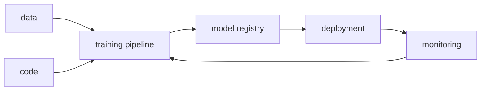

# What Is MLOps?

> MLOps 101 series (1/10)

<!-- a-grade-intro:begin -->

**Core question**: What does it take to turn a model that demos well into a system that runs 365 days a year?

> *MLOps binds the three axes of model, data, and code together with DevOps principles so the result is operable.*

<!-- a-grade-intro:end -->

This is the first post in the MLOps 101 series.

## What You Will Learn

- The definition of MLOps
- What MLOps shares with DevOps and where it diverges
- Six core components
- Maturity levels 0 through 2
- Five common pitfalls

## Why It Matters

Most ML projects never reach production. MLOps is the discipline that closes that gap.

## Concept at a Glance



## Key Terms

- **MLOps**: ML plus DevOps; continuous training, deployment, and monitoring.
- **CT (Continuous Training)**: retraining as data changes.
- **Model Registry**: a versioned store for trained models.
- **Feature Store**: a shared store for features.
- **Drift**: how data and model behavior shift over time.

## Before/After

**Before**: a single notebook, manual deployment, no monitoring.

**After**: an automated pipeline, versioned models, and drift alerts.

## Hands-on: 5 Steps Through a Mini MLOps Loop

### Step 1 — Snapshot the data

```python
import hashlib, json
data = [{"x": 1, "y": 0}, {"x": 2, "y": 1}]
snap = hashlib.sha1(json.dumps(data).encode()).hexdigest()[:10]
print("data version:", snap)
```

### Step 2 — Train a model

```python
from sklearn.linear_model import LogisticRegression
import numpy as np
X = np.array([[1], [2], [3], [4]])
y = np.array([0, 0, 1, 1])
model = LogisticRegression().fit(X, y)
```

### Step 3 — Register the model

```python
import pickle, os
os.makedirs("registry", exist_ok=True)
with open("registry/model_v1.pkl", "wb") as f:
    pickle.dump(model, f)
```

### Step 4 — Attach metadata

```python
meta = {"data_version": snap, "model_version": "v1", "metric": float(model.score(X, y))}
print(meta)
```

### Step 5 — Log a prediction

```python
import time
log = {"ts": time.time(), "pred": int(model.predict([[5]])[0])}
print("log:", log)
```

## What to Notice in This Code

- A data hash is the seed of reproducibility.
- A registry can start as a single file.
- Prediction logs feed monitoring.

## Five Common Mistakes

1. Versioning models but not data and code.
2. Deploying without monitoring.
3. Shipping a notebook to production.
4. Triggering retraining manually.
5. Tracking model metrics without business metrics.

## How This Shows Up in Production

Recommendation systems and fraud detection live in fast-changing data and require MLOps to survive.

## How a Senior Engineer Thinks

- Model accuracy is just the starting line.
- The chance of retraining shapes the architecture.
- Data, code, and model versions must be immutable.
- A model without monitoring is no model at all.
- Maturity is reached gradually, not in one leap.

## Checklist

- [ ] Data is versioned.
- [ ] Models are versioned.
- [ ] Predictions are logged.
- [ ] Retraining is documented.

## Practice Problems

1. Build a data hash for your team's most recent model.
2. Save two model versions to a registry and compare them.
3. Add latency to the prediction log.

## Wrap-up and Next Steps

MLOps is a system, not a single line of model code. Next, experiment tracking begins the journey.

<!-- toc:begin -->
- **What Is MLOps? (current)**
- Experiment Tracking (upcoming)
- Data Versioning (upcoming)
- Model Training Pipeline (upcoming)
- Model Deployment (upcoming)
- Model Monitoring (upcoming)
- Data Drift and Model Drift (upcoming)
- Retraining (upcoming)
- Feature Store (upcoming)
- Building a Production ML System (upcoming)
<!-- toc:end -->

## References

- [Google — MLOps levels](https://cloud.google.com/architecture/mlops-continuous-delivery-and-automation-pipelines-in-machine-learning)
- [ml-ops.org](https://ml-ops.org/)
- [Microsoft — MLOps maturity](https://learn.microsoft.com/en-us/azure/architecture/ai-ml/guide/mlops-maturity-model)
- [Sculley et al. — Hidden Tech Debt in ML](https://papers.nips.cc/paper_files/paper/2015/hash/86df7dcfd896fcaf2674f757a2463eba-Abstract.html)

Tags: MLOps, DevOps, MLSystem, Production, DataScience
