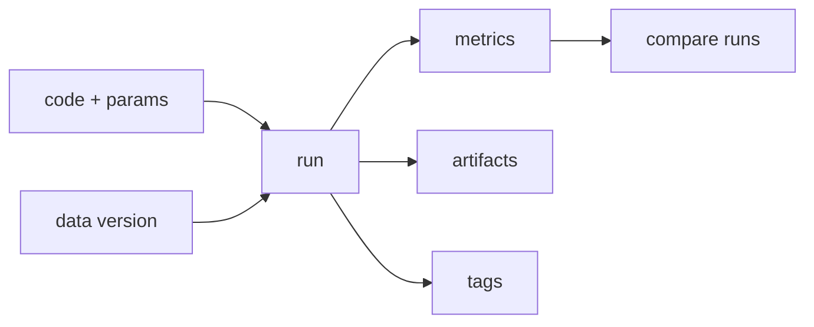

# Experiment Tracking

> MLOps 101 series (2/10)

<!-- a-grade-intro:begin -->

**Core question**: Can you rerun last week's best experiment today?

> *Experiment tracking records parameters, metrics, artifacts, and environment together so reproduction is guaranteed.*

<!-- a-grade-intro:end -->

## What You Will Learn

- The four elements of experiment tracking
- The core MLflow objects
- How runs and experiments compose
- Tools for comparison and ranking
- Five common pitfalls

## Why It Matters

When a folder of notebooks becomes the source of truth, team collaboration breaks. A tracker is shared memory.

## Concept at a Glance



## Key Terms

- **Experiment**: a named container for related runs.
- **Run**: a single training execution.
- **Param**: a fixed input value.
- **Metric**: a measured outcome.
- **Artifact**: a file such as a model, plot, or log.

## Before/After

**Before**: chaos under filenames like `v3_final2.pkl`.

**After**: a runs table and an MLflow UI for comparison.

## Hands-on: 5 Steps Through MLflow

### Step 1 — Bootstrap the tracker

```python
# pip install mlflow
import mlflow
mlflow.set_tracking_uri("file:./mlruns")
mlflow.set_experiment("demo")
```

### Step 2 — Record a run

```python
from sklearn.datasets import make_classification
from sklearn.linear_model import LogisticRegression
X, y = make_classification(n_samples=500, random_state=0)

with mlflow.start_run():
    C = 1.0
    mlflow.log_param("C", C)
    m = LogisticRegression(C=C, max_iter=1000).fit(X, y)
    mlflow.log_metric("acc", m.score(X, y))
```

### Step 3 — Log the model artifact

```python
import pickle, os
os.makedirs("art", exist_ok=True)
with mlflow.start_run():
    m = LogisticRegression().fit(X, y)
    with open("art/model.pkl", "wb") as f:
        pickle.dump(m, f)
    mlflow.log_artifact("art/model.pkl")
```

### Step 4 — Sweep parameters

```python
for C in [0.1, 1.0, 10.0]:
    with mlflow.start_run():
        mlflow.log_param("C", C)
        m = LogisticRegression(C=C, max_iter=1000).fit(X, y)
        mlflow.log_metric("acc", m.score(X, y))
```

### Step 5 — Compare via the API

```python
client = mlflow.tracking.MlflowClient()
exp = client.get_experiment_by_name("demo")
runs = client.search_runs(exp.experiment_id, order_by=["metrics.acc DESC"])
for r in runs[:3]:
    print(r.data.params, r.data.metrics)
```

## What to Notice in This Code

- A `with` block is the run boundary.
- Params and metrics are key-value pairs.
- Artifacts are stored as files as is.

## Five Common Mistakes

1. Recording only successful runs.
2. Forgetting the data version.
3. Inconsistent param and metric names.
4. Using only local mlruns and losing shareability.
5. Choosing the winner manually instead of by comparison.

## How This Shows Up in Production

Hyperparameter sweeps and weekly reviews use MLflow or W&B as shared memory.

## How a Senior Engineer Thinks

- Record every run, including failures.
- Treat data version as a param.
- Standardize metric keys across the team.
- Default to a remote tracking server.
- Run metadata is the entry point of debugging.

## Checklist

- [ ] All training is captured as runs.
- [ ] Data and code versions are included.
- [ ] A shared tracking server is used.
- [ ] Decisions come from the comparison view.

## Practice Problems

1. Sweep three parameter combinations and print the top run.
2. Add the data hash as a param.
3. Use run tags to mark experiment intent.

## Wrap-up and Next Steps

Experiment tracking is the team's short-term memory. Next, data versioning provides the long-term memory.

<!-- toc:begin -->
- [What Is MLOps?](./01-what-is-mlops.md)
- **Experiment Tracking (current)**
- Data Versioning (upcoming)
- Model Training Pipeline (upcoming)
- Model Deployment (upcoming)
- Model Monitoring (upcoming)
- Data Drift and Model Drift (upcoming)
- Retraining (upcoming)
- Feature Store (upcoming)
- Building a Production ML System (upcoming)
<!-- toc:end -->

## References

- [MLflow — Tracking](https://mlflow.org/docs/latest/tracking.html)
- [Weights & Biases](https://docs.wandb.ai/)
- [Neptune.ai — Comparison](https://neptune.ai/blog/best-ml-experiment-tracking-tools)
- [Google — Reproducible ML](https://cloud.google.com/architecture/ml-on-gcp-best-practices)

Tags: MLOps, ExperimentTracking, MLflow, Reproducibility, DataScience
