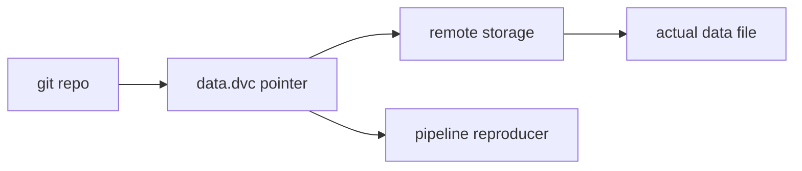

# Data Versioning

> MLOps 101 series (3/10)

<!-- a-grade-intro:begin -->

**Core question**: Code and models live in git, but where does the data live?

> *Data versioning keeps large files in remote storage and commits only hash pointers to git.*

<!-- a-grade-intro:end -->

This is post 3 in the MLOps 101 series.

## What You Will Learn

- Why data needs versioning and how it works
- DVC versus git-LFS
- Synchronizing data, code, and model versions
- Using hashes to guarantee reproduction
- Five common pitfalls

## Why It Matters

The same code with different data produces a different model. Without data versioning, reproduction is impossible.

## Concept at a Glance



## Key Terms

- **DVC**: Data Version Control. Tracks data and models on top of git.
- **Pointer file**: a `.dvc` file holding a hash and metadata.
- **Remote**: S3, GCS, SSH, or local storage backing DVC.
- **Stage**: a pipeline step with inputs, command, and outputs.
- **Repro**: re-runs only the steps whose inputs changed.

## Before/After

**Before**: `data_v3_final.csv` exists only on one teammate's laptop.

**After**: `git pull && dvc pull` reproduces the exact dataset everywhere.

## Hands-on: 5 Steps Through DVC

### Step 1 — Create sample data

```python
import pandas as pd
df = pd.DataFrame({"x": range(100), "y": [i % 2 for i in range(100)]})
df.to_csv("data.csv", index=False)
```

### Step 2 — Initialize DVC (assumed)

```bash
# pip install dvc
# git init && dvc init
# dvc add data.csv
# git add data.csv.dvc .gitignore
# git commit -m "track data v1"
```

### Step 3 — Mimic the pointer

```python
import hashlib, json
h = hashlib.md5(open("data.csv", "rb").read()).hexdigest()
pointer = {"path": "data.csv", "md5": h}
with open("data.csv.ptr", "w") as f:
    json.dump(pointer, f, indent=2)
print(pointer)
```

### Step 4 — A pipeline stage

```python
from sklearn.linear_model import LogisticRegression
import pickle
df = pd.read_csv("data.csv")
m = LogisticRegression().fit(df[["x"]], df["y"])
with open("model.pkl", "wb") as f:
    pickle.dump(m, f)
```

### Step 5 — Change input, observe re-run signal

```python
df.loc[0, "y"] = 1 - df.loc[0, "y"]
df.to_csv("data.csv", index=False)
new_h = hashlib.md5(open("data.csv", "rb").read()).hexdigest()
print("changed:", new_h != h)
```

## What to Notice in This Code

- A hash change is the retraining trigger.
- Only the pointer file lives in git.
- A pipeline stage is command, inputs, outputs.

## Five Common Mistakes

1. Committing large data files directly to git.
2. Forgetting to configure a remote, breaking reproduction for collaborators.
3. Updating data without committing the change.
4. Forgetting to declare DVC stage inputs and outputs.
5. Tracking data but not models.

## How This Shows Up in Production

Vision datasets and large text corpora outgrow git-LFS quickly; DVC with an S3 backend is a typical pairing.

## How a Senior Engineer Thinks

- Git is for code; DVC is for data and models.
- A configured remote is the default.
- Commit code and data versions together.
- Use pipelines so only changed hashes re-run.
- Small samples can stay in git for tests.

## Checklist

- [ ] Data files are tracked by DVC or LFS.
- [ ] A remote is configured.
- [ ] Models are tracked too.
- [ ] The reproduction command is documented.

## Practice Problems

1. Track a small CSV with DVC.
2. Modify the data and observe the hash change.
3. Mimic an S3 remote with a local directory.

## Wrap-up and Next Steps

Data versioning is the precondition for reproduction. Next, the training pipeline automates the loop.

<!-- toc:begin -->
- [What Is MLOps?](./01-what-is-mlops.md)
- [Experiment Tracking](./02-experiment-tracking.md)
- **Data Versioning (current)**
- Model Training Pipeline (upcoming)
- Model Deployment (upcoming)
- Model Monitoring (upcoming)
- Data Drift and Model Drift (upcoming)
- Retraining (upcoming)
- Feature Store (upcoming)
- Building a Production ML System (upcoming)
<!-- toc:end -->

## References

- [DVC — Get Started](https://dvc.org/doc/start)
- [git-LFS](https://git-lfs.com/)
- [Pachyderm](https://www.pachyderm.com/)
- [Google — Data versioning](https://cloud.google.com/architecture/ml-on-gcp-best-practices)

Tags: MLOps, DVC, DataVersioning, Reproducibility, DataScience
