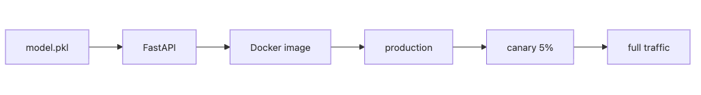

# Model Deployment

Finishing model training does not automatically create a service. If nobody has defined which process loads the model file, how input is validated, or what environment the code runs in, even a strong model becomes unstable the moment it leaves the notebook.

When engineers say deployment is hard, they are usually not describing the model itself. They are describing environment drift, missing version traceability, and the lack of a safe rollback path. That is why model deployment is really about a reproducible runtime plus a controlled release policy.

This is post 5 in the MLOps 101 series.

Here, we will wrap a trained artifact in an API and a container, then connect that runtime to the rollout and rollback decisions needed in production.

## Questions this article answers

- How do you connect a trained model file to a real user request?
- How should you distinguish online, batch, and streaming inference?
- What do FastAPI and Docker each contribute to model deployment?
- Why should version tags and health checks be treated as defaults?
- When do Blue/Green and Canary reduce risk in different ways?

> Mental model: model deployment packages a model file inside an API or batch job, then versions the entire runtime environment as one deployable artifact.

## Why It Matters

Many teams blame deployment failures on model complexity, but the more common source is environment mismatch and rollback chaos. The model works locally, then breaks in the server because the library version changed. A bad release goes live, and no one can cleanly return to the previous version.

That is why deployment is not the final training step. It is the first operating step. The team has to know which version is live, how much traffic it should receive, and exactly how to back out if the release starts misbehaving.

## See the Flow First



*See the Flow First*
This diagram helps frame deployment as a delivery path instead of a file copy. The model artifact moves into an API, the API is packaged into an image, the image reaches production, and traffic shifts only gradually.

In other words, deployment is the bundle of model + serving code + runtime environment + rollout policy.

## Key Terms

- **Online inference**: request in, response out.
- **Batch inference**: process large data on a schedule.
- **Blue/Green**: switch between two parallel environments.
- **Canary**: route a small slice of traffic first.
- **Rollback**: revert to the previous version.

## Before/After

**Before**: calling `predict` from a notebook by hand.

**After**: a container exposes an HTTP endpoint.

## Hands-on: Serve a Model with FastAPI

### Step 1 — Prepare a model

```python
import pickle
from sklearn.linear_model import LogisticRegression

m = LogisticRegression().fit([[0], [1], [2], [3]], [0, 0, 1, 1])
with open("model.pkl", "wb") as f:
    pickle.dump(m, f)
```

### Step 2 — FastAPI app

```python
from fastapi import FastAPI
from pydantic import BaseModel
import pickle

app = FastAPI()
model = pickle.load(open("model.pkl", "rb"))

class Req(BaseModel):
    x: float

@app.post("/predict")
def predict(r: Req):
    p = model.predict([[r.x]])[0]
    return {"prediction": int(p)}
```

### Step 3 — Health check

```python
@app.get("/healthz")
def health():
    return {"ok": True, "version": "1.0.0"}
```

### Step 4 — Dockerfile

```dockerfile
FROM python:3.11-slim
WORKDIR /app
COPY requirements.txt .
RUN pip install -r requirements.txt
COPY . .
CMD ["uvicorn", "main:app", "--host", "0.0.0.0", "--port", "8000"]
```

### Step 5 — Build and run

```bash
docker build -t model-api:1.0.0 .
docker run -p 8000:8000 model-api:1.0.0
curl -X POST localhost:8000/predict -H "Content-Type: application/json" -d '{"x": 2.5}'
```

**Expected output:** a JSON response such as `{"prediction": 1}` and a container that stays healthy on `GET /healthz`.

That `model-api:1.0.0` tag is more than a build label. It is the release identity that tells you which version is live, which version is canarying, and which version you can roll back to.

## First Checks When the Release Looks Wrong

When a freshly deployed model does not behave as expected, the first question is not "is the model bad?" It is "which contract failed first?" A few small checks usually narrow the problem quickly.

### Check 1 — Can the container answer its health endpoint?

```bash
curl -s http://localhost:8000/healthz
```

**Expected output:** a JSON payload such as `{"ok": true, "version": "1.0.0"}`.

If this fails, start with container startup logs and import errors before looking at model behavior.

### Check 2 — Which image tag is actually running?

```bash
docker ps --format "table {{.Image}}\t{{.Status}}\t{{.Names}}"
```

**Expected output:** the intended image tag, such as `model-api:1.0.0`, in a healthy running state.

If the tag is wrong, the issue is a release-process bug, not a model-quality bug.

### Check 3 — Does the API reject bad payloads cleanly?

```bash
curl -s -X POST localhost:8000/predict -H "Content-Type: application/json" -d '{"x":"bad"}'
```

**Expected output:** a FastAPI validation error rather than a server crash.

This confirms that request validation is containing blast radius the way it should.

## What to Notice in This Code

- The model is loaded once at startup, not per request.
- Pydantic validates input automatically.
- Health checks let the orchestrator know what is alive.

## Five Common Mistakes

1. **No version tag — you cannot tell which model is live.**
2. **Unpinned `requirements.txt` — broken reproducibility.**
3. **No rollback procedure documented.**
4. **Model and code tightly coupled — hard to swap models.**
5. **Missing input validation — server crashes on bad payloads.**

## How This Shows Up in Production

Recommendation models often run as FastAPI in Docker on Kubernetes. Weekly reports run as batch jobs. Real-time ad ranking runs as streaming inference.

## How a Senior Engineer Thinks

- The model is an artifact, separate from code.
- Canary releases reduce blast radius.
- Health checks plus metrics are non-negotiable.
- Pass the model path through environment variables.
- The image tag is the model version.

## Checklist

- [ ] A `Dockerfile` exists.
- [ ] A health endpoint is exposed.
- [ ] Input schemas are validated.
- [ ] A rollback plan is documented.

## Practice Problems

1. Add a `/version` endpoint that returns the model SHA.
2. Sketch a canary rollout using Nginx weight directives.
3. What changes if you turn this into a batch inference job?

## Wrap-up and Next Steps

Deployment is the start, not the end — *monitoring* is where real life begins. The next post covers *model monitoring*.

<!-- toc:begin -->
- [What is MLOps?](./01-what-is-mlops.md)
- [Experiment Tracking](./02-experiment-tracking.md)
- [Data Versioning](./03-data-versioning.md)
- [Model Training Pipeline](./04-training-pipeline.md)
- **Model Deployment (current)**
- Model Monitoring (upcoming)
- Data Drift and Model Drift (upcoming)
- Retraining (upcoming)
- Feature Store (upcoming)
- Building a Production ML System (upcoming)
<!-- toc:end -->

## References

- [FastAPI documentation](https://fastapi.tiangolo.com/)
- [Docker — Dockerfile best practices](https://docs.docker.com/develop/develop-images/dockerfile_best-practices/)
- [BentoML](https://docs.bentoml.com/)
- [Seldon Core](https://docs.seldon.io/projects/seldon-core/en/latest/)

Tags: MLOps, Deployment, FastAPI, Docker, DataScience
