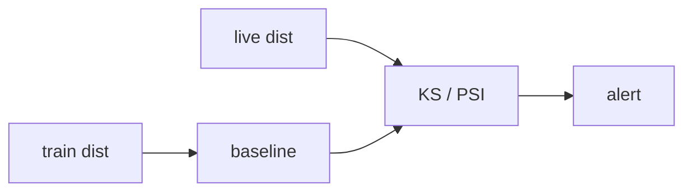

# Data Drift and Model Drift

> MLOps 101 series (7/10)

<!-- a-grade-intro:begin -->

**Core question**: How do you tell *the input distribution changed* apart from *the model just got worse*?

> *Data drift means input distributions shift, model drift means prediction quality drops. Statistical tests catch both.*

<!-- a-grade-intro:end -->

This is post 7 in the MLOps 101 series.

## What You Will Learn

- Data drift vs concept drift
- KS test and PSI
- Choosing a baseline distribution
- Setting alert thresholds
- Five common pitfalls

## Why It Matters

The world keeps moving. The distribution at training time will not last forever. Without drift detection, *silent losses* pile up.

## Concept at a Glance



## Key Terms

- **Data drift**: a change in the distribution of input X.
- **Concept drift**: a change in the relationship between X and Y.
- **PSI**: Population Stability Index. Below 0.1 is considered safe.
- **KS**: Kolmogorov–Smirnov test for distribution distance.
- **Baseline**: the reference distribution, usually training data.

## Before/After

**Before**: you notice accuracy dropped *after* the loss is real.

**After**: PSI > 0.2 fires, and someone is investigating.

## Hands-on: Detect Data Drift with PSI

### Step 1 — Baseline and live data

```python
import numpy as np

base = np.random.normal(0, 1, 1000)
live = np.random.normal(0.5, 1, 1000)
```

### Step 2 — Bin edges

```python
def bin_edges(x, n=10):
    return np.quantile(x, np.linspace(0, 1, n + 1))
```

### Step 3 — PSI calculation

```python
def psi(base, live, n=10):
    edges = bin_edges(base, n)
    edges[0], edges[-1] = -np.inf, np.inf
    b, _ = np.histogram(base, edges)
    l, _ = np.histogram(live, edges)
    bp = b / b.sum() + 1e-6
    lp = l / l.sum() + 1e-6
    return float(np.sum((lp - bp) * np.log(lp / bp)))

print(round(psi(base, live), 3))
```

### Step 4 — KS test

```python
from scipy.stats import ks_2samp
stat, p = ks_2samp(base, live)
print(round(stat, 3), round(p, 4))
```

### Step 5 — Threshold policy

```python
def status(p_value, psi_value):
    if psi_value > 0.2 or p_value < 0.01:
        return "drift"
    if psi_value > 0.1:
        return "watch"
    return "ok"
```

## What to Notice in This Code

- The `+ 1e-6` term prevents division by zero.
- KS reduces a distribution gap to a single number.
- The threshold is a team agreement, not a universal constant.

## Five Common Mistakes

1. **Setting the baseline to "the last few days" — drift becomes invisible.**
2. **Trying to detect concept drift without labels.**
3. **Looking only at single features and ignoring multivariate shift.**
4. **Applying KS to bounded categorical features as-is.**
5. **Alerting only — no automated retraining trigger.**

## How This Shows Up in Production

A risk-scoring model computes PSI nightly. If it crosses 0.2, the model is automatically queued for retraining and a ticket is filed.

## How a Senior Engineer Thinks

- Data drift is the early warning.
- Model drift confirms the impact via metrics.
- Pin the baseline, refresh on a known cadence.
- Use PSI for categorical, KS for continuous features.
- Wire drift alerts to retraining workflows.

## Checklist

- [ ] A baseline distribution is defined.
- [ ] PSI/KS run on a regular schedule.
- [ ] Thresholds are documented.
- [ ] A retraining trigger is connected to the alert.

## Practice Problems

1. Write a PSI function for *categorical* features.
2. How would you measure concept drift when labels arrive late?
3. PSI is 0.18 — alert or ignore? Justify your rule.

## Wrap-up and Next Steps

Once you see drift, the next question is what to do. The next post covers *retraining automation*.

<!-- toc:begin -->
- [What is MLOps?](./01-what-is-mlops.md)
- [Experiment Tracking](./02-experiment-tracking.md)
- [Data Versioning](./03-data-versioning.md)
- [Model Training Pipeline](./04-training-pipeline.md)
- [Model Deployment](./05-model-deployment.md)
- [Model Monitoring](./06-model-monitoring.md)
- **Data Drift and Model Drift (current)**
- Retraining (upcoming)
- Feature Store (upcoming)
- Building a Production ML System (upcoming)
<!-- toc:end -->

## References

- [Evidently AI — drift detection](https://docs.evidentlyai.com/)
- [SciPy — `ks_2samp`](https://docs.scipy.org/doc/scipy/reference/generated/scipy.stats.ks_2samp.html)
- [Population Stability Index explained](https://www.listendata.com/2015/05/population-stability-index.html)
- [Google — Rules of ML](https://developers.google.com/machine-learning/guides/rules-of-ml)

Tags: MLOps, Drift, Monitoring, DataScience, Statistics
